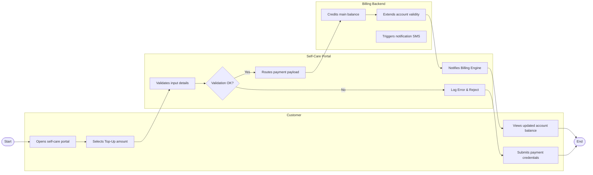

# Swimlane Diagram — Customer Self-Care Portal (Telecom)

## Mermaid Code

## Flow Description | Mô tả luồng

| Lane | Actor / System | Role in Flow |
|------|----------------|--------------|
| 1 | Customer | Opens self-care portal -> Selects Top-Up amount -> Submits payment credentials -> Views updated account balance |
| 2 | Self-Care Portal | Validates input details -> Routes payment payload -> Notifies Billing Engine -> Renders instant success screen |
| 3 | Billing Backend | Credits main balance -> Extends account validity -> Triggers notification SMS |
