# Action Tree — Customer Self-Care Portal (Telecom)

## Mermaid Code

```mermaid
graph TD
    Root["Customer Self-Care Portal (Telecom)"]

    Root --> M1["Authentication & Account Security"]
    M1 --> M1_A1["Send OTP Code"]
    M1 --> M1_A2["Verify Login Token"]
    M1 --> M1_A3["Register Biometric Passkey"]
    M1 --> M1_A4["Update Password"]
    Root --> M2["Usage Dashboard & Analytics"]
    M2 --> M2_A1["Fetch Usage Metrics"]
    M2 --> M2_A2["Render Usage Chart"]
    M2 --> M2_A3["Export Consumption History"]
    M2 --> M2_A4["Calculate Average Spend"]
    Root --> M3["Recharge & Plan Management"]
    M3 --> M3_A1["Process Top-Up"]
    M3 --> M3_A2["Select New Tariff"]
    M3 --> M3_A3["Apply Promo Code"]
    M3 --> M3_A4["Confirm Subscription Upgrade"]
    Root --> M4["VAS & Add-on Services"]
    M4 --> M4_A1["Browse VAS Catalog"]
    M4 --> M4_A2["Subscribe to Roaming Pack"]
    M4 --> M4_A3["Unsubscribe VAS"]
    M4 --> M4_A4["Query VAS Expiry"]
    Root --> M5["Support & Help Desk"]
    M5 --> M5_A1["Create Ticket"]
    M5 --> M5_A2["Attach Screenshot"]
    M5 --> M5_A3["Track Ticket Resolution"]
    M5 --> M5_A4["Rate Support Agent"]
    Root --> M6["Portal Admin & CMS"]
    M6 --> M6_A1["Publish Banner"]
    M6 --> M6_A2["Update FAQ List"]
    M6 --> M6_A3["Configure Promo Alert"]
    M6 --> M6_A4["Review User Traffic Stats"]
```

## Module Description | Mô tả Module

| # | Module | Description | Actions |
|---|--------|-------------|---------|
| 1 | Authentication & Account Security | Handles OTP logins, biometric authentication, and security preferences. | Send OTP Code, Verify Login Token, Register Biometric Passkey, Update Password |
| 2 | Usage Dashboard & Analytics | Visualizes daily data usage, minute consumption, and expense charts. | Fetch Usage Metrics, Render Usage Chart, Export Consumption History, Calculate Average Spend |
| 3 | Recharge & Plan Management | Facilitates top-up payment transactions and subscription plan changes. | Process Top-Up, Select New Tariff, Apply Promo Code, Confirm Subscription Upgrade |
| 4 | VAS & Add-on Services | Enables self-service subscription to roaming and entertainment packs. | Browse VAS Catalog, Subscribe to Roaming Pack, Unsubscribe VAS, Query VAS Expiry |
| 5 | Support & Help Desk | Manages self-service tickets, live chat assistance, and broadband status. | Create Ticket, Attach Screenshot, Track Ticket Resolution, Rate Support Agent |
| 6 | Portal Admin & CMS | Allows telecom staff to configure promo banners, announcements, and FAQs. | Publish Banner, Update FAQ List, Configure Promo Alert, Review User Traffic Stats |
