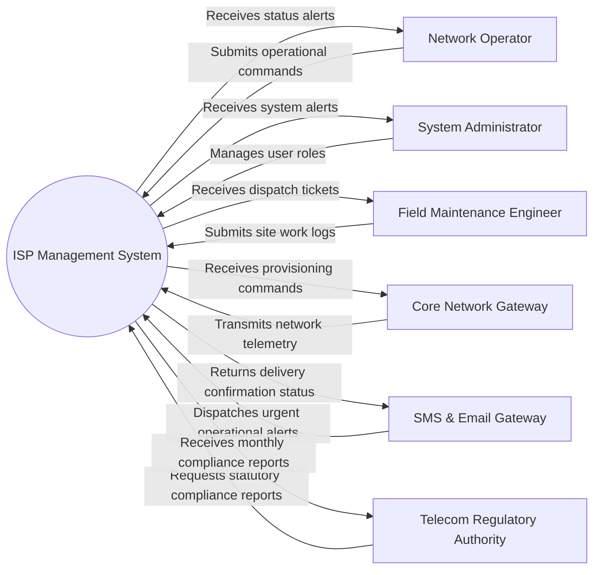

# Context Diagram — ISP Management System

## Mermaid Code

## Actor & Interaction Table | Bảng Actor & Tương tác

| # | Actor | Actor Type | Data Sent TO System | Data Received FROM System | Notes |
|---|-------|------------|---------------------|---------------------------|-------|
| 1 | Network Operator | Primary | Submits operational commands, queries status, updates configurations | Receives status alerts, network telemetry, operational logs | Telecom operator staff |
| 2 | System Administrator | Primary | Manages user roles, configures security policies, reviews audit logs | Receives system alerts, access logs, security health metrics | System manager |
| 3 | Field Maintenance Engineer | Primary | Submits site work logs, updates equipment status, requests access authorization | Receives dispatch tickets, site access codes, maintenance guidelines | On-site technical engineer |
| 4 | Core Network Gateway | Supporting | Transmits network telemetry, session logs, signaling metrics | Receives provisioning commands, traffic throttle signals | Network element interface |
| 5 | SMS & Email Gateway | Supporting | Dispatches urgent operational alerts, technician dispatch SMS | Returns delivery confirmation status | Alert dispatch service |
| 6 | Telecom Regulatory Authority | Regulatory | Requests statutory compliance reports, audit trails | Receives monthly compliance reports, network quality metrics | Industry regulator |

## System Boundary Description | Mô tả Phạm vi Hệ thống

The **ISP Management System** handles core operational workflows including data ingestion, policy enforcement, transactional processing, and regulatory reporting within the telecommunications domain. Out of scope operations include direct physical hardware manufacturing and external banking ledger management.
