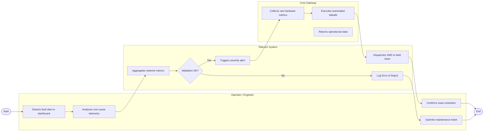

# Swimlane Diagram — Network Operations Center (NOC) System

## Mermaid Code

## Flow Description | Mô tả luồng

| Lane | Actor / System | Role in Flow |
|------|----------------|--------------|
| 1 | Operator / Engineer | Detects fault alert in dashboard -> Analyzes root cause telemetry -> Submits maintenance ticket -> Confirms issue resolution |
| 2 | Telecom System | Aggregates network metrics -> Triggers severity alert -> Dispatches SMS to field team -> Updates system health state |
| 3 | Core Gateway | Collects raw hardware metrics -> Executes automated failsafe -> Returns operational state |
