# Action Tree — Subscriber Identity Management System

## Mermaid Code

```mermaid
graph TD
    Root["Subscriber Identity Management System"]

    Root --> M1["Core Telemetry & Monitoring"]
    M1 --> M1_A1["Ingest Telemetry"]
    M1 --> M1_A2["Render Health Dashboard"]
    M1 --> M1_A3["Query Bandwidth Usage"]
    M1 --> M1_A4["Export Latency Reports"]
    Root --> M2["Fault & Alarm Management"]
    M2 --> M2_A1["Correlate Alarms"]
    M2 --> M2_A2["Set Alert Thresholds"]
    M2 --> M2_A3["Dispatch SMS Notification"]
    M2 --> M2_A4["Acknowledge Fault Alarm"]
    Root --> M3["Provisioning & Configuration"]
    M3 --> M3_A1["Deploy Configuration"]
    M3 --> M3_A2["Update Operating Parameters"]
    M3 --> M3_A3["Rollback Version"]
    M3 --> M3_A4["Sync Gateway State"]
    Root --> M4["Workforce & Maintenance Ticket"]
    M4 --> M4_A1["Create Repair Ticket"]
    M4 --> M4_A2["Assign Field Engineer"]
    M4 --> M4_A3["Update Ticket Progress"]
    M4 --> M4_A4["Close Work Order"]
    Root --> M5["Security & Access Audit"]
    M5 --> M5_A1["Authenticate User"]
    M5 --> M5_A2["Assign User Role"]
    M5 --> M5_A3["Audit System Log"]
    M5 --> M5_A4["Revoke Access Permission"]
    Root --> M6["Compliance & SLA Reporting"]
    M6 --> M6_A1["Calculate Uptime SLA"]
    M6 --> M6_A2["Generate Outage Report"]
    M6 --> M6_A3["Export Regulatory Filing"]
    M6 --> M6_A4["Audit SLA Thresholds"]
```

## Module Description | Mô tả Module

| # | Module | Description | Actions |
|---|--------|-------------|---------|
| 1 | Core Telemetry & Monitoring | Real-time telemetry ingestion and performance dashboard. | Ingest Telemetry, Render Health Dashboard, Query Bandwidth Usage, Export Latency Reports |
| 2 | Fault & Alarm Management | Fault detection, alarm correlation, and alert dispatch. | Correlate Alarms, Set Alert Thresholds, Dispatch SMS Notification, Acknowledge Fault Alarm |
| 3 | Provisioning & Configuration | System configuration, profile management, and remote updates. | Deploy Configuration, Update Operating Parameters, Rollback Version, Sync Gateway State |
| 4 | Workforce & Maintenance Ticket | Manages field technician dispatch and repair workflows. | Create Repair Ticket, Assign Field Engineer, Update Ticket Progress, Close Work Order |
| 5 | Security & Access Audit | Role-based access security, authentication, and audit logs. | Authenticate User, Assign User Role, Audit System Log, Revoke Access Permission |
| 6 | Compliance & SLA Reporting | Generates regulatory SLA filings and uptime compliance audits. | Calculate Uptime SLA, Generate Outage Report, Export Regulatory Filing, Audit SLA Thresholds |
