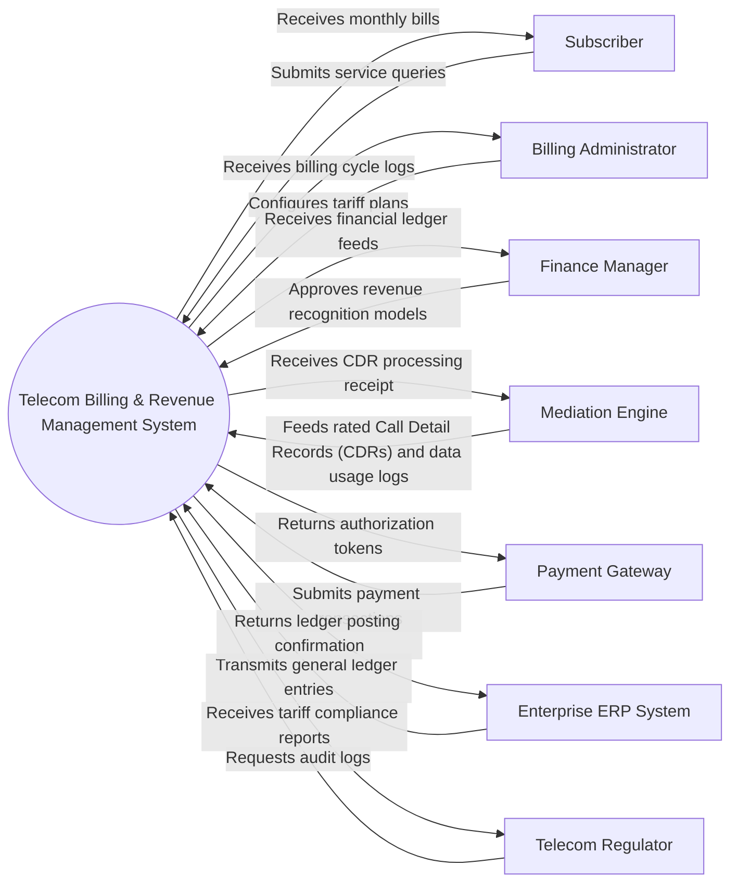

# Context Diagram — Telecom Billing & Revenue Management System

## Mermaid Code

## Actor & Interaction Table | Bảng Actor & Tương tác

| # | Actor | Actor Type | Data Sent TO System | Data Received FROM System | Notes |
|---|-------|------------|---------------------|---------------------------|-------|
| 1 | Subscriber | Primary | Submits service queries, initiates bill payment, requests usage details | Receives monthly bills, payment receipts, balance alerts | Telecom customer |
| 2 | Billing Administrator | Primary | Configures tariff plans, initiates billing cycles, manages dispute adjustments | Receives billing cycle logs, reconciliation reports, exception alerts | Telecom operator staff |
| 3 | Finance Manager | Primary | Approves revenue recognition models, sets subscriber credit thresholds | Receives financial ledger feeds, revenue summaries, tax reports | Executive financial officer |
| 4 | Mediation Engine | Supporting | Feeds rated Call Detail Records (CDRs) and data usage logs | Receives CDR processing receipt, validation error flags | Upstream CDR feeder |
| 5 | Payment Gateway | Supporting | Submits payment transactions, tokenized credit card requests | Returns authorization tokens, transaction settlement status | External payment processor |
| 6 | Enterprise ERP System | Supporting | Transmits general ledger entries, tax accounting records | Returns ledger posting confirmation, account validation status | Corporate financial ERP |
| 7 | Telecom Regulator | Regulatory | Requests audit logs, compulsory tariff filing validations | Receives tariff compliance reports, consumer billing statistics | Regulatory authority |

## System Boundary Description | Mô tả Phạm vi Hệ thống

The **Telecom Billing & Revenue Management System** handles core operational workflows including data ingestion, policy enforcement, transactional processing, and regulatory reporting within the telecommunications domain. Out of scope operations include direct physical hardware manufacturing and external banking ledger management.
