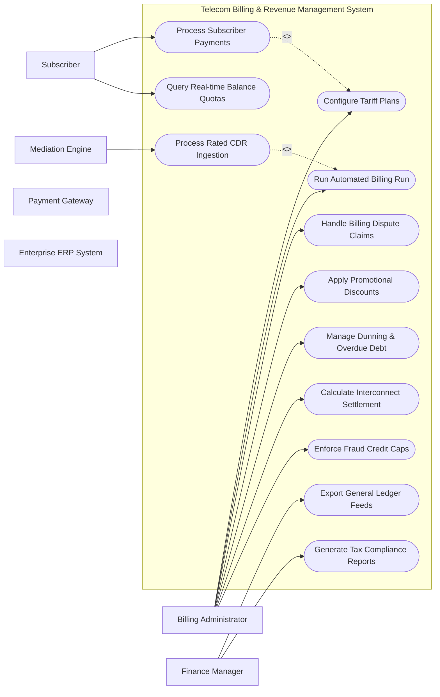

# Use Case Diagram — Telecom Billing & Revenue Management System

## Mermaid Code

## Actor Table | Bảng Actor

| # | Actor | Actor Type | Role Description | Related Use Cases |
|---|-------|------------|------------------|-------------------|
| 1 | Subscriber | Primary | Telecom customer | UC03, UC04, UC05, UC06, UC07, UC08 |
| 2 | Billing Administrator | Primary | Telecom operator staff | UC01, UC02, UC03, UC05, UC07, UC08, UC11, UC12 |
| 3 | Finance Manager | Primary | Executive financial officer | UC01, UC09, UC10 |
| 4 | Mediation Engine | Supporting | Upstream CDR feeder | UC02 |
| 5 | Payment Gateway | Supporting | External payment processor | UC04 |
| 6 | Enterprise ERP System | Supporting | Corporate financial ERP | UC09 |
| 7 | Telecom Regulator | Regulatory | Regulatory authority | UC10 |

## Use Case Table | Bảng Use Case

| # | UC ID | Use Case Name | Primary Actor | Secondary Actor | Description | Priority |
|---|-------|---------------|---------------|-----------------|-------------|----------|
| 1 | UC01 | Configure Tariff Plans | Billing Administrator | Finance Manager | Define voice, SMS, and data rating tariffs including peak and off-peak rate multipliers. | High |
| 2 | UC02 | Process Rated CDR Ingestion | Mediation Engine | Billing Administrator | Ingest rated Call Detail Records and aggregate charges into subscriber accounts. | High |
| 3 | UC03 | Run Automated Billing Run | Billing Administrator | Subscriber | Execute periodic monthly billing runs to calculate final bill amounts and tax. | High |
| 4 | UC04 | Process Subscriber Payments | Subscriber | Payment Gateway | Process payment via card, bank transfer, or digital wallet to settle bills. | High |
| 5 | UC05 | Handle Billing Dispute Claims | Billing Administrator | Subscriber | Investigate customer bill disputes and issue credit notes or tariff adjustments. | Medium |
| 6 | UC06 | Query Real-time Balance Quotas | Subscriber | Billing Engine | Provide subscribers real-time visibility into unbilled data usage and balances. | High |
| 7 | UC07 | Apply Promotional Discounts | Billing Administrator | Subscriber | Apply loyalty discounts, bundled rebates, and promotional tariff credits. | Medium |
| 8 | UC08 | Manage Dunning & Overdue Debt | Billing Administrator | Subscriber | Automate overdue notices, credit limits enforcement, and service bar requests. | High |
| 9 | UC09 | Export General Ledger Feeds | Finance Manager | Enterprise ERP System | Export monthly billed revenue and recognized income to corporate ERP. | High |
| 10 | UC10 | Generate Tax Compliance Reports | Finance Manager | Telecom Regulator | Produce statutory VAT and telecom sector tax compliance filings. | Medium |
| 11 | UC11 | Calculate Interconnect Settlement | Billing Administrator | Partner Operator | Reconcile net settlement fees for international and roaming call traffic. | High |
| 12 | UC12 | Enforce Fraud Credit Caps | Billing Administrator | Fraud Engine | Cap high-risk usage automatically to mitigate tariff abuse and fraud loss. | High |

## Use Case Specification | Đặc tả Use Case

---

### UC01 — Configure Tariff Plans

| Field | Detail |
|-------|--------|
| **UC ID** | UC01 |
| **Use Case Name** | Configure Tariff Plans |
| **Actor(s)** | Primary: Billing Administrator / Secondary: Finance Manager |
| **Description** | Define voice, SMS, and data rating tariffs including peak and off-peak rate multipliers. |
| **Precondition** | 1. User/Actor is authenticated in the system.   2. Required target element or account status is Active. |
| **Main Flow** | 1. Billing Administrator initiates Configure Tariff Plans request.   2. System validates input parameters and security authorization tokens.   3. System checks operational rules against backend policies.   4. System processes requested operation and updates database state.   5. System logs transaction for audit compliance.   6. System returns success confirmation to Billing Administrator. |
| **Alternative Flow** | **AF1** — Cached Batch Mode: If real-time queue is congested, system queues request for batch processing and returns pending token.   **AF2** — Secondary Notification: System dispatches copy of completion receipt to Finance Manager. |
| **Exception Flow** | **EX1** — Validation Failure: If input format is invalid, system halts execution and displays error error message.   **EX2** — System Timeout: If backend fails to respond within 5000ms, system rolls back transaction and logs critical alert. |
| **Postcondition** | System record state is updated successfully, audit logs are saved, and downstream events are triggered. |
| **Business Rule** | **BR1**: All operations must comply with telecom security SLA and privacy regulations.   **BR2**: Financial and state modifications must generate immutable audit logs. |

---

### UC02 — Process Rated CDR Ingestion

| Field | Detail |
|-------|--------|
| **UC ID** | UC02 |
| **Use Case Name** | Process Rated CDR Ingestion |
| **Actor(s)** | Primary: Mediation Engine / Secondary: Billing Administrator |
| **Description** | Ingest rated Call Detail Records and aggregate charges into subscriber accounts. |
| **Precondition** | 1. User/Actor is authenticated in the system.   2. Required target element or account status is Active. |
| **Main Flow** | 1. Mediation Engine initiates Process Rated CDR Ingestion request.   2. System validates input parameters and security authorization tokens.   3. System checks operational rules against backend policies.   4. System processes requested operation and updates database state.   5. System logs transaction for audit compliance.   6. System returns success confirmation to Mediation Engine. |
| **Alternative Flow** | **AF1** — Cached Batch Mode: If real-time queue is congested, system queues request for batch processing and returns pending token.   **AF2** — Secondary Notification: System dispatches copy of completion receipt to Billing Administrator. |
| **Exception Flow** | **EX1** — Validation Failure: If input format is invalid, system halts execution and displays error error message.   **EX2** — System Timeout: If backend fails to respond within 5000ms, system rolls back transaction and logs critical alert. |
| **Postcondition** | System record state is updated successfully, audit logs are saved, and downstream events are triggered. |
| **Business Rule** | **BR1**: All operations must comply with telecom security SLA and privacy regulations.   **BR2**: Financial and state modifications must generate immutable audit logs. |

---

### UC03 — Run Automated Billing Run

| Field | Detail |
|-------|--------|
| **UC ID** | UC03 |
| **Use Case Name** | Run Automated Billing Run |
| **Actor(s)** | Primary: Billing Administrator / Secondary: Subscriber |
| **Description** | Execute periodic monthly billing runs to calculate final bill amounts and tax. |
| **Precondition** | 1. User/Actor is authenticated in the system.   2. Required target element or account status is Active. |
| **Main Flow** | 1. Billing Administrator initiates Run Automated Billing Run request.   2. System validates input parameters and security authorization tokens.   3. System checks operational rules against backend policies.   4. System processes requested operation and updates database state.   5. System logs transaction for audit compliance.   6. System returns success confirmation to Billing Administrator. |
| **Alternative Flow** | **AF1** — Cached Batch Mode: If real-time queue is congested, system queues request for batch processing and returns pending token.   **AF2** — Secondary Notification: System dispatches copy of completion receipt to Subscriber. |
| **Exception Flow** | **EX1** — Validation Failure: If input format is invalid, system halts execution and displays error error message.   **EX2** — System Timeout: If backend fails to respond within 5000ms, system rolls back transaction and logs critical alert. |
| **Postcondition** | System record state is updated successfully, audit logs are saved, and downstream events are triggered. |
| **Business Rule** | **BR1**: All operations must comply with telecom security SLA and privacy regulations.   **BR2**: Financial and state modifications must generate immutable audit logs. |

---

### UC04 — Process Subscriber Payments

| Field | Detail |
|-------|--------|
| **UC ID** | UC04 |
| **Use Case Name** | Process Subscriber Payments |
| **Actor(s)** | Primary: Subscriber / Secondary: Payment Gateway |
| **Description** | Process payment via card, bank transfer, or digital wallet to settle bills. |
| **Precondition** | 1. User/Actor is authenticated in the system.   2. Required target element or account status is Active. |
| **Main Flow** | 1. Subscriber initiates Process Subscriber Payments request.   2. System validates input parameters and security authorization tokens.   3. System checks operational rules against backend policies.   4. System processes requested operation and updates database state.   5. System logs transaction for audit compliance.   6. System returns success confirmation to Subscriber. |
| **Alternative Flow** | **AF1** — Cached Batch Mode: If real-time queue is congested, system queues request for batch processing and returns pending token.   **AF2** — Secondary Notification: System dispatches copy of completion receipt to Payment Gateway. |
| **Exception Flow** | **EX1** — Validation Failure: If input format is invalid, system halts execution and displays error error message.   **EX2** — System Timeout: If backend fails to respond within 5000ms, system rolls back transaction and logs critical alert. |
| **Postcondition** | System record state is updated successfully, audit logs are saved, and downstream events are triggered. |
| **Business Rule** | **BR1**: All operations must comply with telecom security SLA and privacy regulations.   **BR2**: Financial and state modifications must generate immutable audit logs. |

---

### UC05 — Handle Billing Dispute Claims

| Field | Detail |
|-------|--------|
| **UC ID** | UC05 |
| **Use Case Name** | Handle Billing Dispute Claims |
| **Actor(s)** | Primary: Billing Administrator / Secondary: Subscriber |
| **Description** | Investigate customer bill disputes and issue credit notes or tariff adjustments. |
| **Precondition** | 1. User/Actor is authenticated in the system.   2. Required target element or account status is Active. |
| **Main Flow** | 1. Billing Administrator initiates Handle Billing Dispute Claims request.   2. System validates input parameters and security authorization tokens.   3. System checks operational rules against backend policies.   4. System processes requested operation and updates database state.   5. System logs transaction for audit compliance.   6. System returns success confirmation to Billing Administrator. |
| **Alternative Flow** | **AF1** — Cached Batch Mode: If real-time queue is congested, system queues request for batch processing and returns pending token.   **AF2** — Secondary Notification: System dispatches copy of completion receipt to Subscriber. |
| **Exception Flow** | **EX1** — Validation Failure: If input format is invalid, system halts execution and displays error error message.   **EX2** — System Timeout: If backend fails to respond within 5000ms, system rolls back transaction and logs critical alert. |
| **Postcondition** | System record state is updated successfully, audit logs are saved, and downstream events are triggered. |
| **Business Rule** | **BR1**: All operations must comply with telecom security SLA and privacy regulations.   **BR2**: Financial and state modifications must generate immutable audit logs. |

