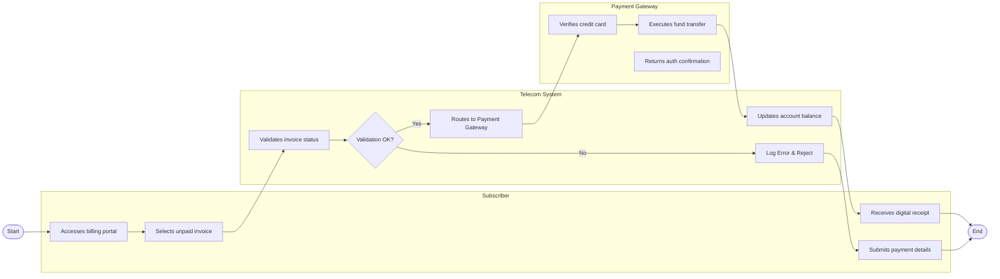

# Swimlane Diagram — Telecom Billing & Revenue Management System

## Mermaid Code

## Flow Description | Mô tả luồng

| Lane | Actor / System | Role in Flow |
|------|----------------|--------------|
| 1 | Subscriber | Accesses billing portal -> Selects unpaid invoice -> Submits payment details -> Receives digital receipt |
| 2 | Telecom System | Validates invoice status -> Routes to Payment Gateway -> Updates account balance -> Triggers confirmation SMS |
| 3 | Payment Gateway | Verifies credit card -> Executes fund transfer -> Returns auth confirmation |
