# Action Tree — Telecom Billing & Revenue Management System

## Mermaid Code

```mermaid
graph TD
    Root["Telecom Billing & Revenue Management System"]

    Root --> M1["Tariff & Rating Engine"]
    M1 --> M1_A1["Create Rating Tariff"]
    M1 --> M1_A2["Set Peak/Off-Peak Rates"]
    M1 --> M1_A3["Update Volume Tier Discounts"]
    M1 --> M1_A4["Simulate Tariff Revenue Impact"]
    Root --> M2["Mediated Ingestion Module"]
    M2 --> M2_A1["Import Network CDRs"]
    M2 --> M2_A2["Validate CDR Format"]
    M2 --> M2_A3["Deduplicate CDR Logs"]
    M2 --> M2_A4["Store Rated Usage"]
    Root --> M3["Billing Cycle Execution"]
    M3 --> M3_A1["Schedule Billing Run"]
    M3 --> M3_A2["Execute Rating Aggregation"]
    M3 --> M3_A3["Generate Bill PDF"]
    M3 --> M3_A4["Dispatch E-Invoices"]
    Root --> M4["Accounts Receivable & Collections"]
    M4 --> M4_A1["Process Card Payment"]
    M4 --> M4_A2["Reconcile Bank Receipts"]
    M4 --> M4_A3["Send Overdue SMS Warning"]
    M4 --> M4_A4["Trigger Service Suspension"]
    Root --> M5["Dispute Management"]
    M5 --> M5_A1["Log Dispute Ticket"]
    M5 --> M5_A2["Investigate Usage History"]
    M5 --> M5_A3["Issue Credit Adjustment"]
    M5 --> M5_A4["Update Account Credit"]
    Root --> M6["GL & Financial Integration"]
    M6 --> M6_A1["Summarize Monthly Revenue"]
    M6 --> M6_A2["Export GL Journal Entries"]
    M6 --> M6_A3["Produce Statutory Tax Audit"]
    M6 --> M6_A4["Audit Interconnect Revenue"]
```

## Module Description | Mô tả Module

| # | Module | Description | Actions |
|---|--------|-------------|---------|
| 1 | Tariff & Rating Engine | Manages price plans, peak discounts, and CDR rating formulas. | Create Rating Tariff, Set Peak/Off-Peak Rates, Update Volume Tier Discounts, Simulate Tariff Revenue Impact |
| 2 | Mediated Ingestion Module | Ingests and validates call detail records from network elements. | Import Network CDRs, Validate CDR Format, Deduplicate CDR Logs, Store Rated Usage |
| 3 | Billing Cycle Execution | Executes batch bill runs and generates PDF statements. | Schedule Billing Run, Execute Rating Aggregation, Generate Bill PDF, Dispatch E-Invoices |
| 4 | Accounts Receivable & Collections | Tracks bill settlement, payment processing, and dunning. | Process Card Payment, Reconcile Bank Receipts, Send Overdue SMS Warning, Trigger Service Suspension |
| 5 | Dispute Management | Handles subscriber complaints and credit notes. | Log Dispute Ticket, Investigate Usage History, Issue Credit Adjustment, Update Account Credit |
| 6 | GL & Financial Integration | Exports accounting records to enterprise ERP. | Summarize Monthly Revenue, Export GL Journal Entries, Produce Statutory Tax Audit, Audit Interconnect Revenue |
