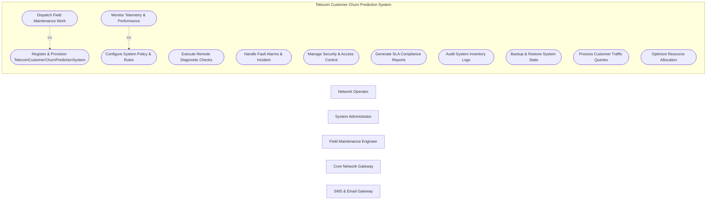

# Use Case Diagram — Telecom Customer Churn Prediction System

## Mermaid Code

## Actor Table | Bảng Actor

| # | Actor | Actor Type | Role Description | Related Use Cases |
|---|-------|------------|------------------|-------------------|
| 1 | Network Operator | Primary | Telecom operator staff | UC01, UC02 |
| 2 | System Administrator | Primary | System manager | UC01, UC02 |
| 3 | Field Maintenance Engineer | Primary | On-site technical engineer | UC01, UC02 |
| 4 | Core Network Gateway | Supporting | Network element interface | UC01, UC02 |
| 5 | SMS & Email Gateway | Supporting | Alert dispatch service | UC01, UC02 |
| 6 | Telecom Regulatory Authority | Regulatory | Industry regulator | UC01, UC02 |

## Use Case Table | Bảng Use Case

| # | UC ID | Use Case Name | Primary Actor | Secondary Actor | Description | Priority |
|---|-------|---------------|---------------|-----------------|-------------|----------|
| 1 | UC01 | Register & Provision TelecomCustomerChurnPredictionSystem | NetworkOperator | CoreNetworkGateway | Register and provision new elements in Telecom Customer Churn Prediction System. | High |
| 2 | UC02 | Monitor Telemetry & Performance | NetworkOperator | CoreNetworkGateway | Monitor real-time network indicators and system traffic performance. | High |
| 3 | UC03 | Configure System Policy & Rules | SystemAdmin | NetworkOperator | Configure policy controls, threshold limits, and operational rules. | High |
| 4 | UC04 | Dispatch Field Maintenance Work | NetworkOperator | FieldEngineer | Create and assign maintenance tickets to field engineers. | High |
| 5 | UC05 | Execute Remote Diagnostic Checks | FieldEngineer | CoreNetworkGateway | Perform remote diagnostic loops and signal parameter verifications. | Medium |
| 6 | UC06 | Handle Fault Alarms & Incident | NetworkOperator | NotificationGateway | Detect critical operational faults and dispatch notifications to engineering teams. | High |
| 7 | UC07 | Manage Security & Access Control | SystemAdmin | NetworkOperator | Maintain role-based access control and system audit logs. | Medium |
| 8 | UC08 | Generate SLA Compliance Reports | SystemAdmin | RegulatorySystem | Generate system performance SLA and regulatory audit filings. | High |
| 9 | UC09 | Audit System Inventory Logs | NetworkOperator | SystemAdmin | Audit physical and logical inventory configuration logs. | Medium |
| 10 | UC10 | Backup & Restore System State | SystemAdmin | CoreNetworkGateway | Execute scheduled system state backup and disaster recovery restore. | High |
| 11 | UC11 | Process Customer Traffic Queries | NetworkOperator | CoreNetworkGateway | Query active session subscriber traffic and bandwidth usage. | Medium |
| 12 | UC12 | Optimize Resource Allocation | NetworkOperator | CoreNetworkGateway | Dynamically reallocate network capacity to balance high load. | High |

## Use Case Specification | Đặc tả Use Case

---

### UC01 — Register & Provision TelecomCustomerChurnPredictionSystem

| Field | Detail |
|-------|--------|
| **UC ID** | UC01 |
| **Use Case Name** | Register & Provision TelecomCustomerChurnPredictionSystem |
| **Actor(s)** | Primary: NetworkOperator / Secondary: CoreNetworkGateway |
| **Description** | Register and provision new elements in Telecom Customer Churn Prediction System. |
| **Precondition** | 1. User/Actor is authenticated in the system.   2. Required target element or account status is Active. |
| **Main Flow** | 1. NetworkOperator initiates Register & Provision TelecomCustomerChurnPredictionSystem request.   2. System validates input parameters and security authorization tokens.   3. System checks operational rules against backend policies.   4. System processes requested operation and updates database state.   5. System logs transaction for audit compliance.   6. System returns success confirmation to NetworkOperator. |
| **Alternative Flow** | **AF1** — Cached Batch Mode: If real-time queue is congested, system queues request for batch processing and returns pending token.   **AF2** — Secondary Notification: System dispatches copy of completion receipt to CoreNetworkGateway. |
| **Exception Flow** | **EX1** — Validation Failure: If input format is invalid, system halts execution and displays error error message.   **EX2** — System Timeout: If backend fails to respond within 5000ms, system rolls back transaction and logs critical alert. |
| **Postcondition** | System record state is updated successfully, audit logs are saved, and downstream events are triggered. |
| **Business Rule** | **BR1**: All operations must comply with telecom security SLA and privacy regulations.   **BR2**: Financial and state modifications must generate immutable audit logs. |

---

### UC02 — Monitor Telemetry & Performance

| Field | Detail |
|-------|--------|
| **UC ID** | UC02 |
| **Use Case Name** | Monitor Telemetry & Performance |
| **Actor(s)** | Primary: NetworkOperator / Secondary: CoreNetworkGateway |
| **Description** | Monitor real-time network indicators and system traffic performance. |
| **Precondition** | 1. User/Actor is authenticated in the system.   2. Required target element or account status is Active. |
| **Main Flow** | 1. NetworkOperator initiates Monitor Telemetry & Performance request.   2. System validates input parameters and security authorization tokens.   3. System checks operational rules against backend policies.   4. System processes requested operation and updates database state.   5. System logs transaction for audit compliance.   6. System returns success confirmation to NetworkOperator. |
| **Alternative Flow** | **AF1** — Cached Batch Mode: If real-time queue is congested, system queues request for batch processing and returns pending token.   **AF2** — Secondary Notification: System dispatches copy of completion receipt to CoreNetworkGateway. |
| **Exception Flow** | **EX1** — Validation Failure: If input format is invalid, system halts execution and displays error error message.   **EX2** — System Timeout: If backend fails to respond within 5000ms, system rolls back transaction and logs critical alert. |
| **Postcondition** | System record state is updated successfully, audit logs are saved, and downstream events are triggered. |
| **Business Rule** | **BR1**: All operations must comply with telecom security SLA and privacy regulations.   **BR2**: Financial and state modifications must generate immutable audit logs. |

---

### UC03 — Configure System Policy & Rules

| Field | Detail |
|-------|--------|
| **UC ID** | UC03 |
| **Use Case Name** | Configure System Policy & Rules |
| **Actor(s)** | Primary: SystemAdmin / Secondary: NetworkOperator |
| **Description** | Configure policy controls, threshold limits, and operational rules. |
| **Precondition** | 1. User/Actor is authenticated in the system.   2. Required target element or account status is Active. |
| **Main Flow** | 1. SystemAdmin initiates Configure System Policy & Rules request.   2. System validates input parameters and security authorization tokens.   3. System checks operational rules against backend policies.   4. System processes requested operation and updates database state.   5. System logs transaction for audit compliance.   6. System returns success confirmation to SystemAdmin. |
| **Alternative Flow** | **AF1** — Cached Batch Mode: If real-time queue is congested, system queues request for batch processing and returns pending token.   **AF2** — Secondary Notification: System dispatches copy of completion receipt to NetworkOperator. |
| **Exception Flow** | **EX1** — Validation Failure: If input format is invalid, system halts execution and displays error error message.   **EX2** — System Timeout: If backend fails to respond within 5000ms, system rolls back transaction and logs critical alert. |
| **Postcondition** | System record state is updated successfully, audit logs are saved, and downstream events are triggered. |
| **Business Rule** | **BR1**: All operations must comply with telecom security SLA and privacy regulations.   **BR2**: Financial and state modifications must generate immutable audit logs. |

---

### UC04 — Dispatch Field Maintenance Work

| Field | Detail |
|-------|--------|
| **UC ID** | UC04 |
| **Use Case Name** | Dispatch Field Maintenance Work |
| **Actor(s)** | Primary: NetworkOperator / Secondary: FieldEngineer |
| **Description** | Create and assign maintenance tickets to field engineers. |
| **Precondition** | 1. User/Actor is authenticated in the system.   2. Required target element or account status is Active. |
| **Main Flow** | 1. NetworkOperator initiates Dispatch Field Maintenance Work request.   2. System validates input parameters and security authorization tokens.   3. System checks operational rules against backend policies.   4. System processes requested operation and updates database state.   5. System logs transaction for audit compliance.   6. System returns success confirmation to NetworkOperator. |
| **Alternative Flow** | **AF1** — Cached Batch Mode: If real-time queue is congested, system queues request for batch processing and returns pending token.   **AF2** — Secondary Notification: System dispatches copy of completion receipt to FieldEngineer. |
| **Exception Flow** | **EX1** — Validation Failure: If input format is invalid, system halts execution and displays error error message.   **EX2** — System Timeout: If backend fails to respond within 5000ms, system rolls back transaction and logs critical alert. |
| **Postcondition** | System record state is updated successfully, audit logs are saved, and downstream events are triggered. |
| **Business Rule** | **BR1**: All operations must comply with telecom security SLA and privacy regulations.   **BR2**: Financial and state modifications must generate immutable audit logs. |

---

### UC05 — Execute Remote Diagnostic Checks

| Field | Detail |
|-------|--------|
| **UC ID** | UC05 |
| **Use Case Name** | Execute Remote Diagnostic Checks |
| **Actor(s)** | Primary: FieldEngineer / Secondary: CoreNetworkGateway |
| **Description** | Perform remote diagnostic loops and signal parameter verifications. |
| **Precondition** | 1. User/Actor is authenticated in the system.   2. Required target element or account status is Active. |
| **Main Flow** | 1. FieldEngineer initiates Execute Remote Diagnostic Checks request.   2. System validates input parameters and security authorization tokens.   3. System checks operational rules against backend policies.   4. System processes requested operation and updates database state.   5. System logs transaction for audit compliance.   6. System returns success confirmation to FieldEngineer. |
| **Alternative Flow** | **AF1** — Cached Batch Mode: If real-time queue is congested, system queues request for batch processing and returns pending token.   **AF2** — Secondary Notification: System dispatches copy of completion receipt to CoreNetworkGateway. |
| **Exception Flow** | **EX1** — Validation Failure: If input format is invalid, system halts execution and displays error error message.   **EX2** — System Timeout: If backend fails to respond within 5000ms, system rolls back transaction and logs critical alert. |
| **Postcondition** | System record state is updated successfully, audit logs are saved, and downstream events are triggered. |
| **Business Rule** | **BR1**: All operations must comply with telecom security SLA and privacy regulations.   **BR2**: Financial and state modifications must generate immutable audit logs. |

