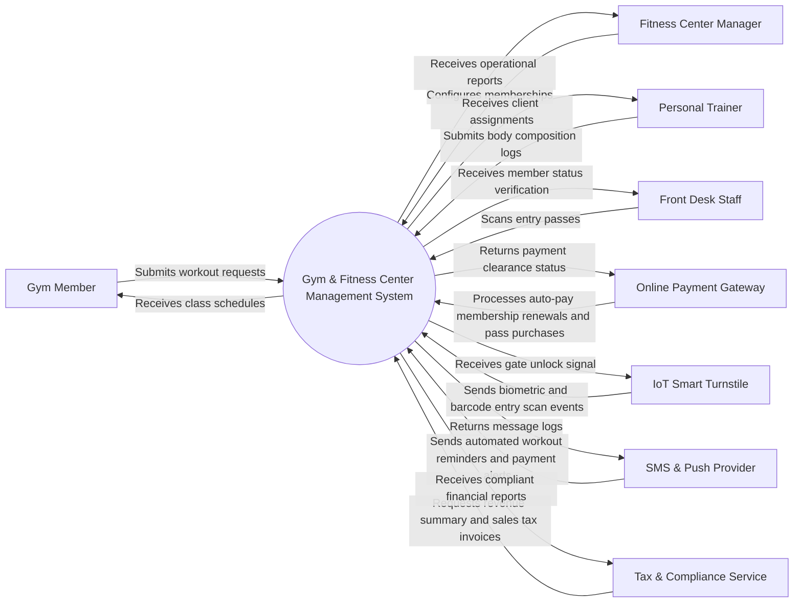

# Context Diagram — Gym & Fitness Center Management System

## Mermaid Code

## Actor & Interaction Table | Bảng Actor & Tương tác

| # | Actor | Actor Type | Data Sent TO System | Data Received FROM System | Notes |
|---|-------|------------|---------------------|---------------------------|-------|
| 1 | Gym Member | Primary | Submits workout requests, reserves fitness classes, buys pass | Receives class schedules, workout plans, gate access QR | Gym subscriber |
| 2 | Fitness Center Manager | Primary | Configures memberships, reviews trainer schedules, views analytics | Receives operational reports, financial metrics, equipment alerts | Facility operational manager |
| 3 | Personal Trainer | Primary | Submits body composition logs, sets workout programs | Receives client assignments, appointment notifications | Fitness instructor |
| 4 | Front Desk Staff | Primary | Scans entry passes, sells supplements, rents lockers | Receives member status verification, transaction receipts | Front desk operator |
| 5 | Online Payment Gateway | Supporting | Processes auto-pay membership renewals and pass purchases | Returns payment clearance status | Payment gateway |
| 6 | IoT Smart Turnstile | Supporting | Sends biometric and barcode entry scan events | Receives gate unlock signal | Physical entrance hardware |
| 7 | SMS & Push Provider | Supporting | Sends automated workout reminders and payment alerts | Returns message logs | Communication API |
| 8 | Tax & Compliance Service | Regulatory | Requests revenue summary and sales tax invoices | Receives compliant financial reports | Tax authority interface |

## System Boundary Description | Mô tả Scope Hệ thống

The Gym & Fitness Center Management System provides an end-to-end digital ecosystem designed specifically to automate and optimize operational workflows for Hệ Thống Quản Lý Phòng Gym và Trung Tâm Fitness. The system boundary includes core module capabilities such as user registrations, event/session scheduling, data processing, resource allocation, and automated reporting. External integrations with payment gateways, messaging networks, IoT sensor hardware, and regulatory audit portals operate outside the core application server but maintain secure API interactions. Manual paper-based logs and unintegrated external physical facilities remain outside the system boundary. overall system enforces strict role-based access control (RBAC) and encryption to safeguard data privacy.
