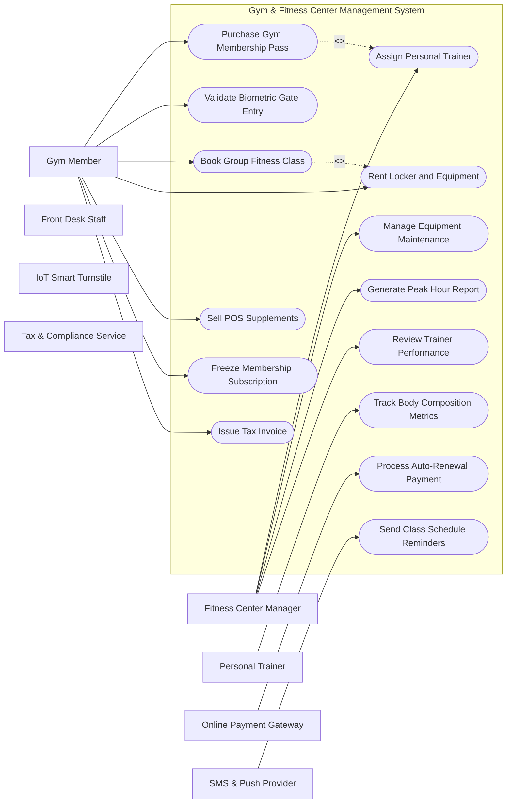

# Use Case Diagram — Gym & Fitness Center Management System

## Mermaid Code

## Actor Table | Bảng Actor

| # | Actor | Actor Type | Role Description | Related Use Cases |
|---|-------|------------|------------------|-------------------|
| 1 | Gym Member | Primary | Gym subscriber | UC01, UC03, UC12 |
| 2 | Fitness Center Manager | Primary | Facility operational manager | UC04, UC08, UC10, UC13 |
| 3 | Personal Trainer | Primary | Fitness instructor | UC05 |
| 4 | Front Desk Staff | Primary | Front desk operator | UC01, UC02 |
| 5 | Online Payment Gateway | Supporting | Payment gateway | UC07 |
| 6 | IoT Smart Turnstile | Supporting | Physical entrance hardware | UC01, UC02 |
| 7 | SMS & Push Provider | Supporting | Communication API | UC09 |
| 8 | Tax & Compliance Service | Regulatory | Tax authority interface | UC01, UC02 |

## Use Case Table | Bảng Use Case

| # | UC ID | Use Case Name | Primary Actor | Secondary Actor | Description | Priority |
|---|-------|---------------|---------------|-----------------|-------------|----------|
| 1 | UC01 | Purchase Gym Membership Pass | Gym Member | Online Payment Gateway | Enables members to purchase daily, monthly, or annual fitness passes. | High |
| 2 | UC02 | Validate Biometric Gate Entry | Desk Staff | IoT Smart Turnstile | Verifies member QR code or fingerprint scan to unlock turnstiles. | High |
| 3 | UC03 | Book Group Fitness Class | Gym Member | Fitness Center Manager | Allows members to reserve spots in Yoga, Zumba, or HIIT sessions. | High |
| 4 | UC04 | Assign Personal Trainer | Fitness Center Manager | Personal Trainer | Pairs gym members with certified personal trainers based on goals. | Medium |
| 5 | UC05 | Track Body Composition Metrics | Personal Trainer | Gym Member | Logs InBody stats including body fat percentage, muscle mass, and BMI. | Medium |
| 6 | UC06 | Rent Locker and Equipment | Desk Staff | Gym Member | Manages long-term or daily smart locker rentals and workout gear. | Low |
| 7 | UC07 | Process Auto-Renewal Payment | Online Payment Gateway | Fitness Center Manager | Executes automated monthly recurring charges for subscription plans. | High |
| 8 | UC08 | Manage Equipment Maintenance | Fitness Center Manager | None | Schedules repairs and tracks maintenance history of fitness machines. | Medium |
| 9 | UC09 | Send Class Schedule Reminders | SMS & Push Provider | Gym Member | Sends push notifications 1 hour before booked group fitness classes. | Low |
| 10 | UC10 | Generate Peak Hour Report | Fitness Center Manager | None | Analyzes hourly check-in data to optimize staffing and class schedules. | High |
| 11 | UC11 | Sell POS Supplements | Desk Staff | Online Payment Gateway | Processes counter sales for protein powders, drinks, and merch. | Medium |
| 12 | UC12 | Freeze Membership Subscription | Gym Member | Fitness Center Manager | Allows members to temporarily pause their subscription for medical/travel reasons. | Medium |
| 13 | UC13 | Review Trainer Performance | Fitness Center Manager | Personal Trainer | Evaluates PT session completion rates and member review ratings. | Low |
| 14 | UC14 | Issue Tax Invoice | Tax Compliance Body | Fitness Center Manager | Generates official electronic tax receipts for corporate wellness claims. | Low |

## Use Case Specification | Đặc tả Use Case

### UC01 — Purchase Gym Membership Pass

| Field | Detail |
|-------|--------|
| **UC ID** | UC01 |
| **Use Case Name** | Purchase Gym Membership Pass |
| **Actor(s)** | Primary: Gym Member / Secondary: Online Payment Gateway |
| **Description** | Enables members to purchase daily, monthly, or annual fitness passes. |
| **Precondition** | 1. User is authenticated with appropriate role permissions. 2. System network connection and target database service are fully active. |
| **Main Flow** | 1. Gym Member initiates Purchase Gym Membership Pass request via the system dashboard. 2. System validates input data parameters and displays confirmation screen. 3. Gym Member reviews details and submits final transaction. 4. System processes payload and communicates with Online Payment Gateway. 5. Online Payment Gateway returns authorization code and transaction status. 6. System updates internal record and returns success notification to Gym Member. |
| **Alternative Flow** | **AF1** — Saved Draft Flow: If user chooses save draft, system stores state without submitting. **AF2** — Fast-track Flow: If user holds VIP badge, system bypasses standard queue validation. |
| **Exception Flow** | **EX1** — Network Timeout: If secondary system fails to respond within 10 seconds, system displays retry prompt. **EX2** — Validation Error: If input fields contain invalid format, system highlights error fields. |
| **Postcondition** | Target transaction state is saved into DB and confirmation log is recorded. |
| **Business Rule** | **BR1**: All transactions must be encrypted using AES-256. **BR2**: Logs must be archived for audit compliance. |

---

### UC02 — Validate Biometric Gate Entry

| Field | Detail |
|-------|--------|
| **UC ID** | UC02 |
| **Use Case Name** | Validate Biometric Gate Entry |
| **Actor(s)** | Primary: Desk Staff / Secondary: IoT Smart Turnstile |
| **Description** | Verifies member QR code or fingerprint scan to unlock turnstiles. |
| **Precondition** | 1. User is authenticated with appropriate role permissions. 2. System network connection and target database service are fully active. |
| **Main Flow** | 1. Desk Staff initiates Validate Biometric Gate Entry request via the system dashboard. 2. System validates input data parameters and displays confirmation screen. 3. Desk Staff reviews details and submits final transaction. 4. System processes payload and communicates with IoT Smart Turnstile. 5. IoT Smart Turnstile returns authorization code and transaction status. 6. System updates internal record and returns success notification to Desk Staff. |
| **Alternative Flow** | **AF1** — Saved Draft Flow: If user chooses save draft, system stores state without submitting. **AF2** — Fast-track Flow: If user holds VIP badge, system bypasses standard queue validation. |
| **Exception Flow** | **EX1** — Network Timeout: If secondary system fails to respond within 10 seconds, system displays retry prompt. **EX2** — Validation Error: If input fields contain invalid format, system highlights error fields. |
| **Postcondition** | Target transaction state is saved into DB and confirmation log is recorded. |
| **Business Rule** | **BR1**: All transactions must be encrypted using AES-256. **BR2**: Logs must be archived for audit compliance. |

---

### UC03 — Book Group Fitness Class

| Field | Detail |
|-------|--------|
| **UC ID** | UC03 |
| **Use Case Name** | Book Group Fitness Class |
| **Actor(s)** | Primary: Gym Member / Secondary: Fitness Center Manager |
| **Description** | Allows members to reserve spots in Yoga, Zumba, or HIIT sessions. |
| **Precondition** | 1. User is authenticated with appropriate role permissions. 2. System network connection and target database service are fully active. |
| **Main Flow** | 1. Gym Member initiates Book Group Fitness Class request via the system dashboard. 2. System validates input data parameters and displays confirmation screen. 3. Gym Member reviews details and submits final transaction. 4. System processes payload and communicates with Fitness Center Manager. 5. Fitness Center Manager returns authorization code and transaction status. 6. System updates internal record and returns success notification to Gym Member. |
| **Alternative Flow** | **AF1** — Saved Draft Flow: If user chooses save draft, system stores state without submitting. **AF2** — Fast-track Flow: If user holds VIP badge, system bypasses standard queue validation. |
| **Exception Flow** | **EX1** — Network Timeout: If secondary system fails to respond within 10 seconds, system displays retry prompt. **EX2** — Validation Error: If input fields contain invalid format, system highlights error fields. |
| **Postcondition** | Target transaction state is saved into DB and confirmation log is recorded. |
| **Business Rule** | **BR1**: All transactions must be encrypted using AES-256. **BR2**: Logs must be archived for audit compliance. |

---

### UC04 — Assign Personal Trainer

| Field | Detail |
|-------|--------|
| **UC ID** | UC04 |
| **Use Case Name** | Assign Personal Trainer |
| **Actor(s)** | Primary: Fitness Center Manager / Secondary: Personal Trainer |
| **Description** | Pairs gym members with certified personal trainers based on goals. |
| **Precondition** | 1. User is authenticated with appropriate role permissions. 2. System network connection and target database service are fully active. |
| **Main Flow** | 1. Fitness Center Manager initiates Assign Personal Trainer request via the system dashboard. 2. System validates input data parameters and displays confirmation screen. 3. Fitness Center Manager reviews details and submits final transaction. 4. System processes payload and communicates with Personal Trainer. 5. Personal Trainer returns authorization code and transaction status. 6. System updates internal record and returns success notification to Fitness Center Manager. |
| **Alternative Flow** | **AF1** — Saved Draft Flow: If user chooses save draft, system stores state without submitting. **AF2** — Fast-track Flow: If user holds VIP badge, system bypasses standard queue validation. |
| **Exception Flow** | **EX1** — Network Timeout: If secondary system fails to respond within 10 seconds, system displays retry prompt. **EX2** — Validation Error: If input fields contain invalid format, system highlights error fields. |
| **Postcondition** | Target transaction state is saved into DB and confirmation log is recorded. |
| **Business Rule** | **BR1**: All transactions must be encrypted using AES-256. **BR2**: Logs must be archived for audit compliance. |

---

