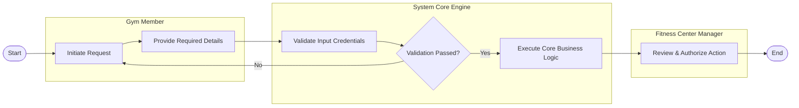

# Swimlane Diagram — Gym & Fitness Center Management System

## Mermaid Code

## Flow Description | Mô tả luồng

| Lane | Actor | Role in Flow |
|------|-------|-------------|
| 1 | Gym Member | Initiates process and inputs payload |
| 2 | System Core Engine | Validates parameters, evaluates decisions, executes logic |
| 3 | Fitness Center Manager | Reviews final outcomes and grants supervisor authorization |

