# Action Tree — Gym & Fitness Center Management System

## Mermaid Code

```mermaid
graph TD
    Root["Gym & Fitness Center Management System"]

    Root --> M1["Membership & Pass Control"]
    M1 --> A1_1["Purchase Pass"]
    M1 --> A1_2["Renew Subscription"]
    M1 --> A1_3["Freeze Subscription"]
    M1 --> A1_4["Cancel Membership"]
    Root --> M2["Turnstile Access Integration"]
    M2 --> A2_1["Scan Member Barcode/Biometric"]
    M2 --> A2_2["Verify Active Pass"]
    M2 --> A2_3["Unlock Gate"]
    M2 --> A2_4["Log Entry Time"]
    Root --> M3["Class Scheduling & Reservation"]
    M3 --> A3_1["Publish Class Schedule"]
    M3 --> A3_2["Reserve Class Slot"]
    M3 --> A3_3["Cancel Reservation"]
    M3 --> A3_4["Log Class Attendance"]
    Root --> M4["Personal Training & Progress"]
    M4 --> A4_1["Assign PT to Member"]
    M4 --> A4_2["Record InBody Metrics"]
    M4 --> A4_3["Set Fitness Goals"]
    M4 --> A4_4["Review Trainer Rating"]
    Root --> M5["Facility & Inventory Management"]
    M5 --> A5_1["Track Equipment Service"]
    M5 --> A5_2["Process Counter POS Sale"]
    M5 --> A5_3["Rent Locker Slot"]
    M5 --> A5_4["Generate Operations Report"]
```

## Module Description | Mô tả Module

| # | Module | Description | Actions |
|---|--------|-------------|---------|
| 1 | Membership & Pass Control | Manages member passes, renewals, and subscription freezes | Purchase Pass, Renew Subscription, Freeze Subscription, Cancel Membership |
| 2 | Turnstile Access Integration | Interfaces with IoT gates for secure turnstile authorization | Scan Member Barcode/Biometric, Verify Active Pass, Unlock Gate, Log Entry Time |
| 3 | Class Scheduling & Reservation | Schedules group fitness sessions and tracks bookings | Publish Class Schedule, Reserve Class Slot, Cancel Reservation, Log Class Attendance |
| 4 | Personal Training & Progress | Pairs members with trainers and tracks physical metrics | Assign PT to Member, Record InBody Metrics, Set Fitness Goals, Review Trainer Rating |
| 5 | Facility & Inventory Management | Monitors equipment status, POS sales, and locker rentals | Track Equipment Service, Process Counter POS Sale, Rent Locker Slot, Generate Operations Report |

