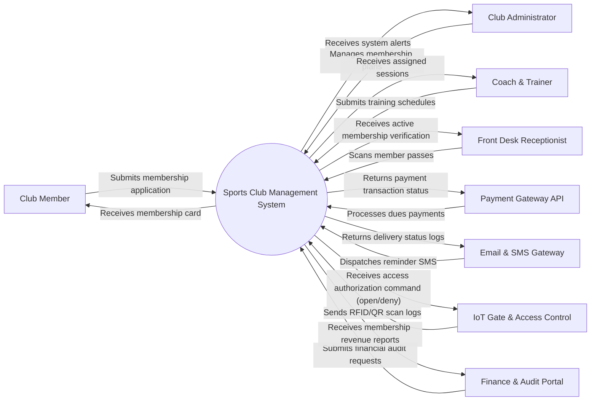

# Context Diagram — Sports Club Management System

## Mermaid Code

## Actor & Interaction Table | Bảng Actor & Tương tác

| # | Actor | Actor Type | Data Sent TO System | Data Received FROM System | Notes |
|---|-------|------------|---------------------|---------------------------|-------|
| 1 | Club Member | Primary | Submits membership application, updates profile, books facilities | Receives membership card, booking confirmations, club notices | Regular club member |
| 2 | Club Administrator | Primary | Manages membership plans, approves requests, views financial reports | Receives system alerts, registration logs, audit trails | Full system control |
| 3 | Coach & Trainer | Primary | Submits training schedules, logs attendance, inputs member progress | Receives assigned sessions, member rosters, facility schedules | Instruction staff |
| 4 | Front Desk Receptionist | Primary | Scans member passes, processes guest passes, collects desk payments | Receives active membership verification, access logs | On-site check-in operator |
| 5 | Payment Gateway API | Supporting | Processes dues payments, credit cards, recurring billing | Returns payment transaction status, refund receipts | Third-party gateway |
| 6 | Email & SMS Gateway | Supporting | Dispatches reminder SMS, email newsletters, payment alerts | Returns delivery status logs | Messaging integration |
| 7 | IoT Gate & Access Control | Supporting | Sends RFID/QR scan logs, gate entry attempts | Receives access authorization command (open/deny) | Smart door/turnstile |
| 8 | Finance & Audit Portal | Regulatory | Submits financial audit requests, compliance checks | Receives membership revenue reports, tax breakdown | External auditor portal |

## System Boundary Description | Mô tả Scope Hệ thống

The Sports Club Management System provides an end-to-end digital ecosystem designed specifically to automate and optimize operational workflows for Hệ Thống Quản Lý Câu Lạc Bộ Thể Thao. The system boundary includes core module capabilities such as user registrations, event/session scheduling, data processing, resource allocation, and automated reporting. External integrations with payment gateways, messaging networks, IoT sensor hardware, and regulatory audit portals operate outside the core application server but maintain secure API interactions. Manual paper-based logs and unintegrated external physical facilities remain outside the system boundary. overall system enforces strict role-based access control (RBAC) and encryption to safeguard data privacy.
