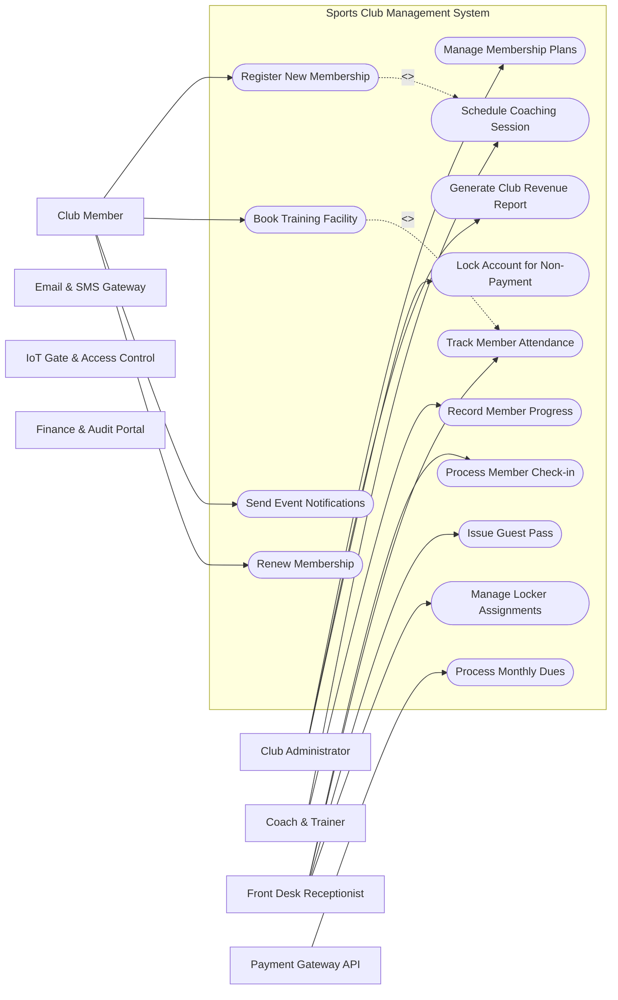

# Use Case Diagram — Sports Club Management System

## Mermaid Code

## Actor Table | Bảng Actor

| # | Actor | Actor Type | Role Description | Related Use Cases |
|---|-------|------------|------------------|-------------------|
| 1 | Club Member | Primary | Regular club member | UC01, UC03, UC13 |
| 2 | Club Administrator | Primary | Full system control | UC05, UC10, UC12 |
| 3 | Coach & Trainer | Primary | Instruction staff | UC04, UC09 |
| 4 | Front Desk Receptionist | Primary | On-site check-in operator | UC02, UC06, UC08, UC14 |
| 5 | Payment Gateway API | Supporting | Third-party gateway | UC07 |
| 6 | Email & SMS Gateway | Supporting | Messaging integration | UC01, UC02 |
| 7 | IoT Gate & Access Control | Supporting | Smart door/turnstile | UC01, UC02 |
| 8 | Finance & Audit Portal | Regulatory | External auditor portal | UC01, UC02 |

## Use Case Table | Bảng Use Case

| # | UC ID | Use Case Name | Primary Actor | Secondary Actor | Description | Priority |
|---|-------|---------------|---------------|-----------------|-------------|----------|
| 1 | UC01 | Register New Membership | Club Member | Payment Gateway API | Allows new sports club members to sign up for a membership tier and pay initial dues. | High |
| 2 | UC02 | Process Member Check-in | Front Desk Receptionist | IoT Gate & Access Control | Verifies member QR code or RFID tag for facility gate access. | High |
| 3 | UC03 | Book Training Facility | Club Member | Payment Gateway API | Enables members to reserve tennis courts, swimming lanes, or gym spaces. | High |
| 4 | UC04 | Schedule Coaching Session | Coach & Trainer | Club Member | Allows coaches to publish available slots and assign members to sessions. | Medium |
| 5 | UC05 | Manage Membership Plans | Club Administrator | None | Configures pricing, duration, perks, and access rules for membership tiers. | High |
| 6 | UC06 | Track Member Attendance | Front Desk Receptionist | Coach & Trainer | Logs daily entries and class attendance for usage analytics. | Medium |
| 7 | UC07 | Process Monthly Dues | Payment Gateway API | Club Administrator | Executes automated recurring billing for monthly or annual memberships. | High |
| 8 | UC08 | Issue Guest Pass | Front Desk Receptionist | Club Member | Generates temporary access passes for guests accompanied by members. | Low |
| 9 | UC09 | Record Member Progress | Coach & Trainer | Club Member | Logs fitness benchmarks, physical metrics, and coaching notes. | Medium |
| 10 | UC10 | Generate Club Revenue Report | Club Administrator | Finance Audit System | Produces detailed financial analytics on dues, facility rentals, and coaching income. | High |
| 11 | UC11 | Send Event Notifications | Notification System | Club Member | Broadcasts club tournament announcements and maintenance schedule alerts. | Low |
| 12 | UC12 | Lock Account for Non-Payment | Club Administrator | Payment Gateway API | Suspends membership privileges automatically if monthly fees remain unpaid. | Medium |
| 13 | UC13 | Renew Membership | Club Member | Payment Gateway API | Allows existing members to extend their subscription before expiration. | High |
| 14 | UC14 | Manage Locker Assignments | Front Desk Receptionist | Club Member | Assigns and tracks physical locker rentals for club members. | Low |

## Use Case Specification | Đặc tả Use Case

### UC01 — Register New Membership

| Field | Detail |
|-------|--------|
| **UC ID** | UC01 |
| **Use Case Name** | Register New Membership |
| **Actor(s)** | Primary: Club Member / Secondary: Payment Gateway API |
| **Description** | Allows new sports club members to sign up for a membership tier and pay initial dues. |
| **Precondition** | 1. User is authenticated with appropriate role permissions. 2. System network connection and target database service are fully active. |
| **Main Flow** | 1. Club Member initiates Register New Membership request via the system dashboard. 2. System validates input data parameters and displays confirmation screen. 3. Club Member reviews details and submits final transaction. 4. System processes payload and communicates with Payment Gateway API. 5. Payment Gateway API returns authorization code and transaction status. 6. System updates internal record and returns success notification to Club Member. |
| **Alternative Flow** | **AF1** — Saved Draft Flow: If user chooses save draft, system stores state without submitting. **AF2** — Fast-track Flow: If user holds VIP badge, system bypasses standard queue validation. |
| **Exception Flow** | **EX1** — Network Timeout: If secondary system fails to respond within 10 seconds, system displays retry prompt. **EX2** — Validation Error: If input fields contain invalid format, system highlights error fields. |
| **Postcondition** | Target transaction state is saved into DB and confirmation log is recorded. |
| **Business Rule** | **BR1**: All transactions must be encrypted using AES-256. **BR2**: Logs must be archived for audit compliance. |

---

### UC02 — Process Member Check-in

| Field | Detail |
|-------|--------|
| **UC ID** | UC02 |
| **Use Case Name** | Process Member Check-in |
| **Actor(s)** | Primary: Front Desk Receptionist / Secondary: IoT Gate & Access Control |
| **Description** | Verifies member QR code or RFID tag for facility gate access. |
| **Precondition** | 1. User is authenticated with appropriate role permissions. 2. System network connection and target database service are fully active. |
| **Main Flow** | 1. Front Desk Receptionist initiates Process Member Check-in request via the system dashboard. 2. System validates input data parameters and displays confirmation screen. 3. Front Desk Receptionist reviews details and submits final transaction. 4. System processes payload and communicates with IoT Gate & Access Control. 5. IoT Gate & Access Control returns authorization code and transaction status. 6. System updates internal record and returns success notification to Front Desk Receptionist. |
| **Alternative Flow** | **AF1** — Saved Draft Flow: If user chooses save draft, system stores state without submitting. **AF2** — Fast-track Flow: If user holds VIP badge, system bypasses standard queue validation. |
| **Exception Flow** | **EX1** — Network Timeout: If secondary system fails to respond within 10 seconds, system displays retry prompt. **EX2** — Validation Error: If input fields contain invalid format, system highlights error fields. |
| **Postcondition** | Target transaction state is saved into DB and confirmation log is recorded. |
| **Business Rule** | **BR1**: All transactions must be encrypted using AES-256. **BR2**: Logs must be archived for audit compliance. |

---

### UC03 — Book Training Facility

| Field | Detail |
|-------|--------|
| **UC ID** | UC03 |
| **Use Case Name** | Book Training Facility |
| **Actor(s)** | Primary: Club Member / Secondary: Payment Gateway API |
| **Description** | Enables members to reserve tennis courts, swimming lanes, or gym spaces. |
| **Precondition** | 1. User is authenticated with appropriate role permissions. 2. System network connection and target database service are fully active. |
| **Main Flow** | 1. Club Member initiates Book Training Facility request via the system dashboard. 2. System validates input data parameters and displays confirmation screen. 3. Club Member reviews details and submits final transaction. 4. System processes payload and communicates with Payment Gateway API. 5. Payment Gateway API returns authorization code and transaction status. 6. System updates internal record and returns success notification to Club Member. |
| **Alternative Flow** | **AF1** — Saved Draft Flow: If user chooses save draft, system stores state without submitting. **AF2** — Fast-track Flow: If user holds VIP badge, system bypasses standard queue validation. |
| **Exception Flow** | **EX1** — Network Timeout: If secondary system fails to respond within 10 seconds, system displays retry prompt. **EX2** — Validation Error: If input fields contain invalid format, system highlights error fields. |
| **Postcondition** | Target transaction state is saved into DB and confirmation log is recorded. |
| **Business Rule** | **BR1**: All transactions must be encrypted using AES-256. **BR2**: Logs must be archived for audit compliance. |

---

### UC04 — Schedule Coaching Session

| Field | Detail |
|-------|--------|
| **UC ID** | UC04 |
| **Use Case Name** | Schedule Coaching Session |
| **Actor(s)** | Primary: Coach & Trainer / Secondary: Club Member |
| **Description** | Allows coaches to publish available slots and assign members to sessions. |
| **Precondition** | 1. User is authenticated with appropriate role permissions. 2. System network connection and target database service are fully active. |
| **Main Flow** | 1. Coach & Trainer initiates Schedule Coaching Session request via the system dashboard. 2. System validates input data parameters and displays confirmation screen. 3. Coach & Trainer reviews details and submits final transaction. 4. System processes payload and communicates with Club Member. 5. Club Member returns authorization code and transaction status. 6. System updates internal record and returns success notification to Coach & Trainer. |
| **Alternative Flow** | **AF1** — Saved Draft Flow: If user chooses save draft, system stores state without submitting. **AF2** — Fast-track Flow: If user holds VIP badge, system bypasses standard queue validation. |
| **Exception Flow** | **EX1** — Network Timeout: If secondary system fails to respond within 10 seconds, system displays retry prompt. **EX2** — Validation Error: If input fields contain invalid format, system highlights error fields. |
| **Postcondition** | Target transaction state is saved into DB and confirmation log is recorded. |
| **Business Rule** | **BR1**: All transactions must be encrypted using AES-256. **BR2**: Logs must be archived for audit compliance. |

---

