# Action Tree — Sports Club Management System

## Mermaid Code

```mermaid
graph TD
    Root["Sports Club Management System"]

    Root --> M1["Membership Management"]
    M1 --> A1_1["Create Member Profile"]
    M1 --> A1_2["Assign Membership Tier"]
    M1 --> A1_3["Renew Subscription"]
    M1 --> A1_4["Suspend Non-Paying Account"]
    Root --> M2["Facility Booking Module"]
    M2 --> A2_1["Search Facility Availability"]
    M2 --> A2_2["Reserve Slot"]
    M2 --> A2_3["Cancel Booking"]
    M2 --> A2_4["Check In for Booking"]
    Root --> M3["Coaching & Training Module"]
    M3 --> A3_1["Create Class Schedule"]
    M3 --> A3_2["Assign Coach to Session"]
    M3 --> A3_3["Register Member for Class"]
    M3 --> A3_4["Log Fitness Benchmarks"]
    Root --> M4["Access Control & Attendance"]
    M4 --> A4_1["Scan Member RFID/QR"]
    M4 --> A4_2["Validate Access Rights"]
    M4 --> A4_3["Trigger Gate Opening"]
    M4 --> A4_4["Generate Attendance Logs"]
    Root --> M5["Billing & Financial Analytics"]
    M5 --> A5_1["Execute Recurring Dues"]
    M5 --> A5_2["Process One-time Payment"]
    M5 --> A5_3["Issue Refund Receipt"]
    M5 --> A5_4["Export Financial Audit"]
```

## Module Description | Mô tả Module

| # | Module | Description | Actions |
|---|--------|-------------|---------|
| 1 | Membership Management | Handles member profiles, tier subscriptions, and renewals | Create Member Profile, Assign Membership Tier, Renew Subscription, Suspend Non-Paying Account |
| 2 | Facility Booking Module | Manages reservations for courts, lanes, and rooms | Search Facility Availability, Reserve Slot, Cancel Booking, Check In for Booking |
| 3 | Coaching & Training Module | Schedules classes and tracks personal training sessions | Create Class Schedule, Assign Coach to Session, Register Member for Class, Log Fitness Benchmarks |
| 4 | Access Control & Attendance | Integrates with smart gates and registers check-ins | Scan Member RFID/QR, Validate Access Rights, Trigger Gate Opening, Generate Attendance Logs |
| 5 | Billing & Financial Analytics | Processes payments and generates revenue reports | Execute Recurring Dues, Process One-time Payment, Issue Refund Receipt, Export Financial Audit |

