# Action Tree — Sports Nutrition Management System

## Mermaid Code

```mermaid
graph TD
    Root["Sports Nutrition Management System"]

    Root --> M1["User & Profile Management"]
    M1 --> A1_1["Register User Account"]
    M1 --> A1_2["Update Profile Information"]
    M1 --> A1_3["Verify Credentials"]
    M1 --> A1_4["Manage Permissions"]
    Root --> M2["Event & Resource Scheduling"]
    M2 --> A2_1["Create Event Schedule"]
    M2 --> A2_2["Allocate Resource"]
    M2 --> A2_3["Update Event Status"]
    M2 --> A2_4["Cancel Event"]
    Root --> M3["Field Inspection & Logging"]
    M3 --> A3_1["Log Inspection Metric"]
    M3 --> A3_2["Input Match Result"]
    M3 --> A3_3["Stream Sensor Telemetry"]
    M3 --> A3_4["Submit Field Incident"]
    Root --> M4["Financial & Payment Processing"]
    M4 --> A4_1["Process Fee Payment"]
    M4 --> A4_2["Generate Invoice"]
    M4 --> A4_3["Issue Refund"]
    M4 --> A4_4["Export Tax Revenue"]
    Root --> M5["Analytics & Compliance Reporting"]
    M5 --> A5_1["Generate Analytics Dashboard"]
    M5 --> A5_2["Export Audit Report"]
    M5 --> A5_3["Archive System History"]
    M5 --> A5_4["Send System Alerts"]
```

## Module Description | Mô tả Module

| # | Module | Description | Actions |
|---|--------|-------------|---------|
| 1 | User & Profile Management | Handles registration, profile updates, and authentication | Register User Account, Update Profile Information, Verify Credentials, Manage Permissions |
| 2 | Event & Resource Scheduling | Schedules sessions, allocates venues, and tracks status | Create Event Schedule, Allocate Resource, Update Event Status, Cancel Event |
| 3 | Field Inspection & Logging | Records live results, sensor telemetry, and field reports | Log Inspection Metric, Input Match Result, Stream Sensor Telemetry, Submit Field Incident |
| 4 | Financial & Payment Processing | Manages online fees, invoice generation, and refunds | Process Fee Payment, Generate Invoice, Issue Refund, Export Tax Revenue |
| 5 | Analytics & Compliance Reporting | Generates operational dashboards and regulatory compliance exports | Generate Analytics Dashboard, Export Audit Report, Archive System History, Send System Alerts |

