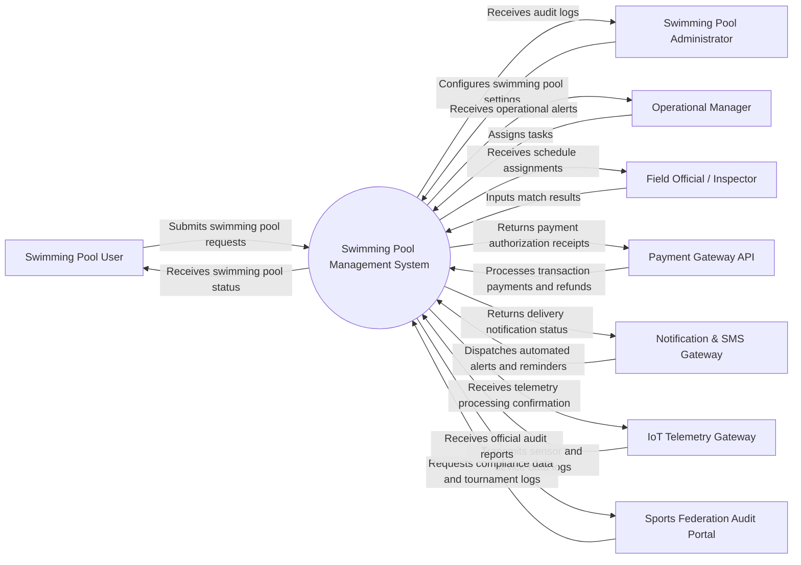

# Context Diagram — Swimming Pool Management System

## Mermaid Code

## Actor & Interaction Table | Bảng Actor & Tương tác

| # | Actor | Actor Type | Data Sent TO System | Data Received FROM System | Notes |
|---|-------|------------|---------------------|---------------------------|-------|
| 1 | Swimming Pool User | Primary | Submits swimming pool requests, updates profile | Receives swimming pool status, confirmation | Primary domain user |
| 2 | Swimming Pool Administrator | Primary | Configures swimming pool settings, manages permissions | Receives audit logs, system performance metrics | System administrator |
| 3 | Operational Manager | Primary | Assigns tasks, manages schedules, reviews reports | Receives operational alerts, user feedback | Operations lead |
| 4 | Field Official / Inspector | Primary | Inputs match results, logs field inspections | Receives schedule assignments, guidelines | On-site officer |
| 5 | Payment Gateway API | Supporting | Processes transaction payments and refunds | Returns payment authorization receipts | Financial gateway |
| 6 | Notification & SMS Gateway | Supporting | Dispatches automated alerts and reminders | Returns delivery notification status | Messaging integration |
| 7 | IoT Telemetry Gateway | Supporting | Transmits sensor and device data logs | Receives telemetry processing confirmation | Hardware/IoT integration |
| 8 | Sports Federation Audit Portal | Regulatory | Requests compliance data and tournament logs | Receives official audit reports | Regulatory compliance portal |

## System Boundary Description | Mô tả Scope Hệ thống

The Swimming Pool Management System provides an end-to-end digital ecosystem designed specifically to automate and optimize operational workflows for Hệ Thống Quản Lý Bể Bơi. The system boundary includes core module capabilities such as user registrations, event/session scheduling, data processing, resource allocation, and automated reporting. External integrations with payment gateways, messaging networks, IoT sensor hardware, and regulatory audit portals operate outside the core application server but maintain secure API interactions. Manual paper-based logs and unintegrated external physical facilities remain outside the system boundary. overall system enforces strict role-based access control (RBAC) and encryption to safeguard data privacy.
