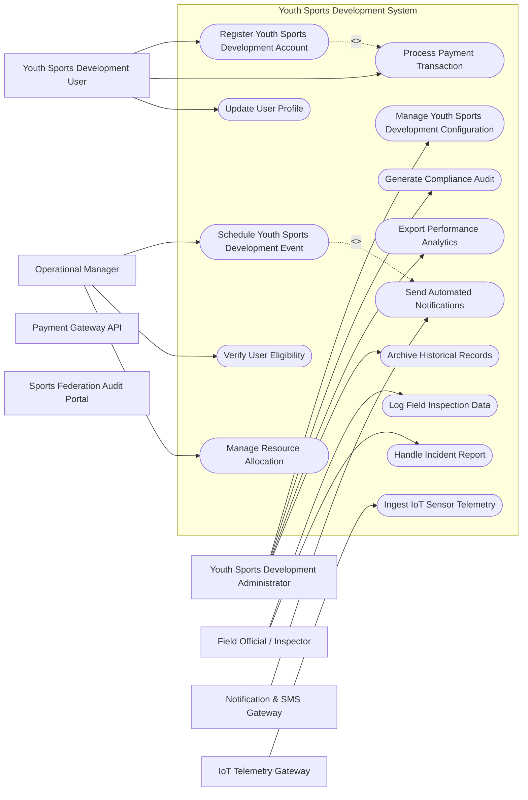

# Use Case Diagram — Youth Sports Development System

## Mermaid Code

## Actor Table | Bảng Actor

| # | Actor | Actor Type | Role Description | Related Use Cases |
|---|-------|------------|------------------|-------------------|
| 1 | Youth Sports Development User | Primary | Primary domain user | UC01, UC04, UC13 |
| 2 | Youth Sports Development Administrator | Primary | System administrator | UC02, UC08, UC10, UC14 |
| 3 | Operational Manager | Primary | Operations lead | UC03, UC09, UC11 |
| 4 | Field Official / Inspector | Primary | On-site officer | UC05, UC12 |
| 5 | Payment Gateway API | Supporting | Financial gateway | UC01, UC02 |
| 6 | Notification & SMS Gateway | Supporting | Messaging integration | UC06 |
| 7 | IoT Telemetry Gateway | Supporting | Hardware/IoT integration | UC07 |
| 8 | Sports Federation Audit Portal | Regulatory | Regulatory compliance portal | UC01, UC02 |

## Use Case Table | Bảng Use Case

| # | UC ID | Use Case Name | Primary Actor | Secondary Actor | Description | Priority |
|---|-------|---------------|---------------|-----------------|-------------|----------|
| 1 | UC01 | Register Youth Sports Development Account | Youth Sports Development User | Payment Gateway API | Allows users to register and setup youth sports development profiles. | High |
| 2 | UC02 | Manage Youth Sports Development Configuration | Youth Sports Development Administrator | None | Configures core parameters and rules for youth sports development. | High |
| 3 | UC03 | Schedule Youth Sports Development Event | Operational Manager | Field Official / Inspector | Schedules timelines, matches, or operational events. | High |
| 4 | UC04 | Process Payment Transaction | Youth Sports Development User | Payment Gateway API | Executes online fee payments, deposits, or subscriptions. | High |
| 5 | UC05 | Log Field Inspection Data | Field Official / Inspector | Operational Manager | Records live metrics, match results, or inspection check-lists. | Medium |
| 6 | UC06 | Send Automated Notifications | Notification & SMS Gateway | Youth Sports Development User | Broadcasts system updates, schedule changes, and reminders. | Low |
| 7 | UC07 | Ingest IoT Sensor Telemetry | IoT Telemetry Gateway | Youth Sports Development Administrator | Processes stream data from sensors, wearables, or gate scanners. | Medium |
| 8 | UC08 | Generate Compliance Audit | Youth Sports Development Administrator | Sports Federation Audit Portal | Exports standardized regulatory compliance reports. | High |
| 9 | UC09 | Verify User Eligibility | Operational Manager | Youth Sports Development User | Checks credentials, medical clearances, or membership status. | Medium |
| 10 | UC10 | Export Performance Analytics | Youth Sports Development Administrator | None | Generates statistical trends, revenue charts, and operational dashboards. | High |
| 11 | UC11 | Manage Resource Allocation | Operational Manager | None | Assigns venues, equipment, or staff to active events. | Medium |
| 12 | UC12 | Handle Incident Report | Field Official / Inspector | Youth Sports Development Administrator | Logs safety infractions, equipment failures, or participant disputes. | Medium |
| 13 | UC13 | Update User Profile | Youth Sports Development User | None | Updates contact info, preferences, and emergency details. | Low |
| 14 | UC14 | Archive Historical Records | Youth Sports Development Administrator | Sports Federation Audit Portal | Stores completed event logs and participant history for long-term audit. | Low |

## Use Case Specification | Đặc tả Use Case

### UC01 — Register Youth Sports Development Account

| Field | Detail |
|-------|--------|
| **UC ID** | UC01 |
| **Use Case Name** | Register Youth Sports Development Account |
| **Actor(s)** | Primary: Youth Sports Development User / Secondary: Payment Gateway API |
| **Description** | Allows users to register and setup youth sports development profiles. |
| **Precondition** | 1. User is authenticated with appropriate role permissions. 2. System network connection and target database service are fully active. |
| **Main Flow** | 1. Youth Sports Development User initiates Register Youth Sports Development Account request via the system dashboard. 2. System validates input data parameters and displays confirmation screen. 3. Youth Sports Development User reviews details and submits final transaction. 4. System processes payload and communicates with Payment Gateway API. 5. Payment Gateway API returns authorization code and transaction status. 6. System updates internal record and returns success notification to Youth Sports Development User. |
| **Alternative Flow** | **AF1** — Saved Draft Flow: If user chooses save draft, system stores state without submitting. **AF2** — Fast-track Flow: If user holds VIP badge, system bypasses standard queue validation. |
| **Exception Flow** | **EX1** — Network Timeout: If secondary system fails to respond within 10 seconds, system displays retry prompt. **EX2** — Validation Error: If input fields contain invalid format, system highlights error fields. |
| **Postcondition** | Target transaction state is saved into DB and confirmation log is recorded. |
| **Business Rule** | **BR1**: All transactions must be encrypted using AES-256. **BR2**: Logs must be archived for audit compliance. |

---

### UC02 — Manage Youth Sports Development Configuration

| Field | Detail |
|-------|--------|
| **UC ID** | UC02 |
| **Use Case Name** | Manage Youth Sports Development Configuration |
| **Actor(s)** | Primary: Youth Sports Development Administrator / Secondary: None |
| **Description** | Configures core parameters and rules for youth sports development. |
| **Precondition** | 1. User is authenticated with appropriate role permissions. 2. System network connection and target database service are fully active. |
| **Main Flow** | 1. Youth Sports Development Administrator initiates Manage Youth Sports Development Configuration request via the system dashboard. 2. System validates input data parameters and displays confirmation screen. 3. Youth Sports Development Administrator reviews details and submits final transaction. 4. System processes payload and communicates with None. 5. None returns authorization code and transaction status. 6. System updates internal record and returns success notification to Youth Sports Development Administrator. |
| **Alternative Flow** | **AF1** — Saved Draft Flow: If user chooses save draft, system stores state without submitting. **AF2** — Fast-track Flow: If user holds VIP badge, system bypasses standard queue validation. |
| **Exception Flow** | **EX1** — Network Timeout: If secondary system fails to respond within 10 seconds, system displays retry prompt. **EX2** — Validation Error: If input fields contain invalid format, system highlights error fields. |
| **Postcondition** | Target transaction state is saved into DB and confirmation log is recorded. |
| **Business Rule** | **BR1**: All transactions must be encrypted using AES-256. **BR2**: Logs must be archived for audit compliance. |

---

### UC03 — Schedule Youth Sports Development Event

| Field | Detail |
|-------|--------|
| **UC ID** | UC03 |
| **Use Case Name** | Schedule Youth Sports Development Event |
| **Actor(s)** | Primary: Operational Manager / Secondary: Field Official / Inspector |
| **Description** | Schedules timelines, matches, or operational events. |
| **Precondition** | 1. User is authenticated with appropriate role permissions. 2. System network connection and target database service are fully active. |
| **Main Flow** | 1. Operational Manager initiates Schedule Youth Sports Development Event request via the system dashboard. 2. System validates input data parameters and displays confirmation screen. 3. Operational Manager reviews details and submits final transaction. 4. System processes payload and communicates with Field Official / Inspector. 5. Field Official / Inspector returns authorization code and transaction status. 6. System updates internal record and returns success notification to Operational Manager. |
| **Alternative Flow** | **AF1** — Saved Draft Flow: If user chooses save draft, system stores state without submitting. **AF2** — Fast-track Flow: If user holds VIP badge, system bypasses standard queue validation. |
| **Exception Flow** | **EX1** — Network Timeout: If secondary system fails to respond within 10 seconds, system displays retry prompt. **EX2** — Validation Error: If input fields contain invalid format, system highlights error fields. |
| **Postcondition** | Target transaction state is saved into DB and confirmation log is recorded. |
| **Business Rule** | **BR1**: All transactions must be encrypted using AES-256. **BR2**: Logs must be archived for audit compliance. |

---

### UC04 — Process Payment Transaction

| Field | Detail |
|-------|--------|
| **UC ID** | UC04 |
| **Use Case Name** | Process Payment Transaction |
| **Actor(s)** | Primary: Youth Sports Development User / Secondary: Payment Gateway API |
| **Description** | Executes online fee payments, deposits, or subscriptions. |
| **Precondition** | 1. User is authenticated with appropriate role permissions. 2. System network connection and target database service are fully active. |
| **Main Flow** | 1. Youth Sports Development User initiates Process Payment Transaction request via the system dashboard. 2. System validates input data parameters and displays confirmation screen. 3. Youth Sports Development User reviews details and submits final transaction. 4. System processes payload and communicates with Payment Gateway API. 5. Payment Gateway API returns authorization code and transaction status. 6. System updates internal record and returns success notification to Youth Sports Development User. |
| **Alternative Flow** | **AF1** — Saved Draft Flow: If user chooses save draft, system stores state without submitting. **AF2** — Fast-track Flow: If user holds VIP badge, system bypasses standard queue validation. |
| **Exception Flow** | **EX1** — Network Timeout: If secondary system fails to respond within 10 seconds, system displays retry prompt. **EX2** — Validation Error: If input fields contain invalid format, system highlights error fields. |
| **Postcondition** | Target transaction state is saved into DB and confirmation log is recorded. |
| **Business Rule** | **BR1**: All transactions must be encrypted using AES-256. **BR2**: Logs must be archived for audit compliance. |

---

