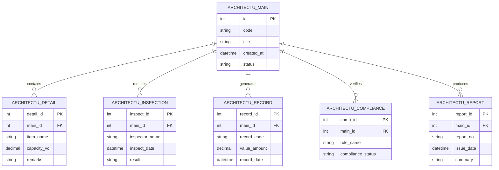

# Conceptual ERD — Architectural Design Management System

## Mermaid Code

## Entity Description Table | Bang mo ta Entity

| # | Entity Name | Vietnamese Name | Description | Key Attributes | Main Relationships |
|---|-------------|-----------------|-------------|----------------|-------------------|
| 1 | ARCHITECTU_MAIN | Entity architectu_main | Stores architectu_main data for Architectural Design Management System | id | Main core entity |
| 2 | ARCHITECTU_DETAIL | Entity architectu_detail | Stores architectu_detail data for Architectural Design Management System | detail_id | Main core entity |
| 3 | ARCHITECTU_INSPECTION | Entity architectu_inspection | Stores architectu_inspection data for Architectural Design Management System | inspect_id | Main core entity |
| 4 | ARCHITECTU_RECORD | Entity architectu_record | Stores architectu_record data for Architectural Design Management System | record_id | Main core entity |
| 5 | ARCHITECTU_COMPLIANCE | Entity architectu_compliance | Stores architectu_compliance data for Architectural Design Management System | comp_id | Main core entity |
| 6 | ARCHITECTU_REPORT | Entity architectu_report | Stores architectu_report data for Architectural Design Management System | report_id | Main core entity |

## Relationship Description | Mo ta Quan he

| # | From Entity | Cardinality | To Entity | Relationship Label | Business Explanation |
|---|-------------|-------------|-----------|-------------------|----------------------|
| 1 | ARCHITECTU_MAIN | one-to-many | ARCHITECTU_DETAIL | contains | Thanh phan chinh bao gom nhieu chi tiet nghiep vu |
| 2 | ARCHITECTU_MAIN | one-to-many | ARCHITECTU_INSPECTION | requires | Thanh phan chinh yeu cau cac dot kiem tra kiem dinh |
| 3 | ARCHITECTU_MAIN | one-to-many | ARCHITECTU_RECORD | generates | Thanh phan chinh xuat cac ban ghi thong ke |
| 4 | ARCHITECTU_MAIN | one-to-many | ARCHITECTU_COMPLIANCE | verifies | Thanh phan chinh kiem tra tinh tuan thu quy chuan |
| 5 | ARCHITECTU_MAIN | one-to-many | ARCHITECTU_REPORT | produces | Thanh phan chinh xuat cac bao cao tong hop |
