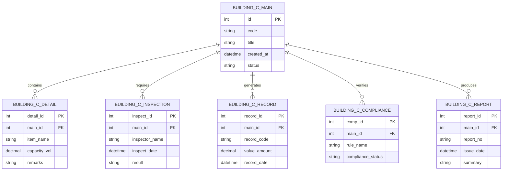

# Conceptual ERD — Building Code Compliance System

## Mermaid Code

## Entity Description Table | Bang mo ta Entity

| # | Entity Name | Vietnamese Name | Description | Key Attributes | Main Relationships |
|---|-------------|-----------------|-------------|----------------|-------------------|
| 1 | BUILDING_C_MAIN | Entity building_c_main | Stores building_c_main data for Building Code Compliance System | id | Main core entity |
| 2 | BUILDING_C_DETAIL | Entity building_c_detail | Stores building_c_detail data for Building Code Compliance System | detail_id | Main core entity |
| 3 | BUILDING_C_INSPECTION | Entity building_c_inspection | Stores building_c_inspection data for Building Code Compliance System | inspect_id | Main core entity |
| 4 | BUILDING_C_RECORD | Entity building_c_record | Stores building_c_record data for Building Code Compliance System | record_id | Main core entity |
| 5 | BUILDING_C_COMPLIANCE | Entity building_c_compliance | Stores building_c_compliance data for Building Code Compliance System | comp_id | Main core entity |
| 6 | BUILDING_C_REPORT | Entity building_c_report | Stores building_c_report data for Building Code Compliance System | report_id | Main core entity |

## Relationship Description | Mo ta Quan he

| # | From Entity | Cardinality | To Entity | Relationship Label | Business Explanation |
|---|-------------|-------------|-----------|-------------------|----------------------|
| 1 | BUILDING_C_MAIN | one-to-many | BUILDING_C_DETAIL | contains | Thanh phan chinh bao gom nhieu chi tiet nghiep vu |
| 2 | BUILDING_C_MAIN | one-to-many | BUILDING_C_INSPECTION | requires | Thanh phan chinh yeu cau cac dot kiem tra kiem dinh |
| 3 | BUILDING_C_MAIN | one-to-many | BUILDING_C_RECORD | generates | Thanh phan chinh xuat cac ban ghi thong ke |
| 4 | BUILDING_C_MAIN | one-to-many | BUILDING_C_COMPLIANCE | verifies | Thanh phan chinh kiem tra tinh tuan thu quy chuan |
| 5 | BUILDING_C_MAIN | one-to-many | BUILDING_C_REPORT | produces | Thanh phan chinh xuat cac bao cao tong hop |
