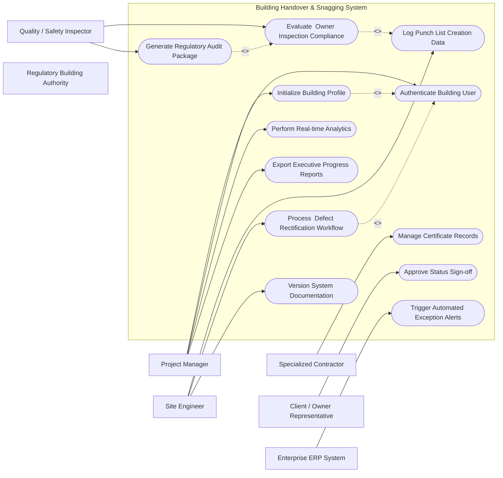

# Use Case Diagram — Building Handover & Snagging System

## Mermaid Code

## Actor Table | Bang Actor

| # | Actor | Actor Type | Role Description | Related Use Cases |
|---|-------|------------|------------------|-------------------|
| 1 | Project Manager | Primary | Responsible for execution and monitoring within Building Handover & Snagging System | UC01, UC02, UC07, UC12 |
| 2 | Site Engineer | Primary | Responsible for execution and monitoring within Building Handover & Snagging System | UC03, UC04, UC10 |
| 3 | Specialized Contractor | Primary | Responsible for execution and monitoring within Building Handover & Snagging System | UC06 |
| 4 | Quality / Safety Inspector | Primary | Responsible for execution and monitoring within Building Handover & Snagging System | UC05, UC08 |
| 5 | Client / Owner Representative | Primary | Responsible for execution and monitoring within Building Handover & Snagging System | UC09 |
| 6 | Enterprise ERP System | Supporting | Responsible for execution and monitoring within Building Handover & Snagging System | UC11 |
| 7 | Regulatory Building Authority | Regulatory | Responsible for execution and monitoring within Building Handover & Snagging System | UC01 |

## Use Case Table | Bang Use Case

| # | UC ID | Use Case Name | Primary Actor | Secondary Actor | Description | Priority |
|---|-------|---------------|---------------|-----------------|-------------|----------|
| 1 | UC01 | Authenticate Building User | Project Manager | None | Authenticates system user for Building Handover & Snagging System | High |
| 2 | UC02 | Initialize Building Profile | Project Manager | Client / Owner Representative | Sets up core project baseline and parameters for Building Handover & Snagging System | High |
| 3 | UC03 | Log Punch List Creation Data | Site Engineer | Specialized Contractor | Enters operational field records for Punch List Creation | High |
| 4 | UC04 | Process  Defect Rectification Workflow | Site Engineer | Quality / Safety Inspector | Executes standard process flow for  Defect Rectification | High |
| 5 | UC05 | Evaluate  Owner Inspection Compliance | Quality / Safety Inspector | Project Manager | Audits field activities against  Owner Inspection standards | High |
| 6 | UC06 | Manage  Certificate Records | Specialized Contractor | Site Engineer | Maintains documentation and certificates for  Certificate | High |
| 7 | UC07 | Perform Real-time Analytics | Project Manager | Enterprise ERP System | Computes system KPIs, variances, and status trends | Medium |
| 8 | UC08 | Generate Regulatory Audit Package | Quality / Safety Inspector | Regulatory Building Authority | Compiles required compliance documentation for official authority | High |
| 9 | UC09 | Approve Status Sign-off | Client / Owner Representative | Project Manager | Grants formal approval for project milestone completion | High |
| 10 | UC10 | Version System Documentation | Site Engineer | Project Manager | Tracks historical document revisions and sign-off logs | Medium |
| 11 | UC11 | Trigger Automated Exception Alerts | Enterprise ERP System | Project Manager | Issues system warnings upon threshold breaches | High |
| 12 | UC12 | Export Executive Progress Reports | Project Manager | Client / Owner Representative | Generates summary dashboard analytics and exportable reports | High |

## Use Case Specification | Dac ta Use Case

---

### UC02 — Initialize Building Profile

| Field | Detail |
|-------|--------|
| **UC ID** | UC02 |
| **Use Case Name** | Initialize Building Profile |
| **Actor(s)** | Primary: Project Manager   Secondary: Client / Owner Representative |
| **Description** | Sets up core project baseline and parameters for Building Handover & Snagging System |
| **Precondition** | 1. User is authenticated with valid role permissions.   2. Active project context is loaded in Building Handover & Snagging System. |
| **Main Flow** | 1. Actor selects "Initialize Building Profile" from system navigation menu.   2. System retrieves relevant workspace records and displays input interface.   3. Actor enters required operational parameters and attaches supporting documents.   4. System validates business logic constraints and data completeness.   5. Actor confirms action and submits form.   6. System saves record, updates status ledger, and issues confirmation notice. |
| **Alternative Flow** | **AF1** — Bulk Import: Actor uploads structured CSV/Excel template file for batch processing.   **AF2** — Draft Save: Actor saves input draft for pending review before final submission. |
| **Exception Flow** | **EX1** — Validation Error: System flags missing mandatory fields and highlights input errors.   **EX2** — Permission Denied: System blocks execution if user role lacks authorization. |
| **Postcondition** | Record is locked into system audit trail and downstream notification alerts are triggered. |
| **Business Rule** | **BR1**: All transactions must be timestamped and logged with user ID.   **BR2**: Changes affecting baseline figures require manager approval. |

---

### UC03 — Log Punch List Creation Data

| Field | Detail |
|-------|--------|
| **UC ID** | UC03 |
| **Use Case Name** | Log Punch List Creation Data |
| **Actor(s)** | Primary: Site Engineer   Secondary: Specialized Contractor |
| **Description** | Enters operational field records for Punch List Creation |
| **Precondition** | 1. User is authenticated with valid role permissions.   2. Active project context is loaded in Building Handover & Snagging System. |
| **Main Flow** | 1. Actor selects "Log Punch List Creation Data" from system navigation menu.   2. System retrieves relevant workspace records and displays input interface.   3. Actor enters required operational parameters and attaches supporting documents.   4. System validates business logic constraints and data completeness.   5. Actor confirms action and submits form.   6. System saves record, updates status ledger, and issues confirmation notice. |
| **Alternative Flow** | **AF1** — Bulk Import: Actor uploads structured CSV/Excel template file for batch processing.   **AF2** — Draft Save: Actor saves input draft for pending review before final submission. |
| **Exception Flow** | **EX1** — Validation Error: System flags missing mandatory fields and highlights input errors.   **EX2** — Permission Denied: System blocks execution if user role lacks authorization. |
| **Postcondition** | Record is locked into system audit trail and downstream notification alerts are triggered. |
| **Business Rule** | **BR1**: All transactions must be timestamped and logged with user ID.   **BR2**: Changes affecting baseline figures require manager approval. |

---

### UC04 — Process  Defect Rectification Workflow

| Field | Detail |
|-------|--------|
| **UC ID** | UC04 |
| **Use Case Name** | Process  Defect Rectification Workflow |
| **Actor(s)** | Primary: Site Engineer   Secondary: Quality / Safety Inspector |
| **Description** | Executes standard process flow for  Defect Rectification |
| **Precondition** | 1. User is authenticated with valid role permissions.   2. Active project context is loaded in Building Handover & Snagging System. |
| **Main Flow** | 1. Actor selects "Process  Defect Rectification Workflow" from system navigation menu.   2. System retrieves relevant workspace records and displays input interface.   3. Actor enters required operational parameters and attaches supporting documents.   4. System validates business logic constraints and data completeness.   5. Actor confirms action and submits form.   6. System saves record, updates status ledger, and issues confirmation notice. |
| **Alternative Flow** | **AF1** — Bulk Import: Actor uploads structured CSV/Excel template file for batch processing.   **AF2** — Draft Save: Actor saves input draft for pending review before final submission. |
| **Exception Flow** | **EX1** — Validation Error: System flags missing mandatory fields and highlights input errors.   **EX2** — Permission Denied: System blocks execution if user role lacks authorization. |
| **Postcondition** | Record is locked into system audit trail and downstream notification alerts are triggered. |
| **Business Rule** | **BR1**: All transactions must be timestamped and logged with user ID.   **BR2**: Changes affecting baseline figures require manager approval. |

---

### UC05 — Evaluate  Owner Inspection Compliance

| Field | Detail |
|-------|--------|
| **UC ID** | UC05 |
| **Use Case Name** | Evaluate  Owner Inspection Compliance |
| **Actor(s)** | Primary: Quality / Safety Inspector   Secondary: Project Manager |
| **Description** | Audits field activities against  Owner Inspection standards |
| **Precondition** | 1. User is authenticated with valid role permissions.   2. Active project context is loaded in Building Handover & Snagging System. |
| **Main Flow** | 1. Actor selects "Evaluate  Owner Inspection Compliance" from system navigation menu.   2. System retrieves relevant workspace records and displays input interface.   3. Actor enters required operational parameters and attaches supporting documents.   4. System validates business logic constraints and data completeness.   5. Actor confirms action and submits form.   6. System saves record, updates status ledger, and issues confirmation notice. |
| **Alternative Flow** | **AF1** — Bulk Import: Actor uploads structured CSV/Excel template file for batch processing.   **AF2** — Draft Save: Actor saves input draft for pending review before final submission. |
| **Exception Flow** | **EX1** — Validation Error: System flags missing mandatory fields and highlights input errors.   **EX2** — Permission Denied: System blocks execution if user role lacks authorization. |
| **Postcondition** | Record is locked into system audit trail and downstream notification alerts are triggered. |
| **Business Rule** | **BR1**: All transactions must be timestamped and logged with user ID.   **BR2**: Changes affecting baseline figures require manager approval. |

---

### UC06 — Manage  Certificate Records

| Field | Detail |
|-------|--------|
| **UC ID** | UC06 |
| **Use Case Name** | Manage  Certificate Records |
| **Actor(s)** | Primary: Specialized Contractor   Secondary: Site Engineer |
| **Description** | Maintains documentation and certificates for  Certificate |
| **Precondition** | 1. User is authenticated with valid role permissions.   2. Active project context is loaded in Building Handover & Snagging System. |
| **Main Flow** | 1. Actor selects "Manage  Certificate Records" from system navigation menu.   2. System retrieves relevant workspace records and displays input interface.   3. Actor enters required operational parameters and attaches supporting documents.   4. System validates business logic constraints and data completeness.   5. Actor confirms action and submits form.   6. System saves record, updates status ledger, and issues confirmation notice. |
| **Alternative Flow** | **AF1** — Bulk Import: Actor uploads structured CSV/Excel template file for batch processing.   **AF2** — Draft Save: Actor saves input draft for pending review before final submission. |
| **Exception Flow** | **EX1** — Validation Error: System flags missing mandatory fields and highlights input errors.   **EX2** — Permission Denied: System blocks execution if user role lacks authorization. |
| **Postcondition** | Record is locked into system audit trail and downstream notification alerts are triggered. |
| **Business Rule** | **BR1**: All transactions must be timestamped and logged with user ID.   **BR2**: Changes affecting baseline figures require manager approval. |

