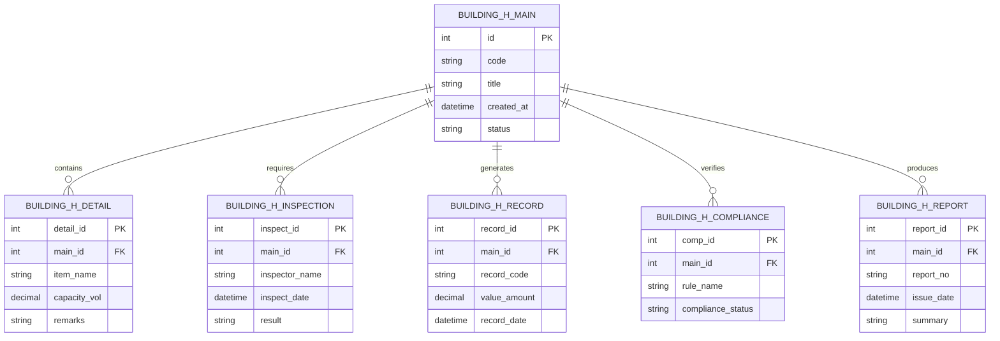

# Conceptual ERD — Building Handover & Snagging System

## Mermaid Code

## Entity Description Table | Bang mo ta Entity

| # | Entity Name | Vietnamese Name | Description | Key Attributes | Main Relationships |
|---|-------------|-----------------|-------------|----------------|-------------------|
| 1 | BUILDING_H_MAIN | Entity building_h_main | Stores building_h_main data for Building Handover & Snagging System | id | Main core entity |
| 2 | BUILDING_H_DETAIL | Entity building_h_detail | Stores building_h_detail data for Building Handover & Snagging System | detail_id | Main core entity |
| 3 | BUILDING_H_INSPECTION | Entity building_h_inspection | Stores building_h_inspection data for Building Handover & Snagging System | inspect_id | Main core entity |
| 4 | BUILDING_H_RECORD | Entity building_h_record | Stores building_h_record data for Building Handover & Snagging System | record_id | Main core entity |
| 5 | BUILDING_H_COMPLIANCE | Entity building_h_compliance | Stores building_h_compliance data for Building Handover & Snagging System | comp_id | Main core entity |
| 6 | BUILDING_H_REPORT | Entity building_h_report | Stores building_h_report data for Building Handover & Snagging System | report_id | Main core entity |

## Relationship Description | Mo ta Quan he

| # | From Entity | Cardinality | To Entity | Relationship Label | Business Explanation |
|---|-------------|-------------|-----------|-------------------|----------------------|
| 1 | BUILDING_H_MAIN | one-to-many | BUILDING_H_DETAIL | contains | Thanh phan chinh bao gom nhieu chi tiet nghiep vu |
| 2 | BUILDING_H_MAIN | one-to-many | BUILDING_H_INSPECTION | requires | Thanh phan chinh yeu cau cac dot kiem tra kiem dinh |
| 3 | BUILDING_H_MAIN | one-to-many | BUILDING_H_RECORD | generates | Thanh phan chinh xuat cac ban ghi thong ke |
| 4 | BUILDING_H_MAIN | one-to-many | BUILDING_H_COMPLIANCE | verifies | Thanh phan chinh kiem tra tinh tuan thu quy chuan |
| 5 | BUILDING_H_MAIN | one-to-many | BUILDING_H_REPORT | produces | Thanh phan chinh xuat cac bao cao tong hop |
