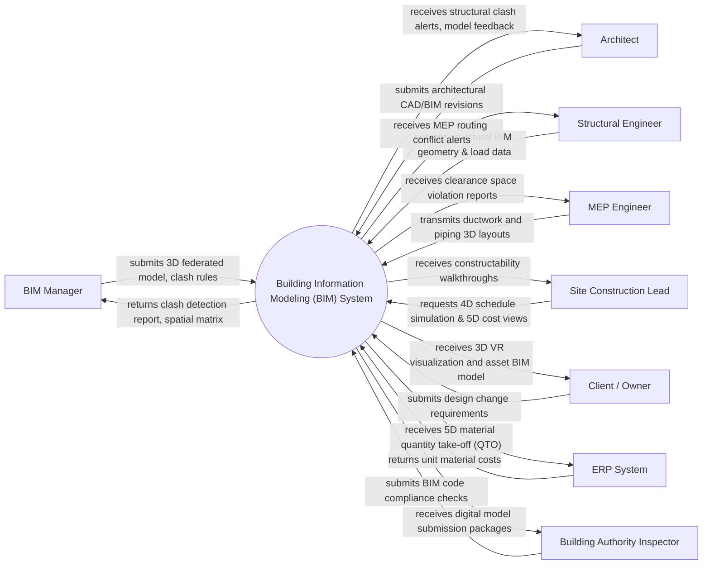

# Context Diagram — Building Information Modeling (BIM) System

## Mermaid Code

## Actor & Interaction Table | Bang Actor & Tuong tac

| # | Actor | Actor Type | Data Sent TO System | Data Received FROM System | Notes |
|---|-------|------------|---------------------|---------------------------|-------|
| 1 | BIM Manager | Primary | submits 3D federated model, clash rules | returns clash detection report, spatial matrix | Key stakeholder in Building Information Modeling (BIM) System |
| 2 | Architect | Primary | submits architectural CAD/BIM revisions | receives structural clash alerts, model feedback | Key stakeholder in Building Information Modeling (BIM) System |
| 3 | Structural Engineer | Primary | submits structural BIM geometry & load data | receives MEP routing conflict alerts | Key stakeholder in Building Information Modeling (BIM) System |
| 4 | MEP Engineer | Primary | transmits ductwork and piping 3D layouts | receives clearance space violation reports | Key stakeholder in Building Information Modeling (BIM) System |
| 5 | Site Construction Lead | Primary | requests 4D schedule simulation & 5D cost views | receives constructability walkthroughs | Key stakeholder in Building Information Modeling (BIM) System |
| 6 | Client / Owner | Primary | submits design change requirements | receives 3D VR visualization and asset BIM model | Key stakeholder in Building Information Modeling (BIM) System |
| 7 | ERP System | Supporting | returns unit material costs | receives 5D material quantity take-off (QTO) | Key stakeholder in Building Information Modeling (BIM) System |
| 8 | Building Authority Inspector | Regulatory | submits BIM code compliance checks | receives digital model submission packages | Key stakeholder in Building Information Modeling (BIM) System |

## System Boundary Description | Mo ta Pham vi He thong

He thong He thong Mo hinh hoa Thong tin Cong trinh (BIM) (Building Information Modeling (BIM) System) quan ly toan bo quy trinh nghiep vu cot loi trong pham vi du an. He thong tiep nhan du lieu tu cac ben lien quan, kiem tra tinh hop le va xu ly luu vet minh bach. Cac he thong ben ngoai va co quan quan ly tuong tac voi he thong thong qua giao dien ket noi va API duoc bao mat.
