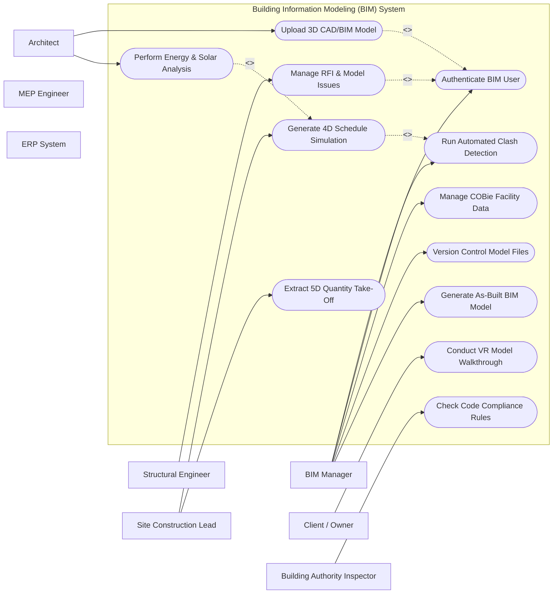

# Use Case Diagram — Building Information Modeling (BIM) System

## Mermaid Code

## Actor Table | Bang Actor

| # | Actor | Actor Type | Role Description | Related Use Cases |
|---|-------|------------|------------------|-------------------|
| 1 | BIM Manager | Primary | Responsible for execution and monitoring within Building Information Modeling (BIM) System | UC03, UC09, UC11, UC12 |
| 2 | Architect | Primary | Responsible for execution and monitoring within Building Information Modeling (BIM) System | UC02, UC08 |
| 3 | Structural Engineer | Primary | Responsible for execution and monitoring within Building Information Modeling (BIM) System | UC04 |
| 4 | MEP Engineer | Primary | Responsible for execution and monitoring within Building Information Modeling (BIM) System | UC01 |
| 5 | Site Construction Lead | Primary | Responsible for execution and monitoring within Building Information Modeling (BIM) System | UC05, UC06 |
| 6 | Client / Owner | Primary | Responsible for execution and monitoring within Building Information Modeling (BIM) System | UC07 |
| 7 | ERP System | Supporting | Responsible for execution and monitoring within Building Information Modeling (BIM) System | UC01 |
| 8 | Building Authority Inspector | Regulatory | Responsible for execution and monitoring within Building Information Modeling (BIM) System | UC10 |

## Use Case Table | Bang Use Case

| # | UC ID | Use Case Name | Primary Actor | Secondary Actor | Description | Priority |
|---|-------|---------------|---------------|-----------------|-------------|----------|
| 1 | UC01 | Authenticate BIM User | All Actors | None | Authenticates BIM user with role-based model privileges | High |
| 2 | UC02 | Upload 3D CAD/BIM Model | Architect | Structural Engineer | Uploads IFC or Revit BIM files to federated repository | High |
| 3 | UC03 | Run Automated Clash Detection | BIM Manager | MEP Engineer | Detects geometric hard/soft clashes across trades | High |
| 4 | UC04 | Manage RFI & Model Issues | Structural Engineer | Architect | Creates and tracks Request for Information linked to BIM elements | High |
| 5 | UC05 | Generate 4D Schedule Simulation | Site Construction Lead | BIM Manager | Links WBS timeline to 3D elements for constructability review | High |
| 6 | UC06 | Extract 5D Quantity Take-Off | Site Construction Lead | ERP System | Automates material volume & cost estimation from 3D model | High |
| 7 | UC07 | Conduct VR Model Walkthrough | Client / Owner | Architect | Renders virtual reality model view for stakeholder approval | Medium |
| 8 | UC08 | Perform Energy & Solar Analysis | Architect | None | Simulates thermal efficiency and solar shading | Medium |
| 9 | UC09 | Manage COBie Facility Data | BIM Manager | Client / Owner | Exports Construction Operations Building Information Exchange data | Medium |
| 10 | UC10 | Check Code Compliance Rules | Building Authority Inspector | BIM Manager | Runs automated check against municipal building standards | High |
| 11 | UC11 | Version Control Model Files | BIM Manager | All Actors | Tracks historical revisions and model branches | Medium |
| 12 | UC12 | Generate As-Built BIM Model | BIM Manager | Site Construction Lead | Finalizes as-built digital twin for facility handover | High |

## Use Case Specification | Dac ta Use Case

---

### UC02 — Upload 3D CAD/BIM Model

| Field | Detail |
|-------|--------|
| **UC ID** | UC02 |
| **Use Case Name** | Upload 3D CAD/BIM Model |
| **Actor(s)** | Primary: Architect   Secondary: Structural Engineer |
| **Description** | Uploads IFC or Revit BIM files to federated repository |
| **Precondition** | 1. User is authenticated with valid role permissions.   2. Active project context is loaded in Building Information Modeling (BIM) System. |
| **Main Flow** | 1. Actor selects "Upload 3D CAD/BIM Model" from system navigation menu.   2. System retrieves relevant workspace records and displays input interface.   3. Actor enters required operational parameters and attaches supporting documents.   4. System validates business logic constraints and data completeness.   5. Actor confirms action and submits form.   6. System saves record, updates status ledger, and issues confirmation notice. |
| **Alternative Flow** | **AF1** — Bulk Import: Actor uploads structured CSV/Excel template file for batch processing.   **AF2** — Draft Save: Actor saves input draft for pending review before final submission. |
| **Exception Flow** | **EX1** — Validation Error: System flags missing mandatory fields and highlights input errors.   **EX2** — Permission Denied: System blocks execution if user role lacks authorization. |
| **Postcondition** | Record is locked into system audit trail and downstream notification alerts are triggered. |
| **Business Rule** | **BR1**: All transactions must be timestamped and logged with user ID.   **BR2**: Changes affecting baseline figures require manager approval. |

---

### UC03 — Run Automated Clash Detection

| Field | Detail |
|-------|--------|
| **UC ID** | UC03 |
| **Use Case Name** | Run Automated Clash Detection |
| **Actor(s)** | Primary: BIM Manager   Secondary: MEP Engineer |
| **Description** | Detects geometric hard/soft clashes across trades |
| **Precondition** | 1. User is authenticated with valid role permissions.   2. Active project context is loaded in Building Information Modeling (BIM) System. |
| **Main Flow** | 1. Actor selects "Run Automated Clash Detection" from system navigation menu.   2. System retrieves relevant workspace records and displays input interface.   3. Actor enters required operational parameters and attaches supporting documents.   4. System validates business logic constraints and data completeness.   5. Actor confirms action and submits form.   6. System saves record, updates status ledger, and issues confirmation notice. |
| **Alternative Flow** | **AF1** — Bulk Import: Actor uploads structured CSV/Excel template file for batch processing.   **AF2** — Draft Save: Actor saves input draft for pending review before final submission. |
| **Exception Flow** | **EX1** — Validation Error: System flags missing mandatory fields and highlights input errors.   **EX2** — Permission Denied: System blocks execution if user role lacks authorization. |
| **Postcondition** | Record is locked into system audit trail and downstream notification alerts are triggered. |
| **Business Rule** | **BR1**: All transactions must be timestamped and logged with user ID.   **BR2**: Changes affecting baseline figures require manager approval. |

---

### UC04 — Manage RFI & Model Issues

| Field | Detail |
|-------|--------|
| **UC ID** | UC04 |
| **Use Case Name** | Manage RFI & Model Issues |
| **Actor(s)** | Primary: Structural Engineer   Secondary: Architect |
| **Description** | Creates and tracks Request for Information linked to BIM elements |
| **Precondition** | 1. User is authenticated with valid role permissions.   2. Active project context is loaded in Building Information Modeling (BIM) System. |
| **Main Flow** | 1. Actor selects "Manage RFI & Model Issues" from system navigation menu.   2. System retrieves relevant workspace records and displays input interface.   3. Actor enters required operational parameters and attaches supporting documents.   4. System validates business logic constraints and data completeness.   5. Actor confirms action and submits form.   6. System saves record, updates status ledger, and issues confirmation notice. |
| **Alternative Flow** | **AF1** — Bulk Import: Actor uploads structured CSV/Excel template file for batch processing.   **AF2** — Draft Save: Actor saves input draft for pending review before final submission. |
| **Exception Flow** | **EX1** — Validation Error: System flags missing mandatory fields and highlights input errors.   **EX2** — Permission Denied: System blocks execution if user role lacks authorization. |
| **Postcondition** | Record is locked into system audit trail and downstream notification alerts are triggered. |
| **Business Rule** | **BR1**: All transactions must be timestamped and logged with user ID.   **BR2**: Changes affecting baseline figures require manager approval. |

---

### UC05 — Generate 4D Schedule Simulation

| Field | Detail |
|-------|--------|
| **UC ID** | UC05 |
| **Use Case Name** | Generate 4D Schedule Simulation |
| **Actor(s)** | Primary: Site Construction Lead   Secondary: BIM Manager |
| **Description** | Links WBS timeline to 3D elements for constructability review |
| **Precondition** | 1. User is authenticated with valid role permissions.   2. Active project context is loaded in Building Information Modeling (BIM) System. |
| **Main Flow** | 1. Actor selects "Generate 4D Schedule Simulation" from system navigation menu.   2. System retrieves relevant workspace records and displays input interface.   3. Actor enters required operational parameters and attaches supporting documents.   4. System validates business logic constraints and data completeness.   5. Actor confirms action and submits form.   6. System saves record, updates status ledger, and issues confirmation notice. |
| **Alternative Flow** | **AF1** — Bulk Import: Actor uploads structured CSV/Excel template file for batch processing.   **AF2** — Draft Save: Actor saves input draft for pending review before final submission. |
| **Exception Flow** | **EX1** — Validation Error: System flags missing mandatory fields and highlights input errors.   **EX2** — Permission Denied: System blocks execution if user role lacks authorization. |
| **Postcondition** | Record is locked into system audit trail and downstream notification alerts are triggered. |
| **Business Rule** | **BR1**: All transactions must be timestamped and logged with user ID.   **BR2**: Changes affecting baseline figures require manager approval. |

---

### UC06 — Extract 5D Quantity Take-Off

| Field | Detail |
|-------|--------|
| **UC ID** | UC06 |
| **Use Case Name** | Extract 5D Quantity Take-Off |
| **Actor(s)** | Primary: Site Construction Lead   Secondary: ERP System |
| **Description** | Automates material volume & cost estimation from 3D model |
| **Precondition** | 1. User is authenticated with valid role permissions.   2. Active project context is loaded in Building Information Modeling (BIM) System. |
| **Main Flow** | 1. Actor selects "Extract 5D Quantity Take-Off" from system navigation menu.   2. System retrieves relevant workspace records and displays input interface.   3. Actor enters required operational parameters and attaches supporting documents.   4. System validates business logic constraints and data completeness.   5. Actor confirms action and submits form.   6. System saves record, updates status ledger, and issues confirmation notice. |
| **Alternative Flow** | **AF1** — Bulk Import: Actor uploads structured CSV/Excel template file for batch processing.   **AF2** — Draft Save: Actor saves input draft for pending review before final submission. |
| **Exception Flow** | **EX1** — Validation Error: System flags missing mandatory fields and highlights input errors.   **EX2** — Permission Denied: System blocks execution if user role lacks authorization. |
| **Postcondition** | Record is locked into system audit trail and downstream notification alerts are triggered. |
| **Business Rule** | **BR1**: All transactions must be timestamped and logged with user ID.   **BR2**: Changes affecting baseline figures require manager approval. |

