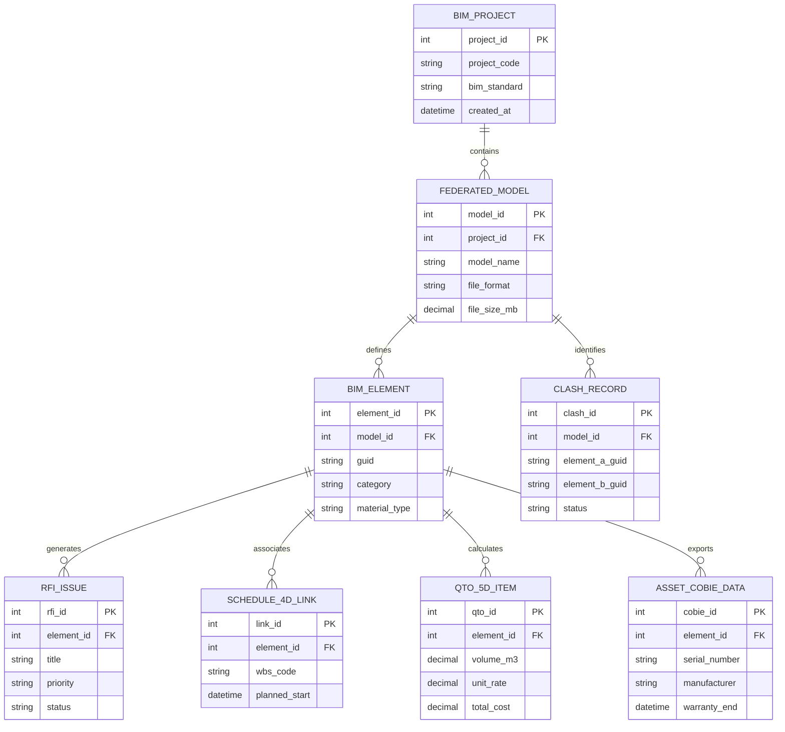

# Conceptual ERD — Building Information Modeling (BIM) System

## Mermaid Code

## Entity Description Table | Bang mo ta Entity

| # | Entity Name | Vietnamese Name | Description | Key Attributes | Main Relationships |
|---|-------------|-----------------|-------------|----------------|-------------------|
| 1 | BIM_PROJECT | Entity bim_project | Stores bim_project data for Building Information Modeling (BIM) System | project_id | Main core entity |
| 2 | FEDERATED_MODEL | Entity federated_model | Stores federated_model data for Building Information Modeling (BIM) System | model_id | Main core entity |
| 3 | BIM_ELEMENT | Entity bim_element | Stores bim_element data for Building Information Modeling (BIM) System | element_id | Main core entity |
| 4 | CLASH_RECORD | Entity clash_record | Stores clash_record data for Building Information Modeling (BIM) System | clash_id | Main core entity |
| 5 | RFI_ISSUE | Entity rfi_issue | Stores rfi_issue data for Building Information Modeling (BIM) System | rfi_id | Main core entity |
| 6 | SCHEDULE_4D_LINK | Entity schedule_4d_link | Stores schedule_4d_link data for Building Information Modeling (BIM) System | link_id | Main core entity |
| 7 | QTO_5D_ITEM | Entity qto_5d_item | Stores qto_5d_item data for Building Information Modeling (BIM) System | qto_id | Main core entity |
| 8 | ASSET_COBIE_DATA | Entity asset_cobie_data | Stores asset_cobie_data data for Building Information Modeling (BIM) System | cobie_id | Main core entity |

## Relationship Description | Mo ta Quan he

| # | From Entity | Cardinality | To Entity | Relationship Label | Business Explanation |
|---|-------------|-------------|-----------|-------------------|----------------------|
| 1 | BIM_PROJECT | one-to-many | FEDERATED_MODEL | contains | Mot du an BIM chua nhieu file mo hinh thanh phan |
| 2 | FEDERATED_MODEL | one-to-many | BIM_ELEMENT | defines | Mo hinh dinh nghia nhieu doi tuong BIM chi tiet |
| 3 | FEDERATED_MODEL | one-to-many | CLASH_RECORD | identifies | Mo hinh phat hien nhieu va chạm hinh hoc |
| 4 | BIM_ELEMENT | one-to-many | RFI_ISSUE | generates | Doi tuong BIM phat sinh yeu cau lam ro RFI |
| 5 | BIM_ELEMENT | one-to-many | SCHEDULE_4D_LINK | associates | Doi tuong BIM lien ket voi tien do 4D |
| 6 | BIM_ELEMENT | one-to-many | QTO_5D_ITEM | calculates | Doi tuong BIM xuat khoi luong va chi phi 5D |
| 7 | BIM_ELEMENT | one-to-many | ASSET_COBIE_DATA | exports | Doi tuong BIM xuat du lieu quan ly tai san COBie |
