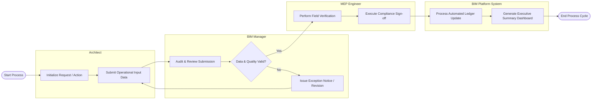

# Swimlane Diagram — Building Information Modeling (BIM) System

## Mermaid Code

## Flow Description | Mo ta luong

| Lane | Actor / System | Role in Flow |
|------|----------------|--------------|
| 1 | Architect | Initiates requests and logs operational data into Building Information Modeling (BIM) System. |
| 2 | BIM Manager | Audits data validity, checks operational thresholds, and issues revision requests if needed. |
| 3 | MEP Engineer | Conducts physical or technical verification and grants formal sign-off. |
| 4 | BIM Platform System | Automatically updates database records, recalculates indicators, and displays executive dashboards. |
