# Action Tree — Building Information Modeling (BIM) System

## Mermaid Code

```mermaid
graph TD
    Root["Building Information Modeling (BIM) System"]

    Root --> M1["Model Repository & Federation Module"]
    Root --> M2["Clash Detection & Quality QA/QC Module"]
    Root --> M3["4D Schedule & 5D Cost Integration Module"]
    Root --> M4["RFI & Issue Management Module"]
    Root --> M5["COBie & Handover Digital Twin Module"]

    M1 --> A1_1["Upload IFC/Revit Models"]
    M1 --> A1_2["Federate Multi-Discipline Models"]
    M1 --> A1_3["Manage Version Branches"]

    M2 --> A2_1["Configure Clash Matrix Rules"]
    M2 --> A2_2["Run Geometric Clash Analysis"]
    M2 --> A2_3["Assign Clash Resolution Tasks"]

    M3 --> A3_1["Map WBS Tasks to BIM Elements"]
    M3 --> A3_2["Simulate Construction Sequence"]
    M3 --> A3_3["Export 5D QTO Cost Reports"]

    M4 --> A4_1["Raise Element-Linked RFIs"]
    M4 --> A4_2["Track Issue Resolution"]
    M4 --> A4_3["Generate BCF Markup Packages"]

    M5 --> A5_1["Extract COBie Asset Metadata"]
    M5 --> A5_2["Verify As-Built Geometry"]
    M5 --> A5_3["Export Digital Twin File"]
```

## Module Description | Mo ta Module

| # | Module | Description | Actions |
|---|--------|-------------|---------|
| 1 | Model Repository & Federation Module | Handles core functions for Model Repository & Federation Module | Upload IFC/Revit Models, Federate Multi-Discipline Models, Manage Version Branches |
| 2 | Clash Detection & Quality QA/QC Module | Handles core functions for Clash Detection & Quality QA/QC Module | Configure Clash Matrix Rules, Run Geometric Clash Analysis, Assign Clash Resolution Tasks |
| 3 | 4D Schedule & 5D Cost Integration Module | Handles core functions for 4D Schedule & 5D Cost Integration Module | Map WBS Tasks to BIM Elements, Simulate Construction Sequence, Export 5D QTO Cost Reports |
| 4 | RFI & Issue Management Module | Handles core functions for RFI & Issue Management Module | Raise Element-Linked RFIs, Track Issue Resolution, Generate BCF Markup Packages |
| 5 | COBie & Handover Digital Twin Module | Handles core functions for COBie & Handover Digital Twin Module | Extract COBie Asset Metadata, Verify As-Built Geometry, Export Digital Twin File |
