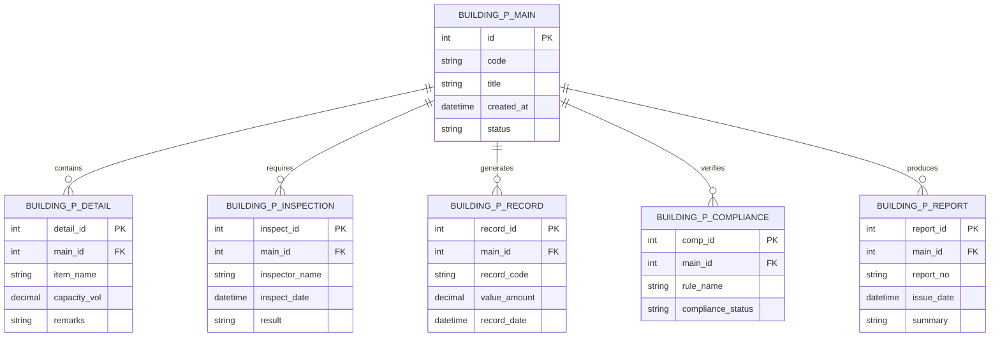

# Conceptual ERD — Building Permit & Approval System

## Mermaid Code

## Entity Description Table | Bang mo ta Entity

| # | Entity Name | Vietnamese Name | Description | Key Attributes | Main Relationships |
|---|-------------|-----------------|-------------|----------------|-------------------|
| 1 | BUILDING_P_MAIN | Entity building_p_main | Stores building_p_main data for Building Permit & Approval System | id | Main core entity |
| 2 | BUILDING_P_DETAIL | Entity building_p_detail | Stores building_p_detail data for Building Permit & Approval System | detail_id | Main core entity |
| 3 | BUILDING_P_INSPECTION | Entity building_p_inspection | Stores building_p_inspection data for Building Permit & Approval System | inspect_id | Main core entity |
| 4 | BUILDING_P_RECORD | Entity building_p_record | Stores building_p_record data for Building Permit & Approval System | record_id | Main core entity |
| 5 | BUILDING_P_COMPLIANCE | Entity building_p_compliance | Stores building_p_compliance data for Building Permit & Approval System | comp_id | Main core entity |
| 6 | BUILDING_P_REPORT | Entity building_p_report | Stores building_p_report data for Building Permit & Approval System | report_id | Main core entity |

## Relationship Description | Mo ta Quan he

| # | From Entity | Cardinality | To Entity | Relationship Label | Business Explanation |
|---|-------------|-------------|-----------|-------------------|----------------------|
| 1 | BUILDING_P_MAIN | one-to-many | BUILDING_P_DETAIL | contains | Thanh phan chinh bao gom nhieu chi tiet nghiep vu |
| 2 | BUILDING_P_MAIN | one-to-many | BUILDING_P_INSPECTION | requires | Thanh phan chinh yeu cau cac dot kiem tra kiem dinh |
| 3 | BUILDING_P_MAIN | one-to-many | BUILDING_P_RECORD | generates | Thanh phan chinh xuat cac ban ghi thong ke |
| 4 | BUILDING_P_MAIN | one-to-many | BUILDING_P_COMPLIANCE | verifies | Thanh phan chinh kiem tra tinh tuan thu quy chuan |
| 5 | BUILDING_P_MAIN | one-to-many | BUILDING_P_REPORT | produces | Thanh phan chinh xuat cac bao cao tong hop |
