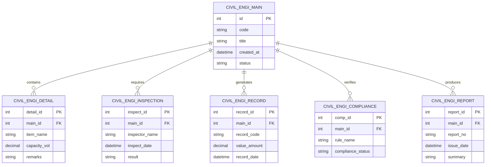

# Conceptual ERD — Civil Engineering Works Management System

## Mermaid Code

## Entity Description Table | Bang mo ta Entity

| # | Entity Name | Vietnamese Name | Description | Key Attributes | Main Relationships |
|---|-------------|-----------------|-------------|----------------|-------------------|
| 1 | CIVIL_ENGI_MAIN | Entity civil_engi_main | Stores civil_engi_main data for Civil Engineering Works Management System | id | Main core entity |
| 2 | CIVIL_ENGI_DETAIL | Entity civil_engi_detail | Stores civil_engi_detail data for Civil Engineering Works Management System | detail_id | Main core entity |
| 3 | CIVIL_ENGI_INSPECTION | Entity civil_engi_inspection | Stores civil_engi_inspection data for Civil Engineering Works Management System | inspect_id | Main core entity |
| 4 | CIVIL_ENGI_RECORD | Entity civil_engi_record | Stores civil_engi_record data for Civil Engineering Works Management System | record_id | Main core entity |
| 5 | CIVIL_ENGI_COMPLIANCE | Entity civil_engi_compliance | Stores civil_engi_compliance data for Civil Engineering Works Management System | comp_id | Main core entity |
| 6 | CIVIL_ENGI_REPORT | Entity civil_engi_report | Stores civil_engi_report data for Civil Engineering Works Management System | report_id | Main core entity |

## Relationship Description | Mo ta Quan he

| # | From Entity | Cardinality | To Entity | Relationship Label | Business Explanation |
|---|-------------|-------------|-----------|-------------------|----------------------|
| 1 | CIVIL_ENGI_MAIN | one-to-many | CIVIL_ENGI_DETAIL | contains | Thanh phan chinh bao gom nhieu chi tiet nghiep vu |
| 2 | CIVIL_ENGI_MAIN | one-to-many | CIVIL_ENGI_INSPECTION | requires | Thanh phan chinh yeu cau cac dot kiem tra kiem dinh |
| 3 | CIVIL_ENGI_MAIN | one-to-many | CIVIL_ENGI_RECORD | generates | Thanh phan chinh xuat cac ban ghi thong ke |
| 4 | CIVIL_ENGI_MAIN | one-to-many | CIVIL_ENGI_COMPLIANCE | verifies | Thanh phan chinh kiem tra tinh tuan thu quy chuan |
| 5 | CIVIL_ENGI_MAIN | one-to-many | CIVIL_ENGI_REPORT | produces | Thanh phan chinh xuat cac bao cao tong hop |
