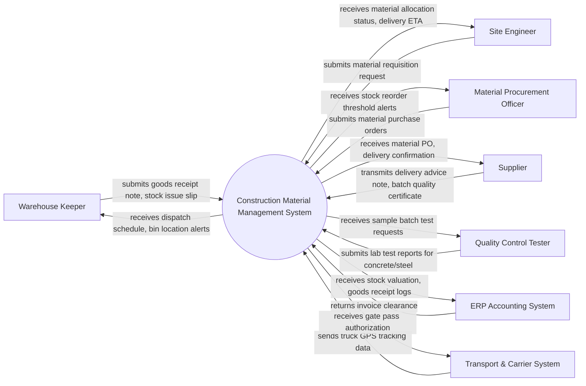

# Context Diagram — Construction Material Management System

## Mermaid Code

## Actor & Interaction Table | Bang Actor & Tuong tac

| # | Actor | Actor Type | Data Sent TO System | Data Received FROM System | Notes |
|---|-------|------------|---------------------|---------------------------|-------|
| 1 | Warehouse Keeper | Primary | submits goods receipt note, stock issue slip | receives dispatch schedule, bin location alerts | Key stakeholder in Construction Material Management System |
| 2 | Site Engineer | Primary | submits material requisition request | receives material allocation status, delivery ETA | Key stakeholder in Construction Material Management System |
| 3 | Material Procurement Officer | Primary | submits material purchase orders | receives stock reorder threshold alerts | Key stakeholder in Construction Material Management System |
| 4 | Supplier | Primary | transmits delivery advice note, batch quality certificate | receives material PO, delivery confirmation | Key stakeholder in Construction Material Management System |
| 5 | Quality Control Tester | Primary | submits lab test reports for concrete/steel | receives sample batch test requests | Key stakeholder in Construction Material Management System |
| 6 | ERP Accounting System | Supporting | returns invoice clearance | receives stock valuation, goods receipt logs | Key stakeholder in Construction Material Management System |
| 7 | Transport & Carrier System | Supporting | sends truck GPS tracking data | receives gate pass authorization | Key stakeholder in Construction Material Management System |

## System Boundary Description | Mo ta Pham vi He thong

He thong He thong Quan ly Vat lieu Xay dung (Construction Material Management System) quan ly toan bo quy trinh nghiep vu cot loi trong pham vi du an. He thong tiep nhan du lieu tu cac ben lien quan, kiem tra tinh hop le va xu ly luu vet minh bach. Cac he thong ben ngoai va co quan quan ly tuong tac voi he thong thong qua giao dien ket noi va API duoc bao mat.
