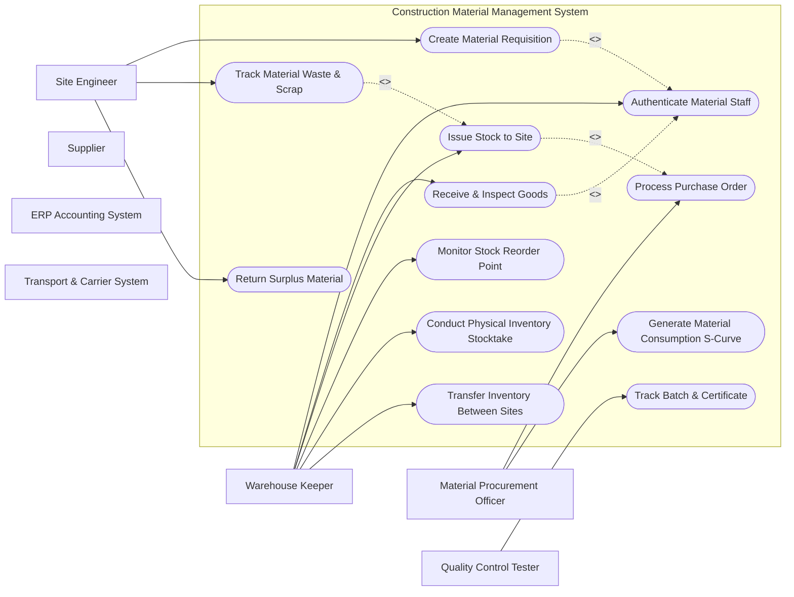

# Use Case Diagram — Construction Material Management System

## Mermaid Code

## Actor Table | Bang Actor

| # | Actor | Actor Type | Role Description | Related Use Cases |
|---|-------|------------|------------------|-------------------|
| 1 | Warehouse Keeper | Primary | Responsible for execution and monitoring within Construction Material Management System | UC01, UC04, UC05, UC07, UC09, UC10 |
| 2 | Site Engineer | Primary | Responsible for execution and monitoring within Construction Material Management System | UC02, UC08, UC12 |
| 3 | Material Procurement Officer | Primary | Responsible for execution and monitoring within Construction Material Management System | UC03, UC11 |
| 4 | Supplier | Primary | Responsible for execution and monitoring within Construction Material Management System | UC01 |
| 5 | Quality Control Tester | Primary | Responsible for execution and monitoring within Construction Material Management System | UC06 |
| 6 | ERP Accounting System | Supporting | Responsible for execution and monitoring within Construction Material Management System | UC01 |
| 7 | Transport & Carrier System | Supporting | Responsible for execution and monitoring within Construction Material Management System | UC01 |

## Use Case Table | Bang Use Case

| # | UC ID | Use Case Name | Primary Actor | Secondary Actor | Description | Priority |
|---|-------|---------------|---------------|-----------------|-------------|----------|
| 1 | UC01 | Authenticate Material Staff | Warehouse Keeper | None | Authenticates warehouse personnel and site engineers | High |
| 2 | UC02 | Create Material Requisition | Site Engineer | Warehouse Keeper | Submits request for raw materials needed on site | High |
| 3 | UC03 | Process Purchase Order | Material Procurement Officer | Supplier | Issues material PO to approved suppliers | High |
| 4 | UC04 | Receive & Inspect Goods | Warehouse Keeper | Quality Control Tester | Logs incoming delivery note, checks quantity & quality sample | High |
| 5 | UC05 | Issue Stock to Site | Warehouse Keeper | Site Engineer | Dispatches requested materials and updates inventory bin location | High |
| 6 | UC06 | Track Batch & Certificate | Quality Control Tester | Supplier | Links mill test certificates to steel/concrete batches | Medium |
| 7 | UC07 | Monitor Stock Reorder Point | Warehouse Keeper | Material Procurement Officer | Monitors safety stock level and generates auto-replenishment alert | High |
| 8 | UC08 | Track Material Waste & Scrap | Site Engineer | Warehouse Keeper | Logs damaged materials, cutoff scrap, and site wastage | Medium |
| 9 | UC09 | Conduct Physical Inventory Stocktake | Warehouse Keeper | ERP Accounting System | Reconciles actual physical stock with system ledger | High |
| 10 | UC10 | Transfer Inventory Between Sites | Warehouse Keeper | Site Engineer | Manages inter-site material movement and transit logs | Medium |
| 11 | UC11 | Generate Material Consumption S-Curve | Material Procurement Officer | ERP Accounting System | Plots actual vs estimated material consumption rate | High |
| 12 | UC12 | Return Surplus Material | Site Engineer | Warehouse Keeper | Returns unused materials from site to main yard | Low |

## Use Case Specification | Dac ta Use Case

---

### UC02 — Create Material Requisition

| Field | Detail |
|-------|--------|
| **UC ID** | UC02 |
| **Use Case Name** | Create Material Requisition |
| **Actor(s)** | Primary: Site Engineer   Secondary: Warehouse Keeper |
| **Description** | Submits request for raw materials needed on site |
| **Precondition** | 1. User is authenticated with valid role permissions.   2. Active project context is loaded in Construction Material Management System. |
| **Main Flow** | 1. Actor selects "Create Material Requisition" from system navigation menu.   2. System retrieves relevant workspace records and displays input interface.   3. Actor enters required operational parameters and attaches supporting documents.   4. System validates business logic constraints and data completeness.   5. Actor confirms action and submits form.   6. System saves record, updates status ledger, and issues confirmation notice. |
| **Alternative Flow** | **AF1** — Bulk Import: Actor uploads structured CSV/Excel template file for batch processing.   **AF2** — Draft Save: Actor saves input draft for pending review before final submission. |
| **Exception Flow** | **EX1** — Validation Error: System flags missing mandatory fields and highlights input errors.   **EX2** — Permission Denied: System blocks execution if user role lacks authorization. |
| **Postcondition** | Record is locked into system audit trail and downstream notification alerts are triggered. |
| **Business Rule** | **BR1**: All transactions must be timestamped and logged with user ID.   **BR2**: Changes affecting baseline figures require manager approval. |

---

### UC03 — Process Purchase Order

| Field | Detail |
|-------|--------|
| **UC ID** | UC03 |
| **Use Case Name** | Process Purchase Order |
| **Actor(s)** | Primary: Material Procurement Officer   Secondary: Supplier |
| **Description** | Issues material PO to approved suppliers |
| **Precondition** | 1. User is authenticated with valid role permissions.   2. Active project context is loaded in Construction Material Management System. |
| **Main Flow** | 1. Actor selects "Process Purchase Order" from system navigation menu.   2. System retrieves relevant workspace records and displays input interface.   3. Actor enters required operational parameters and attaches supporting documents.   4. System validates business logic constraints and data completeness.   5. Actor confirms action and submits form.   6. System saves record, updates status ledger, and issues confirmation notice. |
| **Alternative Flow** | **AF1** — Bulk Import: Actor uploads structured CSV/Excel template file for batch processing.   **AF2** — Draft Save: Actor saves input draft for pending review before final submission. |
| **Exception Flow** | **EX1** — Validation Error: System flags missing mandatory fields and highlights input errors.   **EX2** — Permission Denied: System blocks execution if user role lacks authorization. |
| **Postcondition** | Record is locked into system audit trail and downstream notification alerts are triggered. |
| **Business Rule** | **BR1**: All transactions must be timestamped and logged with user ID.   **BR2**: Changes affecting baseline figures require manager approval. |

---

### UC04 — Receive & Inspect Goods

| Field | Detail |
|-------|--------|
| **UC ID** | UC04 |
| **Use Case Name** | Receive & Inspect Goods |
| **Actor(s)** | Primary: Warehouse Keeper   Secondary: Quality Control Tester |
| **Description** | Logs incoming delivery note, checks quantity & quality sample |
| **Precondition** | 1. User is authenticated with valid role permissions.   2. Active project context is loaded in Construction Material Management System. |
| **Main Flow** | 1. Actor selects "Receive & Inspect Goods" from system navigation menu.   2. System retrieves relevant workspace records and displays input interface.   3. Actor enters required operational parameters and attaches supporting documents.   4. System validates business logic constraints and data completeness.   5. Actor confirms action and submits form.   6. System saves record, updates status ledger, and issues confirmation notice. |
| **Alternative Flow** | **AF1** — Bulk Import: Actor uploads structured CSV/Excel template file for batch processing.   **AF2** — Draft Save: Actor saves input draft for pending review before final submission. |
| **Exception Flow** | **EX1** — Validation Error: System flags missing mandatory fields and highlights input errors.   **EX2** — Permission Denied: System blocks execution if user role lacks authorization. |
| **Postcondition** | Record is locked into system audit trail and downstream notification alerts are triggered. |
| **Business Rule** | **BR1**: All transactions must be timestamped and logged with user ID.   **BR2**: Changes affecting baseline figures require manager approval. |

---

### UC05 — Issue Stock to Site

| Field | Detail |
|-------|--------|
| **UC ID** | UC05 |
| **Use Case Name** | Issue Stock to Site |
| **Actor(s)** | Primary: Warehouse Keeper   Secondary: Site Engineer |
| **Description** | Dispatches requested materials and updates inventory bin location |
| **Precondition** | 1. User is authenticated with valid role permissions.   2. Active project context is loaded in Construction Material Management System. |
| **Main Flow** | 1. Actor selects "Issue Stock to Site" from system navigation menu.   2. System retrieves relevant workspace records and displays input interface.   3. Actor enters required operational parameters and attaches supporting documents.   4. System validates business logic constraints and data completeness.   5. Actor confirms action and submits form.   6. System saves record, updates status ledger, and issues confirmation notice. |
| **Alternative Flow** | **AF1** — Bulk Import: Actor uploads structured CSV/Excel template file for batch processing.   **AF2** — Draft Save: Actor saves input draft for pending review before final submission. |
| **Exception Flow** | **EX1** — Validation Error: System flags missing mandatory fields and highlights input errors.   **EX2** — Permission Denied: System blocks execution if user role lacks authorization. |
| **Postcondition** | Record is locked into system audit trail and downstream notification alerts are triggered. |
| **Business Rule** | **BR1**: All transactions must be timestamped and logged with user ID.   **BR2**: Changes affecting baseline figures require manager approval. |

---

### UC06 — Track Batch & Certificate

| Field | Detail |
|-------|--------|
| **UC ID** | UC06 |
| **Use Case Name** | Track Batch & Certificate |
| **Actor(s)** | Primary: Quality Control Tester   Secondary: Supplier |
| **Description** | Links mill test certificates to steel/concrete batches |
| **Precondition** | 1. User is authenticated with valid role permissions.   2. Active project context is loaded in Construction Material Management System. |
| **Main Flow** | 1. Actor selects "Track Batch & Certificate" from system navigation menu.   2. System retrieves relevant workspace records and displays input interface.   3. Actor enters required operational parameters and attaches supporting documents.   4. System validates business logic constraints and data completeness.   5. Actor confirms action and submits form.   6. System saves record, updates status ledger, and issues confirmation notice. |
| **Alternative Flow** | **AF1** — Bulk Import: Actor uploads structured CSV/Excel template file for batch processing.   **AF2** — Draft Save: Actor saves input draft for pending review before final submission. |
| **Exception Flow** | **EX1** — Validation Error: System flags missing mandatory fields and highlights input errors.   **EX2** — Permission Denied: System blocks execution if user role lacks authorization. |
| **Postcondition** | Record is locked into system audit trail and downstream notification alerts are triggered. |
| **Business Rule** | **BR1**: All transactions must be timestamped and logged with user ID.   **BR2**: Changes affecting baseline figures require manager approval. |

