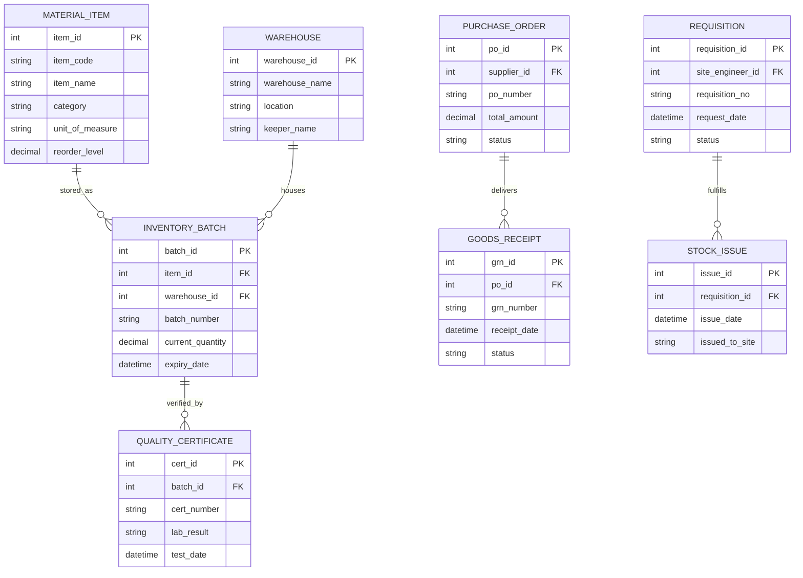

# Conceptual ERD — Construction Material Management System

## Mermaid Code

## Entity Description Table | Bang mo ta Entity

| # | Entity Name | Vietnamese Name | Description | Key Attributes | Main Relationships |
|---|-------------|-----------------|-------------|----------------|-------------------|
| 1 | MATERIAL_ITEM | Entity material_item | Stores material_item data for Construction Material Management System | item_id | Main core entity |
| 2 | WAREHOUSE | Entity warehouse | Stores warehouse data for Construction Material Management System | warehouse_id | Main core entity |
| 3 | INVENTORY_BATCH | Entity inventory_batch | Stores inventory_batch data for Construction Material Management System | batch_id | Main core entity |
| 4 | REQUISITION | Entity requisition | Stores requisition data for Construction Material Management System | requisition_id | Main core entity |
| 5 | PURCHASE_ORDER | Entity purchase_order | Stores purchase_order data for Construction Material Management System | po_id | Main core entity |
| 6 | GOODS_RECEIPT | Entity goods_receipt | Stores goods_receipt data for Construction Material Management System | grn_id | Main core entity |
| 7 | STOCK_ISSUE | Entity stock_issue | Stores stock_issue data for Construction Material Management System | issue_id | Main core entity |
| 8 | QUALITY_CERTIFICATE | Entity quality_certificate | Stores quality_certificate data for Construction Material Management System | cert_id | Main core entity |

## Relationship Description | Mo ta Quan he

| # | From Entity | Cardinality | To Entity | Relationship Label | Business Explanation |
|---|-------------|-------------|-----------|-------------------|----------------------|
| 1 | MATERIAL_ITEM | one-to-many | INVENTORY_BATCH | stored_as | Mot vat lieu co nhieu lo hang ton kho |
| 2 | WAREHOUSE | one-to-many | INVENTORY_BATCH | houses | Kho hang quan ly nhieu lo vat lieu |
| 3 | REQUISITION | one-to-many | STOCK_ISSUE | fulfills | Phieu yeu cau duoc xuat kho bang nhieu phieu phat |
| 4 | PURCHASE_ORDER | one-to-many | GOODS_RECEIPT | delivers | Don mua hang nhan duoc qua cac phieu nhan kho |
| 5 | INVENTORY_BATCH | one-to-many | QUALITY_CERTIFICATE | verified_by | Lo vat lieu duoc xac nhan qua chung chi chat luong |
