# Action Tree — Construction Material Management System

## Mermaid Code

```mermaid
graph TD
    Root["Construction Material Management System"]

    Root --> M1["Material Catalog & Inventory Module"]
    Root --> M2["Requisition & Allocation Module"]
    Root --> M3["Procurement & Receiving Module"]
    Root --> M4["Quality & Batch Traceability Module"]
    Root --> M5["Stock Audit & Analytics Module"]

    M1 --> A1_1["Define Item Master"]
    M1 --> A1_2["Track Batch Numbers"]
    M1 --> A1_3["Manage Bin Locations"]

    M2 --> A2_1["Submit Site Requisition"]
    M2 --> A2_2["Approve Material Requests"]
    M2 --> A2_3["Issue Goods Dispatch Slip"]

    M3 --> A3_1["Issue Purchase Order"]
    M3 --> A3_2["Inspect Incoming Goods"]
    M3 --> A3_3["Generate Goods Receipt Note"]

    M4 --> A4_1["Attach Mill Certificates"]
    M4 --> A4_2["Log Lab Test Results"]
    M4 --> A4_3["Block Defective Batches"]

    M5 --> A5_1["Conduct Stocktake Audit"]
    M5 --> A5_2["Track Material Scrap Rate"]
    M5 --> A5_3["Generate Consumption S-Curves"]
```

## Module Description | Mo ta Module

| # | Module | Description | Actions |
|---|--------|-------------|---------|
| 1 | Material Catalog & Inventory Module | Handles core functions for Material Catalog & Inventory Module | Define Item Master, Track Batch Numbers, Manage Bin Locations |
| 2 | Requisition & Allocation Module | Handles core functions for Requisition & Allocation Module | Submit Site Requisition, Approve Material Requests, Issue Goods Dispatch Slip |
| 3 | Procurement & Receiving Module | Handles core functions for Procurement & Receiving Module | Issue Purchase Order, Inspect Incoming Goods, Generate Goods Receipt Note |
| 4 | Quality & Batch Traceability Module | Handles core functions for Quality & Batch Traceability Module | Attach Mill Certificates, Log Lab Test Results, Block Defective Batches |
| 5 | Stock Audit & Analytics Module | Handles core functions for Stock Audit & Analytics Module | Conduct Stocktake Audit, Track Material Scrap Rate, Generate Consumption S-Curves |
