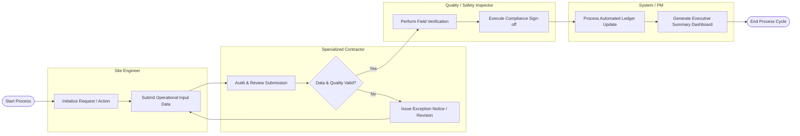

# Swimlane Diagram — Construction Procurement System

## Mermaid Code

## Flow Description | Mo ta luong

| Lane | Actor / System | Role in Flow |
|------|----------------|--------------|
| 1 | Site Engineer | Initiates requests and logs operational data into Construction Procurement System. |
| 2 | Specialized Contractor | Audits data validity, checks operational thresholds, and issues revision requests if needed. |
| 3 | Quality / Safety Inspector | Conducts physical or technical verification and grants formal sign-off. |
| 4 | System / PM | Automatically updates database records, recalculates indicators, and displays executive dashboards. |
