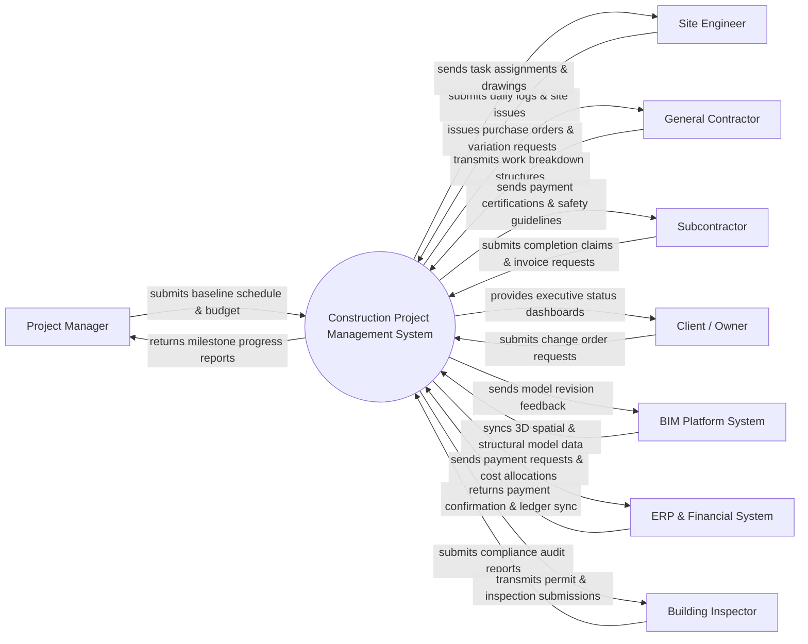

# Context Diagram — Construction Project Management System

## Mermaid Code

## Actor & Interaction Table | Bang Actor & Tuong tac

| # | Actor | Actor Type | Data Sent TO System | Data Received FROM System | Notes |
|---|-------|------------|---------------------|---------------------------|-------|
| 1 | Project Manager | Primary | Submits baseline schedule, budget parameters, resource allocations | Receives milestone progress reports, cost variance analytics | Key user responsible for project planning, tracking, and overall execution |
| 2 | Site Engineer | Primary | Submits daily site logs, inspection requests, quality issues | Receives task assignments, updated engineering drawings, safety checklists | On-site technical staff tracking daily construction activities |
| 3 | General Contractor | Primary | Transmits work breakdown structures, equipment allocation, site bids | Receives purchase orders, variation requests, contract status | Main contractor overseeing construction execution |
| 4 | Subcontractor | Primary | Submits work completion claims, invoice requests, progress photos | Receives payment certifications, work packages, safety guidelines | Specialized trade contractors (e.g. electrical, plumbing, masonry) |
| 5 | Client / Owner | Primary | Submits change order requests, design approval parameters | Receives executive status dashboards, project progress videos, financial summaries | Project owner or real estate developer funding the construction project |
| 6 | BIM Platform System | Supporting | Syncs 3D spatial and structural model data, clash detection logs | Receives model revision feedback, field variance notes | 3rd-party Building Information Modeling software integrated with system |
| 7 | ERP & Financial System | Supporting | Returns payment confirmation, ledger sync, tax clearance status | Receives payment requests, cost allocations, material purchase invoices | Enterprise financial and accounting software |
| 8 | Building Inspector | Regulatory | Submits compliance audit reports, inspection approvals, occupancy permits | Receives permit applications, inspection request submissions, compliance documentation | Government or municipal building control authority |

## System Boundary Description | Mo ta Pham vi He thong

He thong Quan ly Du an Xay dung (Construction Project Management System) la he thong trung tam quan ly toan bo vong doi du an tu giai doan lap ke hoach, lap du toan, phan chia goi thau, quan ly tien do tren cong truong den ban giao va thanh quyet toan. He thong khong xu ly truc tiep viec thiet ke 3D/CAD (thuoc pham vi cua he thong BIM) hay hach toan ke toan doanh nghiep chi tiet (thuoc pham vi ERP), ma ket noi qua API de trao doi va dong bo du lieu. Moi tuong tac nghiep vu giua cac ben chu dau tu, nha thau chinh, nha thau phu va ky su cong truong deu duoc luu vet va thong ke minh bach tren he thong.
