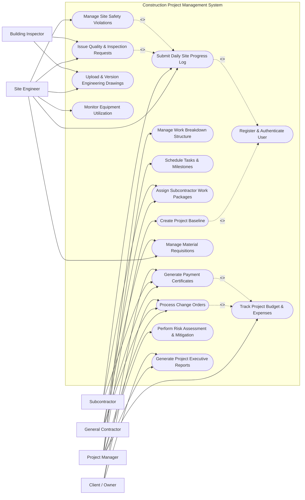

# Use Case Diagram — Construction Project Management System

## Mermaid Code

## Actor Table | Bang Actor

| # | Actor | Actor Type | Role Description | Related Use Cases |
|---|-------|------------|------------------|-------------------|
| 1 | Project Manager | Primary | Manages overall project planning, WBS, budget tracking, risk evaluation, and reporting | UC01, UC02, UC03, UC04, UC08, UC09, UC13, UC16 |
| 2 | Site Engineer | Primary | Monitors site operations, logs daily progress, inspections, safety, drawings, and equipment | UC01, UC06, UC07, UC10, UC11, UC14, UC15 |
| 3 | General Contractor | Primary | Manages work packages, material requests, change orders, and interim payment claims | UC01, UC05, UC07, UC08, UC12 |
| 4 | Subcontractor | Primary | Executes assigned trade work packages, submits daily progress logs, and requests payment | UC01, UC05, UC06, UC12 |
| 5 | Client / Owner | Primary | Reviews executive reports, approves change orders, and releases interim payments | UC01, UC08, UC12, UC16 |
| 6 | Building Inspector | Secondary | Conducts regulatory compliance audits and signs off on engineering drawings and inspection logs | UC10, UC14 |

## Use Case Table | Bang Use Case

| # | UC ID | Use Case Name | Primary Actor | Secondary Actor | Description | Priority |
|---|-------|---------------|---------------|-----------------|-------------|----------|
| 1 | UC01 | Register & Authenticate User | All Actors | None | Authenticates system users with role-based permissions | High |
| 2 | UC02 | Create Project Baseline | Project Manager | Client / Owner | Establishes original schedule, cost, and scope baseline | High |
| 3 | UC03 | Manage Work Breakdown Structure | Project Manager | General Contractor | Decomposes project into manageable work tasks and packages | High |
| 4 | UC04 | Schedule Tasks & Milestones | Project Manager | Site Engineer | Sets task timelines, critical paths, and milestone dates | High |
| 5 | UC05 | Assign Subcontractor Work Packages | General Contractor | Subcontractor | Contracts specific work tasks to trade subcontractors | Medium |
| 6 | UC06 | Submit Daily Site Progress Log | Site Engineer | Subcontractor | Logs daily work activities, weather, labor, and issues | High |
| 7 | UC07 | Manage Material Requisitions | Site Engineer | General Contractor | Requests and approves raw materials needed on site | Medium |
| 8 | UC08 | Process Change Orders | General Contractor | Project Manager, Owner | Handles scope adjustments, cost impacts, and formal approvals | High |
| 9 | UC09 | Track Project Budget & Expenses | Project Manager | Client / Owner | Tracks real-time cost variance against allocated baseline | High |
| 10 | UC10 | Issue Quality & Inspection Requests | Site Engineer | Building Inspector | Schedules and logs quality compliance inspections | High |
| 11 | UC11 | Manage Site Safety Violations | Site Engineer | General Contractor | Records safety incidents, non-conformance reports (NCR) | Medium |
| 12 | UC12 | Generate Payment Certificates | Subcontractor | General Contractor, Owner | Computes and approves Interim Payment Certificates (IPC) | High |
| 13 | UC13 | Perform Risk Assessment & Mitigation | Project Manager | Site Engineer | Logs potential construction risks and mitigation actions | Medium |
| 14 | UC14 | Upload & Version Engineering Drawings | Site Engineer | Building Inspector | Stores structural blueprint revisions with version control | Medium |
| 15 | UC15 | Monitor Equipment Utilization | Site Engineer | General Contractor | Tracks heavy machinery usage, fuel, and downtime | Low |
| 16 | UC16 | Generate Project Executive Reports | Project Manager | Client / Owner | Compiles progress summary charts, financial S-curves, and photos | High |

## Use Case Specification | Dac ta Use Case

---

### UC02 — Create Project Baseline

| Field | Detail |
|-------|--------|
| **UC ID** | UC02 |
| **Use Case Name** | Create Project Baseline |
| **Actor(s)** | Primary: Project Manager   Secondary: Client / Owner |
| **Description** | Establishes the initial project charter, including total budget, start/end dates, milestone targets, and baseline work breakdown structure. |
| **Precondition** | 1. Project Manager is authenticated in the system with Project Creation privilege.   2. Project contract documents and initial estimates are finalized. |
| **Main Flow** | 1. Project Manager selects "Create New Project Baseline" from the Project Management menu.   2. System displays Project Initialization form (Project Title, Code, Location, Start Date, End Date, Budget Cap).   3. Project Manager enters project details and uploads initial scope document.   4. Project Manager defines high-level milestone dates and total budget allocation.   5. System validates inputs for logical date order and non-negative financial values.   6. System saves project baseline status as "Draft Baseline" and sends approval request to Client / Owner. |
| **Alternative Flow** | **AF1** — Owner Revision Request: If Client / Owner requests scope adjustment during approval, system updates status to "Needs Revision" and notifies Project Manager to edit baseline parameters.   **AF2** — Import Baseline File: Project Manager uploads baseline via Primavera P6 or MS Project XML file; system parses task dates and budget automatically. |
| **Exception Flow** | **EX1** — Invalid Date Range: If End Date is prior to Start Date, system displays error message "End date must be after Start date" and prompts re-entry.   **EX2** — Duplicate Project Code: System detects existing project code in database and prompts "Project Code already exists, please enter unique code". |
| **Postcondition** | Project baseline is active, milestones are locked into baseline control, and WBS creation is enabled. |
| **Business Rule** | **BR1**: Baseline cannot be altered once approved by Client / Owner without going through a formal Change Order (UC08).   **BR2**: Project Code must follow corporate naming convention `PRJ-YYYY-[0-9]{3}`. |

---

### UC06 — Submit Daily Site Progress Log

| Field | Detail |
|-------|--------|
| **UC ID** | UC06 |
| **Use Case Name** | Submit Daily Site Progress Log |
| **Actor(s)** | Primary: Site Engineer   Secondary: Subcontractor |
| **Description** | Records daily construction activities on site, including headcount, weather conditions, work volume completed, photos, and blocking issues. |
| **Precondition** | 1. Active project and active Work Packages exist for the current date.   2. Site Engineer has mobile or web access on site. |
| **Main Flow** | 1. Site Engineer opens "Daily Site Log" section and selects current Project and Date.   2. System retrieves active Work Packages and auto-fills weather conditions from local weather service.   3. Site Engineer inputs workforce headcount by trade (masons, electricians, steelworkers).   4. Site Engineer enters work volume completed per WBS item and uploads site progress photos.   5. Site Engineer notes any delays, site accidents, or material shortages.   6. System validates entries, recalculates cumulative task completion percentages, and saves log. |
| **Alternative Flow** | **AF1** — Offline Mode Submission: If internet connection is unavailable on site, application stores log locally and syncs automatically upon reconnecting.   **AF2** — Subcontractor Co-submission: Subcontractor logs daily progress for their specific work package; Site Engineer verifies and approves before final log submission. |
| **Exception Flow** | **EX1** — Excessive Completion Percentage: If entered work volume exceeds total package scope, system flags warning "Completed volume exceeds package capacity; verify input".   **EX2** — Missing Required Photo: If mandatory photographic evidence is missing for a key milestone, system blocks submission until photo is attached. |
| **Postcondition** | Daily log is locked for the date, task completion percentages update in real-time, and S-curve progress chart updates. |
| **Business Rule** | **BR1**: Daily log must be submitted before 22:00 local time on the date of activity.   **BR2**: Progress photos must include GPS coordinates and timestamp metadata. |

---

### UC08 — Process Change Orders

| Field | Detail |
|-------|--------|
| **UC ID** | UC08 |
| **Use Case Name** | Process Change Orders |
| **Actor(s)** | Primary: General Contractor   Secondary: Project Manager, Client / Owner |
| **Description** | Initiates, evaluates, and approves formal Change Requests (CR) that alter project scope, contract cost, or schedule timeline. |
| **Precondition** | 1. Project baseline is locked and active.   2. General Contractor identifies a scope variation or client-requested design alteration. |
| **Main Flow** | 1. General Contractor submits Change Order Request (CO Number, Justification, Cost Variance, Days Extension).   2. System attaches supporting engineering drawings and cost estimate calculations.   3. Project Manager reviews technical feasibility, budget impact, and schedule variance.   4. Project Manager approves technical aspects and forwards to Client / Owner for financial sanction.   5. Client / Owner reviews impact summary and digitally signs Change Order Approval.   6. System updates current project budget, revised completion target date, and locks approved Change Order. |
| **Alternative Flow** | **AF1** — Rejection by Owner: If Client / Owner rejects change order, system logs status as "Rejected" and returns file to contractor with reason comments.   **AF2** — Fast-track Emergency Change: For critical site safety repairs, Project Manager grants temporary emergency approval up to $5,000 pending formal owner sign-off. |
| **Exception Flow** | **EX1** — Budget Cap Exceeded: If cost impact exceeds overall project contingency limit, system flags high-level financial risk alert.   **EX2** — Unauthorized Approver: System blocks user without Owner Approval role from executing final sign-off. |
| **Postcondition** | Revised budget baseline and schedule targets are established; contract value is adjusted in ERP system. |
| **Business Rule** | **BR1**: Any change order exceeding $10,000 or 5-day schedule impact requires dual approval (PM + Owner).   **BR2**: Change orders must be processed within 14 business days from initial submission. |

---

### UC09 — Track Project Budget & Expenses

| Field | Detail |
|-------|--------|
| **UC ID** | UC09 |
| **Use Case Name** | Track Project Budget & Expenses |
| **Actor(s)** | Primary: Project Manager   Secondary: Client / Owner |
| **Description** | Monitors planned vs actual costs, committed purchase orders, earned value parameters (BCWS, BCWP, ACWP), and cost performance index (CPI). |
| **Precondition** | 1. Active project baseline budget exists.   2. Cost items, invoices, and progress logs are continuously updated in the system. |
| **Main Flow** | 1. Project Manager selects "Financial Health & Budget Tracking" module.   2. System retrieves baseline budget, total committed purchase orders, actual incurred costs (ACWP), and earned value (BCWP).   3. System computes Schedule Variance (SV), Cost Variance (CV), CPI, and SPI.   4. System renders Earned Value Management (EVM) S-Curve chart comparing Planned Value vs Actual Cost.   5. Project Manager filters cost variance by WBS level to pinpoint cost overruns.   6. System generates budget health summary report for executive review. |
| **Alternative Flow** | **AF1** — Forecast at Completion (EAC): System uses historical CPI trend to predict Estimate at Completion (EAC) and Estimate to Complete (ETC).   **AF2** — Export Financial Report: User exports budget breakdown into Excel or PDF format for stakeholder presentation. |
| **Exception Flow** | **EX1** — CPI Threshold Breach: If CPI drops below 0.85 (over budget), system automatically triggers warning notification to PM and Owner.   **EX2** — Missing Cost Item Data: System notifies user of unallocated expenses lacking WBS cost code assignment. |
| **Postcondition** | Real-time financial indicators are calculated and stored in historical analytics repository. |
| **Business Rule** | **BR1**: Earned Value (BCWP) is calculated strictly based on verified Daily Progress Logs (UC06).   **BR2**: Cost Variance = Earned Value (BCWP) - Actual Cost (ACWP). |

---

### UC12 — Generate Payment Certificates

| Field | Detail |
|-------|--------|
| **UC ID** | UC12 |
| **Use Case Name** | Generate Payment Certificates |
| **Actor(s)** | Primary: Subcontractor   Secondary: General Contractor, Client / Owner |
| **Description** | Prepares, verifies, and certifies Interim Payment Certificates (IPC) for work performed by contractors during a billing period. |
| **Precondition** | 1. Billing period cycle is reached (e.g. monthly billing).   2. Daily site progress logs for the period are approved by Site Engineer. |
| **Main Flow** | 1. Subcontractor submits Interim Payment Claim detailing work completed and material on site.   2. System auto-calculates claimed amount based on cumulative completion percentages of work packages.   3. General Contractor audits claim against site inspection logs and adjusts certified work quantities.   4. System applies contract retention percentage (e.g. 5% or 10%) and deducts previous advance payments.   5. Project Manager and Client / Owner approve final certified amount.   6. System generates official Interim Payment Certificate (IPC) document and sends payment request payload to ERP system. |
| **Alternative Flow** | **AF1** — Claim Quantity Dispute: If contractor disputes certified quantity, system holds disputed line item in escrow while certifying undisputed balance.   **AF2** — Final Payment Certificate: At project completion, system processes Final Payment Certificate (FPC) including retention release. |
| **Exception Flow** | **EX1** — Unapproved Inspection Logs: System blocks payment certification if work items lack mandatory inspection sign-off (UC10).   **EX2** — Tax Clearance Expiry: System flags warning if contractor tax registration or liability insurance has expired. |
| **Postcondition** | Official IPC certificate is issued, financial liability is logged in ERP, and payment release schedule is initiated. |
| **Business Rule** | **BR1**: Retention amount of 5% is mandatory for all interim payments until final practical completion.   **BR2**: Payment certificates must be signed by General Contractor and Project Manager prior to disbursement. |
