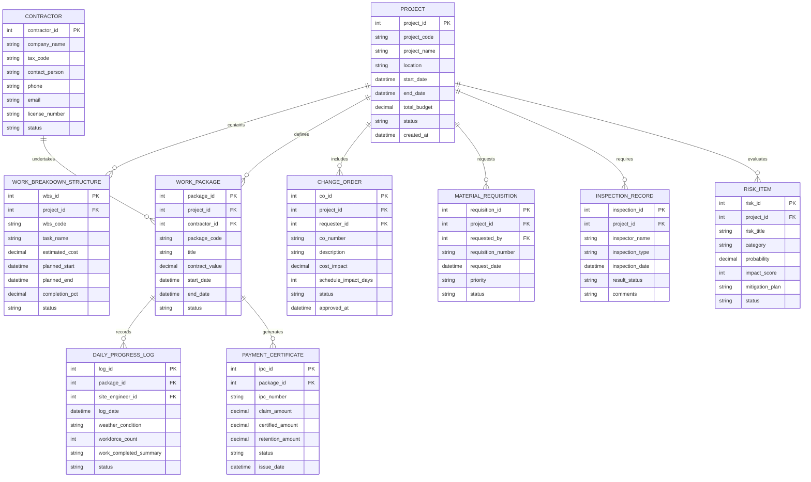

# Conceptual ERD — Construction Project Management System

## Mermaid Code

## Entity Description Table | Bang mo ta Entity

| # | Entity Name | Vietnamese Name | Description | Key Attributes | Main Relationships |
|---|-------------|-----------------|-------------|----------------|-------------------|
| 1 | PROJECT | Du an | Represents the main construction project entity | project_id, project_code, project_name, total_budget | Contains WBS, defines Work Packages, includes Change Orders |
| 2 | WORK_BREAKDOWN_STRUCTURE | Cau truc Phan chia Cong viec | Hierarchical breakdown of tasks and milestone activities | wbs_id, wbs_code, task_name, completion_pct | Belongs to Project |
| 3 | CONTRACTOR | Nha thau | External general or trade subcontractor firm executing work | contractor_id, company_name, tax_code, license_number | Undertakes Work Packages |
| 4 | WORK_PACKAGE | Goi thau Cong viec | Specific contracted bundle of construction scope assigned to contractor | package_id, package_code, title, contract_value | Belongs to Project & Contractor; has Daily Logs & IPCs |
| 5 | DAILY_PROGRESS_LOG | Nhat ky Cong truong Hang ngay | Daily field log tracking workforce, weather, and completed work | log_id, log_date, weather_condition, workforce_count | Belongs to Work Package |
| 6 | CHANGE_ORDER | Yeu cau Thay doi | Formal adjustment request impacting scope, budget, or timeline | co_id, co_number, cost_impact, schedule_impact_days | Belongs to Project |
| 7 | MATERIAL_REQUISITION | Phieu Yeu cau Vat tu | Site requisition document for raw materials and supplies | requisition_id, requisition_number, request_date, priority | Belongs to Project |
| 8 | INSPECTION_RECORD | Bien ban Kiem dinh | Quality assurance or safety compliance inspection log | inspection_id, inspector_name, inspection_type, result_status | Belongs to Project |
| 9 | PAYMENT_CERTIFICATE | Chung nhan Thanh toan | Interim Payment Certificate (IPC) authorizing contractor payment | ipc_id, ipc_number, certified_amount, retention_amount | Belongs to Work Package |
| 10 | RISK_ITEM | Danh muc Rui ro | Identified project risk along with probability and mitigation strategy | risk_id, risk_title, probability, impact_score | Belongs to Project |

## Relationship Description | Mo ta Quan he

| # | From Entity | Cardinality | To Entity | Relationship Label | Business Explanation |
|---|-------------|-------------|-----------|-------------------|----------------------|
| 1 | PROJECT | one-to-many | WORK_BREAKDOWN_STRUCTURE | contains | Mot du an bao gom nhieu muc cong viec WBS chi tiet |
| 2 | PROJECT | one-to-many | WORK_PACKAGE | defines | Mot du an phan chia thanh nhieu goi thau thi cong |
| 3 | CONTRACTOR | one-to-many | WORK_PACKAGE | undertakes | Mot nha thau co the thuc hien nhieu goi thau trong du an |
| 4 | WORK_PACKAGE | one-to-many | DAILY_PROGRESS_LOG | records | Mot goi thau duoc ghi nhat ky tien do thi cong qua nhieu ngay |
| 5 | WORK_PACKAGE | one-to-many | PAYMENT_CERTIFICATE | generates | Mot goi thau xuat nhieu dot chung nhan thanh toan dinh ky |
| 6 | PROJECT | one-to-many | CHANGE_ORDER | includes | Mot du an co the phat sinh nhieu yeu cau dieu chinh hop dong |
| 7 | PROJECT | one-to-many | MATERIAL_REQUISITION | requests | Mot du an phat sinh nhieu phieu yeu cau cap vat tu cong truong |
| 8 | PROJECT | one-to-many | INSPECTION_RECORD | requires | Mot du an trai qua nhieu dot kiem dinh chat luong va an toan |
| 9 | PROJECT | one-to-many | RISK_ITEM | evaluates | Mot du an quan ly danh sach nhieu rui ro va phuong an giam thai |
