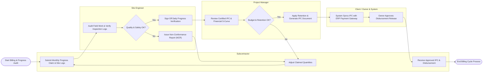

# Swimlane Diagram — Construction Project Management System

## Mermaid Code

## Flow Description | Mo ta luong

| Lane | Actor / System | Role in Flow |
|------|----------------|--------------|
| 1 | Subcontractor | Submits monthly work progress claims, adjusts claimed quantities upon feedback, and receives certified interim payments. |
| 2 | Site Engineer | Audits physical work on site against inspection logs, verifies safety compliance, issues NCRs for non-conforming work, and signs off progress logs. |
| 3 | Project Manager | Reviews audited progress claims against master baseline budget, validates retention deductions, and issues formal Interim Payment Certificates. |
| 4 | Client / Owner & System | System syncs IPC data payload with enterprise ERP financial backend; Client/Owner grants final disbursement approval. |
