# Action Tree — Construction Project Management System

## Mermaid Code

```mermaid
graph TD
    Root["Construction Project Management System"]

    Root --> M1["Project Setup & Baseline"]
    Root --> M2["WBS & Schedule Management"]
    Root --> M3["Site Execution & Field Tracking"]
    Root --> M4["Change & Risk Management"]
    Root --> M5["Quality, Inspection & Safety"]
    Root --> M6["Contract & Payment Certification"]

    M1 --> A1["Define Project Baseline & Charter"]
    M1 --> A2["Assign Project Roles & Permissions"]
    M1 --> A3["Import Primavera/MS Project Baseline"]

    M2 --> B1["Create & Edit WBS Nodes"]
    M2 --> B2["Set Critical Path Milestones"]
    M2 --> B3["Allocate Labor & Equipment Resources"]

    M3 --> C1["Submit Daily Site Progress Log"]
    M3 --> C2["Request Material Requisition"]
    M3 --> C3["Track Real-Time S-Curve Progress"]

    M4 --> D1["Initiate Change Order Request"]
    M4 --> D2["Evaluate Financial & Timeline Impact"]
    M4 --> D3["Perform Risk Assessment & Mitigation"]

    M5 --> E1["Schedule Quality Inspection"]
    M5 --> E2["Issue Non-Conformance Report (NCR)"]
    M5 --> E3["Upload Engineering Drawing Revision"]

    M6 --> F1["Submit Subcontractor Progress Claim"]
    M6 --> F2["Generate Interim Payment Certificate (IPC)"]
    M6 --> F3["Sync Payment Payload with ERP"]
```

## Module Description | Mo ta Module

| # | Module | Description | Actions |
|---|--------|-------------|---------|
| 1 | Project Setup & Baseline | Initializes project charter, defines user roles, and establishes schedule/cost baseline | Define Project Baseline, Assign Roles, Import Baseline |
| 2 | WBS & Schedule Management | Decomposes project scope into tasks, manages critical path, and assigns resources | Create WBS Nodes, Set Critical Path, Allocate Resources |
| 3 | Site Execution & Field Tracking | Records daily site activities, material requests, and progress tracking | Submit Daily Log, Request Material, Track S-Curve |
| 4 | Change & Risk Management | Evaluates scope change orders, cost variations, and evaluates project risk matrix | Initiate Change Order, Evaluate Cost Impact, Perform Risk Assessment |
| 5 | Quality, Inspection & Safety | Handles QA/QC inspections, safety NCRs, and drawing version control | Schedule Inspection, Issue NCR, Upload Drawing Revision |
| 6 | Contract & Payment Certification | Processes subcontractor claims, generates IPC certificates, and syncs financial ledger | Submit Progress Claim, Generate IPC, Sync Payment with ERP |
