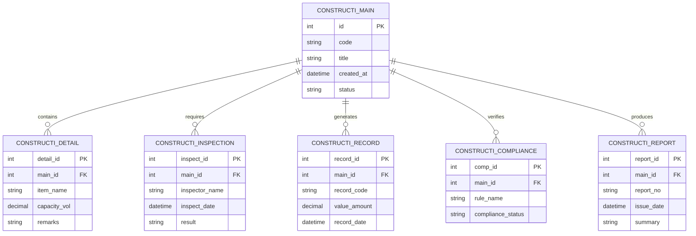

# Conceptual ERD — Construction Risk Management System

## Mermaid Code

## Entity Description Table | Bang mo ta Entity

| # | Entity Name | Vietnamese Name | Description | Key Attributes | Main Relationships |
|---|-------------|-----------------|-------------|----------------|-------------------|
| 1 | CONSTRUCTI_MAIN | Entity constructi_main | Stores constructi_main data for Construction Risk Management System | id | Main core entity |
| 2 | CONSTRUCTI_DETAIL | Entity constructi_detail | Stores constructi_detail data for Construction Risk Management System | detail_id | Main core entity |
| 3 | CONSTRUCTI_INSPECTION | Entity constructi_inspection | Stores constructi_inspection data for Construction Risk Management System | inspect_id | Main core entity |
| 4 | CONSTRUCTI_RECORD | Entity constructi_record | Stores constructi_record data for Construction Risk Management System | record_id | Main core entity |
| 5 | CONSTRUCTI_COMPLIANCE | Entity constructi_compliance | Stores constructi_compliance data for Construction Risk Management System | comp_id | Main core entity |
| 6 | CONSTRUCTI_REPORT | Entity constructi_report | Stores constructi_report data for Construction Risk Management System | report_id | Main core entity |

## Relationship Description | Mo ta Quan he

| # | From Entity | Cardinality | To Entity | Relationship Label | Business Explanation |
|---|-------------|-------------|-----------|-------------------|----------------------|
| 1 | CONSTRUCTI_MAIN | one-to-many | CONSTRUCTI_DETAIL | contains | Thanh phan chinh bao gom nhieu chi tiet nghiep vu |
| 2 | CONSTRUCTI_MAIN | one-to-many | CONSTRUCTI_INSPECTION | requires | Thanh phan chinh yeu cau cac dot kiem tra kiem dinh |
| 3 | CONSTRUCTI_MAIN | one-to-many | CONSTRUCTI_RECORD | generates | Thanh phan chinh xuat cac ban ghi thong ke |
| 4 | CONSTRUCTI_MAIN | one-to-many | CONSTRUCTI_COMPLIANCE | verifies | Thanh phan chinh kiem tra tinh tuan thu quy chuan |
| 5 | CONSTRUCTI_MAIN | one-to-many | CONSTRUCTI_REPORT | produces | Thanh phan chinh xuat cac bao cao tong hop |
