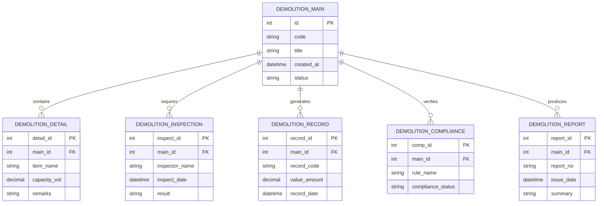

# Conceptual ERD — Demolition Project Management System

## Mermaid Code

## Entity Description Table | Bang mo ta Entity

| # | Entity Name | Vietnamese Name | Description | Key Attributes | Main Relationships |
|---|-------------|-----------------|-------------|----------------|-------------------|
| 1 | DEMOLITION_MAIN | Entity demolition_main | Stores demolition_main data for Demolition Project Management System | id | Main core entity |
| 2 | DEMOLITION_DETAIL | Entity demolition_detail | Stores demolition_detail data for Demolition Project Management System | detail_id | Main core entity |
| 3 | DEMOLITION_INSPECTION | Entity demolition_inspection | Stores demolition_inspection data for Demolition Project Management System | inspect_id | Main core entity |
| 4 | DEMOLITION_RECORD | Entity demolition_record | Stores demolition_record data for Demolition Project Management System | record_id | Main core entity |
| 5 | DEMOLITION_COMPLIANCE | Entity demolition_compliance | Stores demolition_compliance data for Demolition Project Management System | comp_id | Main core entity |
| 6 | DEMOLITION_REPORT | Entity demolition_report | Stores demolition_report data for Demolition Project Management System | report_id | Main core entity |

## Relationship Description | Mo ta Quan he

| # | From Entity | Cardinality | To Entity | Relationship Label | Business Explanation |
|---|-------------|-------------|-----------|-------------------|----------------------|
| 1 | DEMOLITION_MAIN | one-to-many | DEMOLITION_DETAIL | contains | Thanh phan chinh bao gom nhieu chi tiet nghiep vu |
| 2 | DEMOLITION_MAIN | one-to-many | DEMOLITION_INSPECTION | requires | Thanh phan chinh yeu cau cac dot kiem tra kiem dinh |
| 3 | DEMOLITION_MAIN | one-to-many | DEMOLITION_RECORD | generates | Thanh phan chinh xuat cac ban ghi thong ke |
| 4 | DEMOLITION_MAIN | one-to-many | DEMOLITION_COMPLIANCE | verifies | Thanh phan chinh kiem tra tinh tuan thu quy chuan |
| 5 | DEMOLITION_MAIN | one-to-many | DEMOLITION_REPORT | produces | Thanh phan chinh xuat cac bao cao tong hop |
