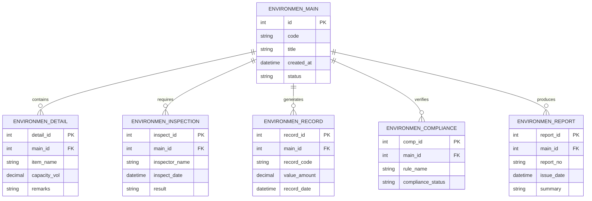

# Conceptual ERD — Environmental Monitoring System (Construction)

## Mermaid Code

## Entity Description Table | Bang mo ta Entity

| # | Entity Name | Vietnamese Name | Description | Key Attributes | Main Relationships |
|---|-------------|-----------------|-------------|----------------|-------------------|
| 1 | ENVIRONMEN_MAIN | Entity environmen_main | Stores environmen_main data for Environmental Monitoring System (Construction) | id | Main core entity |
| 2 | ENVIRONMEN_DETAIL | Entity environmen_detail | Stores environmen_detail data for Environmental Monitoring System (Construction) | detail_id | Main core entity |
| 3 | ENVIRONMEN_INSPECTION | Entity environmen_inspection | Stores environmen_inspection data for Environmental Monitoring System (Construction) | inspect_id | Main core entity |
| 4 | ENVIRONMEN_RECORD | Entity environmen_record | Stores environmen_record data for Environmental Monitoring System (Construction) | record_id | Main core entity |
| 5 | ENVIRONMEN_COMPLIANCE | Entity environmen_compliance | Stores environmen_compliance data for Environmental Monitoring System (Construction) | comp_id | Main core entity |
| 6 | ENVIRONMEN_REPORT | Entity environmen_report | Stores environmen_report data for Environmental Monitoring System (Construction) | report_id | Main core entity |

## Relationship Description | Mo ta Quan he

| # | From Entity | Cardinality | To Entity | Relationship Label | Business Explanation |
|---|-------------|-------------|-----------|-------------------|----------------------|
| 1 | ENVIRONMEN_MAIN | one-to-many | ENVIRONMEN_DETAIL | contains | Thanh phan chinh bao gom nhieu chi tiet nghiep vu |
| 2 | ENVIRONMEN_MAIN | one-to-many | ENVIRONMEN_INSPECTION | requires | Thanh phan chinh yeu cau cac dot kiem tra kiem dinh |
| 3 | ENVIRONMEN_MAIN | one-to-many | ENVIRONMEN_RECORD | generates | Thanh phan chinh xuat cac ban ghi thong ke |
| 4 | ENVIRONMEN_MAIN | one-to-many | ENVIRONMEN_COMPLIANCE | verifies | Thanh phan chinh kiem tra tinh tuan thu quy chuan |
| 5 | ENVIRONMEN_MAIN | one-to-many | ENVIRONMEN_REPORT | produces | Thanh phan chinh xuat cac bao cao tong hop |
