# Action Tree — Environmental Monitoring System (Construction)

## Mermaid Code

```mermaid
graph TD
    Root["Environmental Monitoring System (Construction)"]

    Root --> M1["Core Setup & Administration Module"]
    Root --> M2["Field Operational Logging Module"]
    Root --> M3["Compliance & QA/QC Audit Module"]
    Root --> M4["Data Integration & Processing Module"]
    Root --> M5["Executive Reporting & Analytics Module"]

    M1 --> A1_1["Configure Baseline Parameters"]
    M1 --> A1_2["Assign User Roles"]
    M1 --> A1_3["Set Operational Thresholds"]

    M2 --> A2_1["Log Noise Sensing Data"]
    M2 --> A2_2["Record  Dust PM2.5 Details"]
    M2 --> A2_3["Attach Media Evidence"]

    M3 --> A3_1["Execute Checklist Audit"]
    M3 --> A3_2["Issue Non-Conformance Reports"]
    M3 --> A3_3["Verify Statutory Standards"]

    M4 --> A4_1["Sync with Enterprise ERP"]
    M4 --> A4_2["Process Automated Calculations"]
    M4 --> A4_3["Log Version History"]

    M5 --> A5_1["Generate Dashboard Charts"]
    M5 --> A5_2["Export Audit Certificates"]
    M5 --> A5_3["Send Milestone Notifications"]
```

## Module Description | Mo ta Module

| # | Module | Description | Actions |
|---|--------|-------------|---------|
| 1 | Core Setup & Administration Module | Handles core functions for Core Setup & Administration Module | Configure Baseline Parameters, Assign User Roles, Set Operational Thresholds |
| 2 | Field Operational Logging Module | Handles core functions for Field Operational Logging Module | Log Noise Sensing Data, Record  Dust PM2.5 Details, Attach Media Evidence |
| 3 | Compliance & QA/QC Audit Module | Handles core functions for Compliance & QA/QC Audit Module | Execute Checklist Audit, Issue Non-Conformance Reports, Verify Statutory Standards |
| 4 | Data Integration & Processing Module | Handles core functions for Data Integration & Processing Module | Sync with Enterprise ERP, Process Automated Calculations, Log Version History |
| 5 | Executive Reporting & Analytics Module | Handles core functions for Executive Reporting & Analytics Module | Generate Dashboard Charts, Export Audit Certificates, Send Milestone Notifications |
