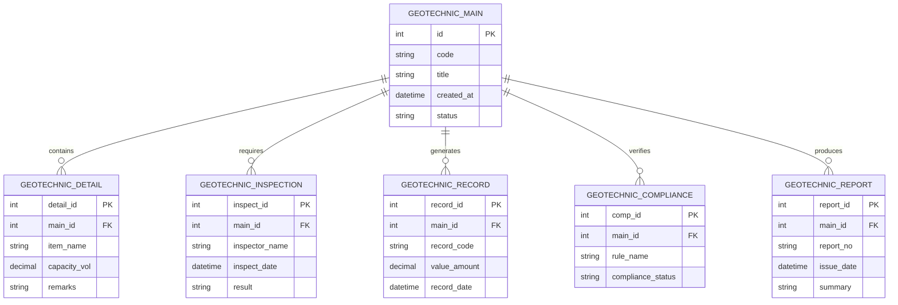

# Conceptual ERD — Geotechnical Investigation Management System

## Mermaid Code

## Entity Description Table | Bang mo ta Entity

| # | Entity Name | Vietnamese Name | Description | Key Attributes | Main Relationships |
|---|-------------|-----------------|-------------|----------------|-------------------|
| 1 | GEOTECHNIC_MAIN | Entity geotechnic_main | Stores geotechnic_main data for Geotechnical Investigation Management System | id | Main core entity |
| 2 | GEOTECHNIC_DETAIL | Entity geotechnic_detail | Stores geotechnic_detail data for Geotechnical Investigation Management System | detail_id | Main core entity |
| 3 | GEOTECHNIC_INSPECTION | Entity geotechnic_inspection | Stores geotechnic_inspection data for Geotechnical Investigation Management System | inspect_id | Main core entity |
| 4 | GEOTECHNIC_RECORD | Entity geotechnic_record | Stores geotechnic_record data for Geotechnical Investigation Management System | record_id | Main core entity |
| 5 | GEOTECHNIC_COMPLIANCE | Entity geotechnic_compliance | Stores geotechnic_compliance data for Geotechnical Investigation Management System | comp_id | Main core entity |
| 6 | GEOTECHNIC_REPORT | Entity geotechnic_report | Stores geotechnic_report data for Geotechnical Investigation Management System | report_id | Main core entity |

## Relationship Description | Mo ta Quan he

| # | From Entity | Cardinality | To Entity | Relationship Label | Business Explanation |
|---|-------------|-------------|-----------|-------------------|----------------------|
| 1 | GEOTECHNIC_MAIN | one-to-many | GEOTECHNIC_DETAIL | contains | Thanh phan chinh bao gom nhieu chi tiet nghiep vu |
| 2 | GEOTECHNIC_MAIN | one-to-many | GEOTECHNIC_INSPECTION | requires | Thanh phan chinh yeu cau cac dot kiem tra kiem dinh |
| 3 | GEOTECHNIC_MAIN | one-to-many | GEOTECHNIC_RECORD | generates | Thanh phan chinh xuat cac ban ghi thong ke |
| 4 | GEOTECHNIC_MAIN | one-to-many | GEOTECHNIC_COMPLIANCE | verifies | Thanh phan chinh kiem tra tinh tuan thu quy chuan |
| 5 | GEOTECHNIC_MAIN | one-to-many | GEOTECHNIC_REPORT | produces | Thanh phan chinh xuat cac bao cao tong hop |
