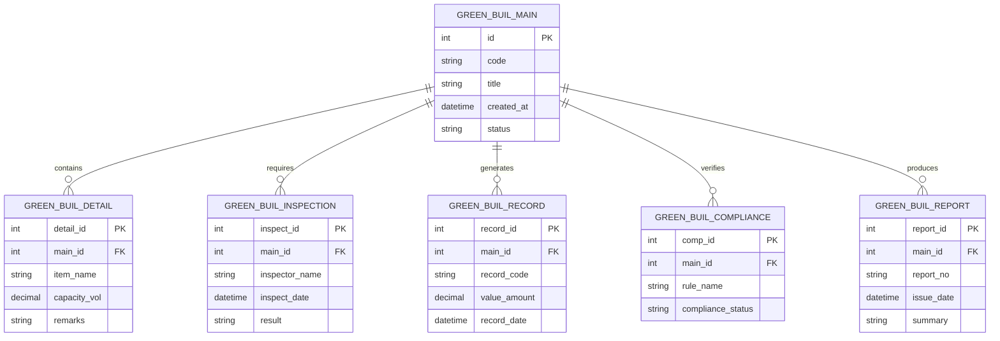

# Conceptual ERD — Green Building Design Management System

## Mermaid Code

## Entity Description Table | Bang mo ta Entity

| # | Entity Name | Vietnamese Name | Description | Key Attributes | Main Relationships |
|---|-------------|-----------------|-------------|----------------|-------------------|
| 1 | GREEN_BUIL_MAIN | Entity green_buil_main | Stores green_buil_main data for Green Building Design Management System | id | Main core entity |
| 2 | GREEN_BUIL_DETAIL | Entity green_buil_detail | Stores green_buil_detail data for Green Building Design Management System | detail_id | Main core entity |
| 3 | GREEN_BUIL_INSPECTION | Entity green_buil_inspection | Stores green_buil_inspection data for Green Building Design Management System | inspect_id | Main core entity |
| 4 | GREEN_BUIL_RECORD | Entity green_buil_record | Stores green_buil_record data for Green Building Design Management System | record_id | Main core entity |
| 5 | GREEN_BUIL_COMPLIANCE | Entity green_buil_compliance | Stores green_buil_compliance data for Green Building Design Management System | comp_id | Main core entity |
| 6 | GREEN_BUIL_REPORT | Entity green_buil_report | Stores green_buil_report data for Green Building Design Management System | report_id | Main core entity |

## Relationship Description | Mo ta Quan he

| # | From Entity | Cardinality | To Entity | Relationship Label | Business Explanation |
|---|-------------|-------------|-----------|-------------------|----------------------|
| 1 | GREEN_BUIL_MAIN | one-to-many | GREEN_BUIL_DETAIL | contains | Thanh phan chinh bao gom nhieu chi tiet nghiep vu |
| 2 | GREEN_BUIL_MAIN | one-to-many | GREEN_BUIL_INSPECTION | requires | Thanh phan chinh yeu cau cac dot kiem tra kiem dinh |
| 3 | GREEN_BUIL_MAIN | one-to-many | GREEN_BUIL_RECORD | generates | Thanh phan chinh xuat cac ban ghi thong ke |
| 4 | GREEN_BUIL_MAIN | one-to-many | GREEN_BUIL_COMPLIANCE | verifies | Thanh phan chinh kiem tra tinh tuan thu quy chuan |
| 5 | GREEN_BUIL_MAIN | one-to-many | GREEN_BUIL_REPORT | produces | Thanh phan chinh xuat cac bao cao tong hop |
