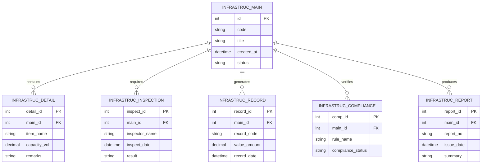

# Conceptual ERD — Infrastructure Asset Management System

## Mermaid Code

## Entity Description Table | Bang mo ta Entity

| # | Entity Name | Vietnamese Name | Description | Key Attributes | Main Relationships |
|---|-------------|-----------------|-------------|----------------|-------------------|
| 1 | INFRASTRUC_MAIN | Entity infrastruc_main | Stores infrastruc_main data for Infrastructure Asset Management System | id | Main core entity |
| 2 | INFRASTRUC_DETAIL | Entity infrastruc_detail | Stores infrastruc_detail data for Infrastructure Asset Management System | detail_id | Main core entity |
| 3 | INFRASTRUC_INSPECTION | Entity infrastruc_inspection | Stores infrastruc_inspection data for Infrastructure Asset Management System | inspect_id | Main core entity |
| 4 | INFRASTRUC_RECORD | Entity infrastruc_record | Stores infrastruc_record data for Infrastructure Asset Management System | record_id | Main core entity |
| 5 | INFRASTRUC_COMPLIANCE | Entity infrastruc_compliance | Stores infrastruc_compliance data for Infrastructure Asset Management System | comp_id | Main core entity |
| 6 | INFRASTRUC_REPORT | Entity infrastruc_report | Stores infrastruc_report data for Infrastructure Asset Management System | report_id | Main core entity |

## Relationship Description | Mo ta Quan he

| # | From Entity | Cardinality | To Entity | Relationship Label | Business Explanation |
|---|-------------|-------------|-----------|-------------------|----------------------|
| 1 | INFRASTRUC_MAIN | one-to-many | INFRASTRUC_DETAIL | contains | Thanh phan chinh bao gom nhieu chi tiet nghiep vu |
| 2 | INFRASTRUC_MAIN | one-to-many | INFRASTRUC_INSPECTION | requires | Thanh phan chinh yeu cau cac dot kiem tra kiem dinh |
| 3 | INFRASTRUC_MAIN | one-to-many | INFRASTRUC_RECORD | generates | Thanh phan chinh xuat cac ban ghi thong ke |
| 4 | INFRASTRUC_MAIN | one-to-many | INFRASTRUC_COMPLIANCE | verifies | Thanh phan chinh kiem tra tinh tuan thu quy chuan |
| 5 | INFRASTRUC_MAIN | one-to-many | INFRASTRUC_REPORT | produces | Thanh phan chinh xuat cac bao cao tong hop |
