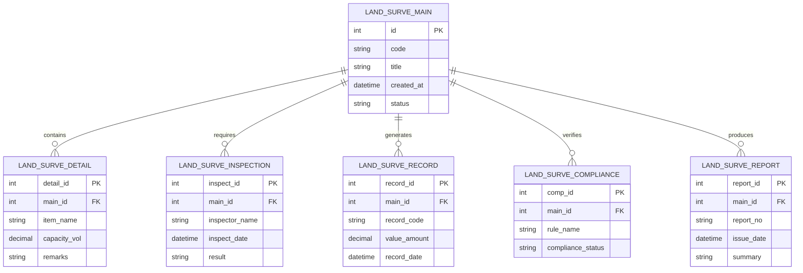

# Conceptual ERD — Land Survey & Mapping System

## Mermaid Code

## Entity Description Table | Bang mo ta Entity

| # | Entity Name | Vietnamese Name | Description | Key Attributes | Main Relationships |
|---|-------------|-----------------|-------------|----------------|-------------------|
| 1 | LAND_SURVE_MAIN | Entity land_surve_main | Stores land_surve_main data for Land Survey & Mapping System | id | Main core entity |
| 2 | LAND_SURVE_DETAIL | Entity land_surve_detail | Stores land_surve_detail data for Land Survey & Mapping System | detail_id | Main core entity |
| 3 | LAND_SURVE_INSPECTION | Entity land_surve_inspection | Stores land_surve_inspection data for Land Survey & Mapping System | inspect_id | Main core entity |
| 4 | LAND_SURVE_RECORD | Entity land_surve_record | Stores land_surve_record data for Land Survey & Mapping System | record_id | Main core entity |
| 5 | LAND_SURVE_COMPLIANCE | Entity land_surve_compliance | Stores land_surve_compliance data for Land Survey & Mapping System | comp_id | Main core entity |
| 6 | LAND_SURVE_REPORT | Entity land_surve_report | Stores land_surve_report data for Land Survey & Mapping System | report_id | Main core entity |

## Relationship Description | Mo ta Quan he

| # | From Entity | Cardinality | To Entity | Relationship Label | Business Explanation |
|---|-------------|-------------|-----------|-------------------|----------------------|
| 1 | LAND_SURVE_MAIN | one-to-many | LAND_SURVE_DETAIL | contains | Thanh phan chinh bao gom nhieu chi tiet nghiep vu |
| 2 | LAND_SURVE_MAIN | one-to-many | LAND_SURVE_INSPECTION | requires | Thanh phan chinh yeu cau cac dot kiem tra kiem dinh |
| 3 | LAND_SURVE_MAIN | one-to-many | LAND_SURVE_RECORD | generates | Thanh phan chinh xuat cac ban ghi thong ke |
| 4 | LAND_SURVE_MAIN | one-to-many | LAND_SURVE_COMPLIANCE | verifies | Thanh phan chinh kiem tra tinh tuan thu quy chuan |
| 5 | LAND_SURVE_MAIN | one-to-many | LAND_SURVE_REPORT | produces | Thanh phan chinh xuat cac bao cao tong hop |
