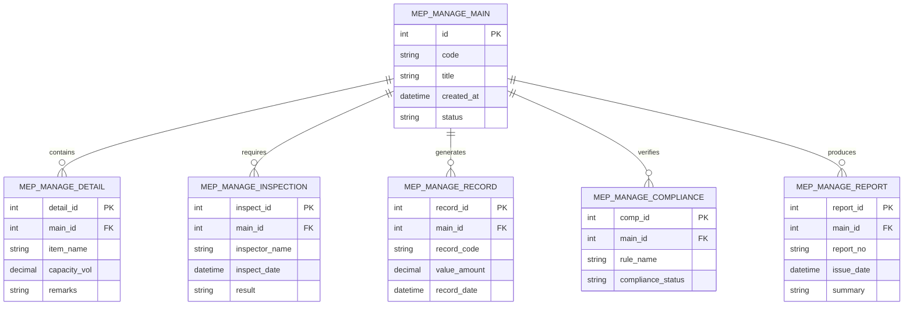

# Conceptual ERD — MEP Management System

## Mermaid Code

## Entity Description Table | Bang mo ta Entity

| # | Entity Name | Vietnamese Name | Description | Key Attributes | Main Relationships |
|---|-------------|-----------------|-------------|----------------|-------------------|
| 1 | MEP_MANAGE_MAIN | Entity mep_manage_main | Stores mep_manage_main data for MEP Management System | id | Main core entity |
| 2 | MEP_MANAGE_DETAIL | Entity mep_manage_detail | Stores mep_manage_detail data for MEP Management System | detail_id | Main core entity |
| 3 | MEP_MANAGE_INSPECTION | Entity mep_manage_inspection | Stores mep_manage_inspection data for MEP Management System | inspect_id | Main core entity |
| 4 | MEP_MANAGE_RECORD | Entity mep_manage_record | Stores mep_manage_record data for MEP Management System | record_id | Main core entity |
| 5 | MEP_MANAGE_COMPLIANCE | Entity mep_manage_compliance | Stores mep_manage_compliance data for MEP Management System | comp_id | Main core entity |
| 6 | MEP_MANAGE_REPORT | Entity mep_manage_report | Stores mep_manage_report data for MEP Management System | report_id | Main core entity |

## Relationship Description | Mo ta Quan he

| # | From Entity | Cardinality | To Entity | Relationship Label | Business Explanation |
|---|-------------|-------------|-----------|-------------------|----------------------|
| 1 | MEP_MANAGE_MAIN | one-to-many | MEP_MANAGE_DETAIL | contains | Thanh phan chinh bao gom nhieu chi tiet nghiep vu |
| 2 | MEP_MANAGE_MAIN | one-to-many | MEP_MANAGE_INSPECTION | requires | Thanh phan chinh yeu cau cac dot kiem tra kiem dinh |
| 3 | MEP_MANAGE_MAIN | one-to-many | MEP_MANAGE_RECORD | generates | Thanh phan chinh xuat cac ban ghi thong ke |
| 4 | MEP_MANAGE_MAIN | one-to-many | MEP_MANAGE_COMPLIANCE | verifies | Thanh phan chinh kiem tra tinh tuan thu quy chuan |
| 5 | MEP_MANAGE_MAIN | one-to-many | MEP_MANAGE_REPORT | produces | Thanh phan chinh xuat cac bao cao tong hop |
